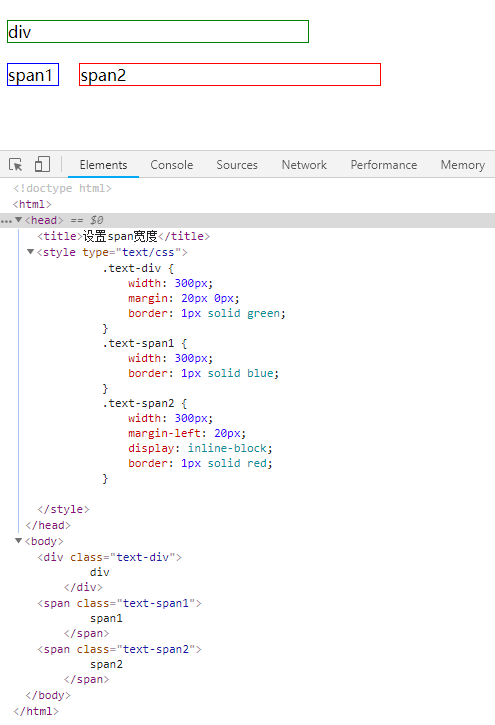

# 直接对一个span设置宽度无效的原因及解决办法

[原因：]()
> div本身就是一个块级元素，直接设置宽高，即刻生效； 
> span是内联元素，并不是一个实际意义上的块级元素，需要设置display: block/inlie-block; 等样式，
> 将span变成块级元素后，设置的宽高才能生效。

```
<!DOCTYPE html>
<html>
<head>
	<title>设置span宽度</title>
	<style type="text/css">
		.text-div {
			width: 60px;
			margin: 20px 0px;
			border: 1px solid green;
		}
		.text-span1 {
			width: 300px;
			border: 1px solid blue;
		}
		.text-span2 {
			width: 300px;
			margin-left: 20px;
			display: inline-block;
			border: 1px solid red;
		}
	</style>
</head>
<body>
	<div class="text-div">
		div
	</div>
	<span class="text-span1">
		span1
	</span>
	<span class="text-span2">
		span2
	</span>
</body>
</html>
```
效果图如下：


