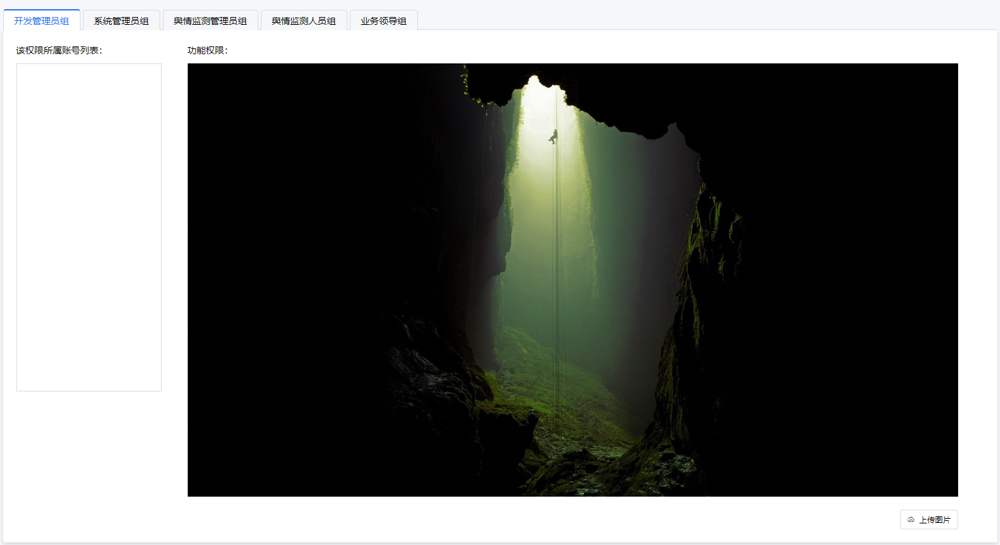

# div内图片自动缩放
## 需求：
在列表右边显示一张图片，图片按原始比例显示，不能失真。
```html
<div class="image">
  
</div>
```
```css
.image {
    width: 100%; /*定义容器尺寸，保证图片始终在容器内显示*/
    min-height: 460px; /*给一个最小高度，使上传按钮始终在下方*/

    img{
        width: 100%; /*仅定义宽度或高度为100%，保证图片可以按原比例显示*/
    }
}
```
