# Github+Hexo+NexT搭建个人博客
## 一、准备工作
- win7/8/10
- git[下载](https://www.git-scm.com/download/win)
- node[下载](https://nodejs.org/zh-cn/)：安装时记得勾选 `Add to PATH` 选项。  

下载完成后使用以下命令查看两个工具是否已正确安装。
```cmd
E:\HexoRepository
$ git --version
git version 2.11.0.windows.1

E:\HexoRepository
$ npm -v
6.9.0
```
## 二、本地初始化hexo环境
1. 在本地某一目录下新建一个文件夹作为博客根目录：HexoRepository（名字随意），之后的命令如无特别说明均是在此目录下执行；
2. 切换到HexoRepository目录：`cd HexoRepository`；
3. 安装Hexo脚手架：`npm install -g hexo-cli`；
4. 初始化Hexo：`hexo init`：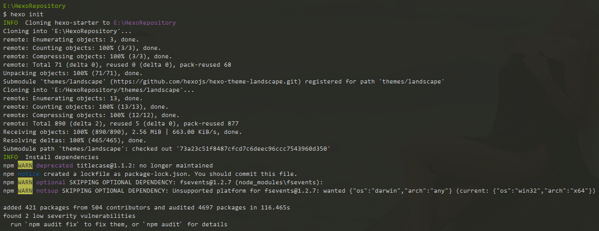
5. 安装Hexo所需组件：`npm install`：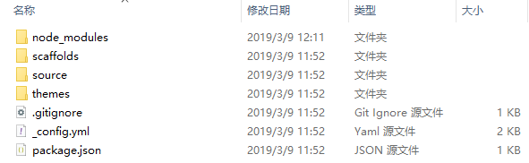
6. 安装NexT主题：`git clone https://github.com/theme-next/hexo-theme-next themes/next`：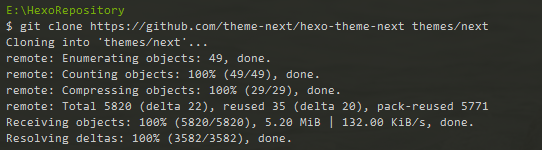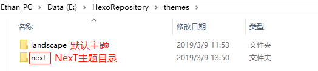
7. 设置Hexo使用NexT主题：`E:/HexoRepository/_config.yml`：  
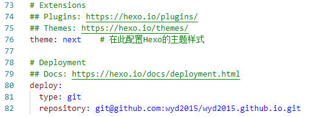
8. 设置博客显示的语言和网站url：
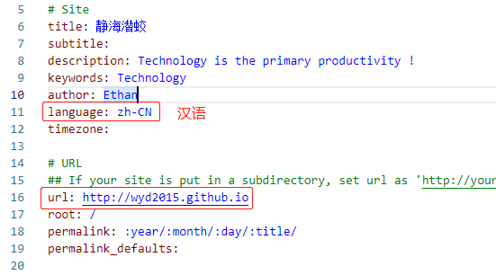
## 三、关联Github账户
1. 注册、登录Github账户；
2. 新建Repository：格式为：`用户名.github.io`，如我的账户名称是`wyd2015`，需要建立的Repository是`wyd2015.github.io`；  
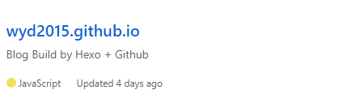
3. 创建SSH Key：`ssh-keygen -t rsa -C 'github注册邮箱'`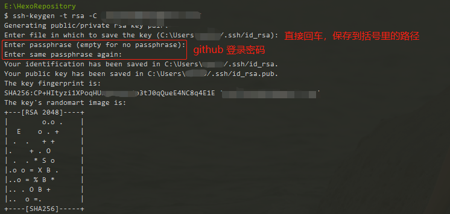
4. 找到id_rsa.pub文件，并复制文件的所有内容：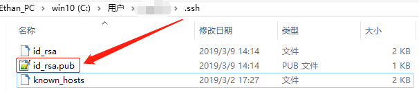
5. 在github新建SSH Key：  
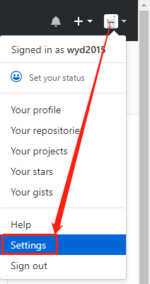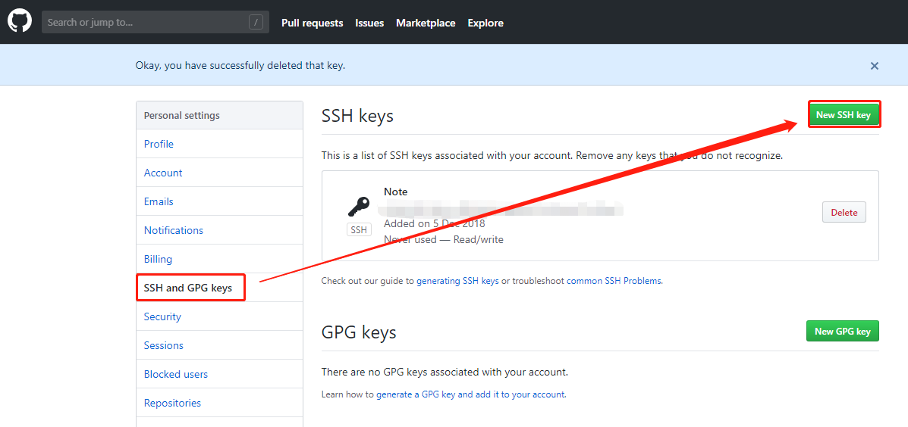
6. 粘贴id_rsa.pub文件内容到`Key`的输入框，Title随便指定：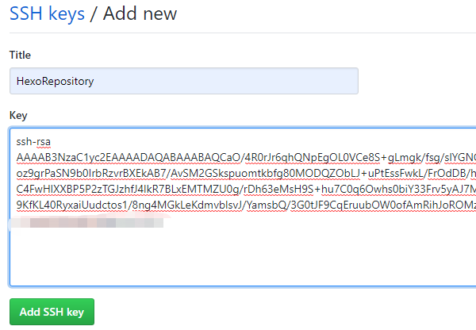
7. 测试是否关联成功：`ssh -T git@github.com`: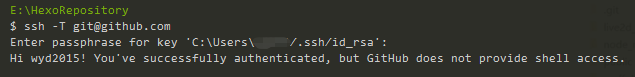
8. 修改本地站点目录（E:/HexoRepository）下的`_config.yml`文件，绑定刚刚新建的github仓库`wyd2015.github.io`：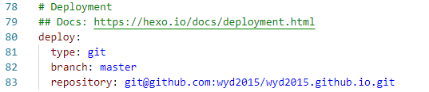
9. 为博客设置已注册的域名：

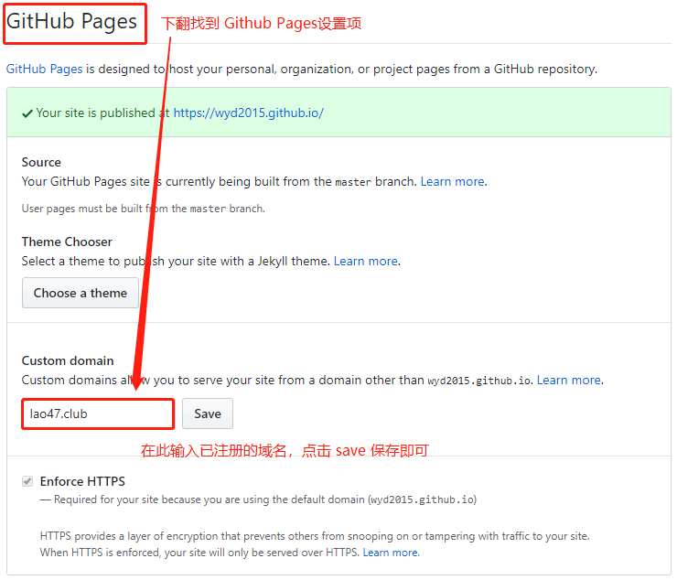

## 四、安装hexo的git部署插件
`npm install hexo-deployer-git --save`

## 五、修改NexT样式
修改next的具体样式需要修改`./themes/next/_config.yml`文件，这里只简单介绍几个修改项。
1. 设置NexT的具体样式，推荐使用 `Gemini`：  
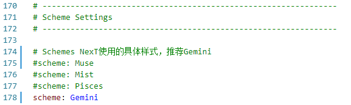
2. 设置需要显示的菜单项：  
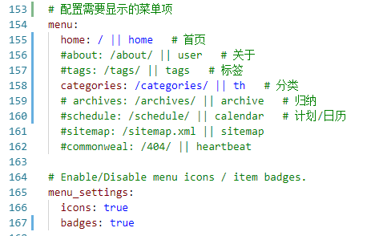
3. 设置需要显示的社交账户：  
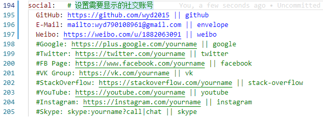
4. 设置用户头像，头像存放路径：`E:\HexoRepository\themes\next\source\images\`：  
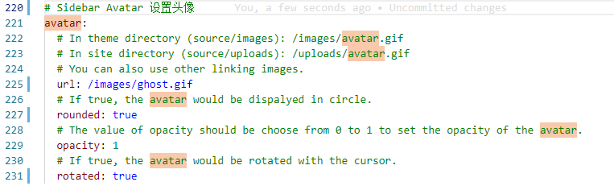
5. 文章列表显示内容摘要：  
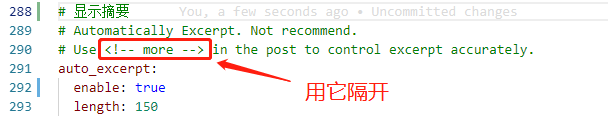
6. 卜算子进行网站访问次数统计：  
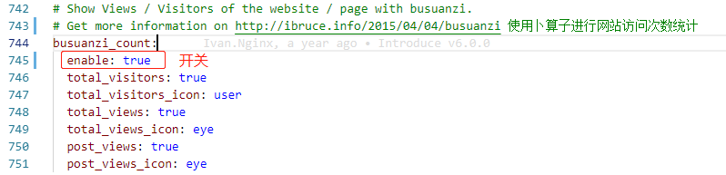
7. 启用本地搜索： 具体参考[官方介绍](https://github.com/theme-next/hexo-generator-searchdb)  
`npm install hexo-generator-searchdb --save`  
next主题文件夹下的`_config.yml`：
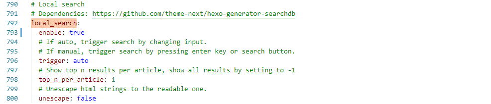
根目录下的`_config.yml`：
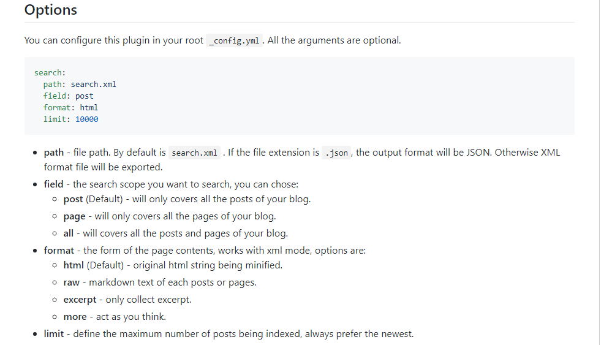
8. 设置图片弹出效果——`鼠标移到图片上显示放大镜`：具体参考[官方文档](https://github.com/theme-next/theme-next-fancybox3)
- 切换到next目录下: `cd themes/next`;  
- 安装fancybox3: `git clone https://github.com/theme-next/theme-next-fancybox3 source/lib/fancybox`;  
- 在next目录下的_config.yml文件中开启fancybox开关: `fancybox: true`
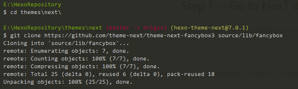
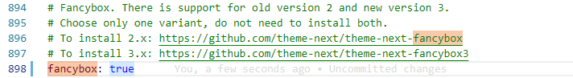
9. 压缩代码，使用`all_minifier`，具体参考[官方文档](https://github.com/chenzhutian/hexo-all-minifier)
>- 在HexoRepository/  目录下执行：`npm install hexo-all-minifier --save`  
>- 在next目录下的_config.yml文件中添加 `all_minifier: true`  
>- 使用 `hexo g` 生成静态代码时就会自动压缩了！
## 六、本地预览Hexo
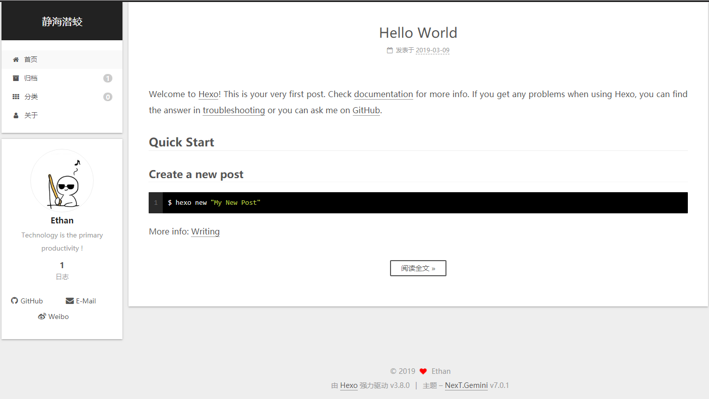
## 七、 上传到github仓库
1. 生成静态文件：`hexo generate`
2. 上传到github：`hexo deploy`
## 八、常用命令
```yml
# 常见命令
hexo new "postName" #新建文章
hexo new page "pageName" #新建页面
hexo generate #生成静态页面至public目录
hexo server #开启预览访问端口（默认端口4000，'ctrl + c'关闭server）
hexo deploy #部署到GitHub
hexo help  # 查看帮助
hexo version  #查看Hexo的版本

# 缩写
hexo n == hexo new
hexo g == hexo generate
hexo s == hexo server
hexo d == hexo deploy

# 组合命令
hexo s -g #生成并本地预览
hexo d -g #生成并上传
```
