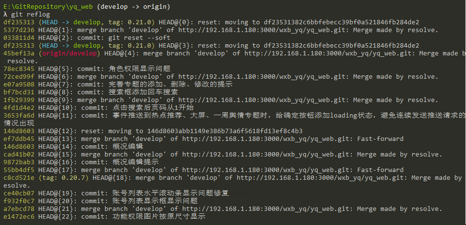
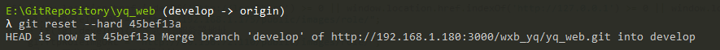

# git命令回滚到指定commit位置

回滚到指定版本，接下来会有两种情况：  
1. 由于操作失误，自己的错误代码把别人提交的代码覆盖掉了，需要回滚版本，然后强推当前分区内容到远程服务器：
```git 
# 查看git提交记录
git log

# 版本回滚到指定commit位置，使用--hard会丢弃指定commit_id以后的修改
git reset --hard commit_id

# 强推将当前分区内容推送到远程服务器
git push origin HEAD --force
```

2. 因为线上版本有问题，现在的develop分支上已经合并了待测试的新功能，所以不能直接在现有版本上重新打包，需要回滚到最近上线时的版本，重新打包后还要回到最新版：
```git
# 查看最近的git提交记录，包含reset记录
git reflog

# 回到回退前的最新版
git reset --hard commit_id
```
`git reflog`
  

`git reset --hard`
