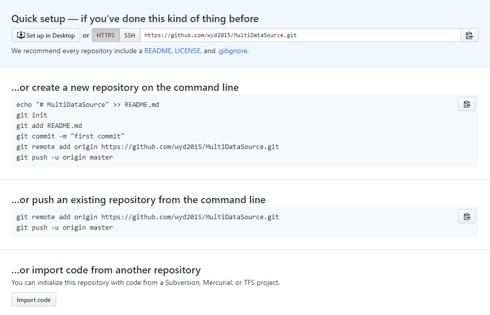
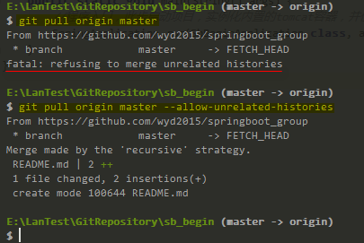

# 上传本地项目到github

**步骤如下**：
```bash
1. git init     #初始化 git LocalRepository
2. git add .    #添加项目到 LocalRepository
3. git status   #查看git状态
4. git commit -m "msg"  #提交代码到本地仓库，msg表示提交时的描述信息
5. git remote add origin https://github.com/... #与github远程仓库建立连接
6. git pull origin master       #与远程仓库的代码进行合并
7. git push -u origin master    #推送本地仓库的代码到github远程仓库
```



在执行第6步时出错：
>E:\LanTest\GitRepository\sb_begin (master -> origin)
>$ git pull origin master
>From https://github.com/wyd2015/springboot_group
> \* branch            master     -> FETCH_HEAD
>`fatal: refusing to merge unrelated histories`

**出错原因**:
远程仓库和本地的仓库没有一个共同的`commit标识符`，Git不让提交，git认为使用者写错了代码来源（`origin`），如果使用者确定是这个origin，可以在`git pull origin master`后面添加`--allow-unrelated-histories`，告诉git，此次的`commit标识符`由使用者自己确定。

**解决办法**:
使用下面的命令进行pull操作：
`git pull origin master --allow-unrelated-histories`
