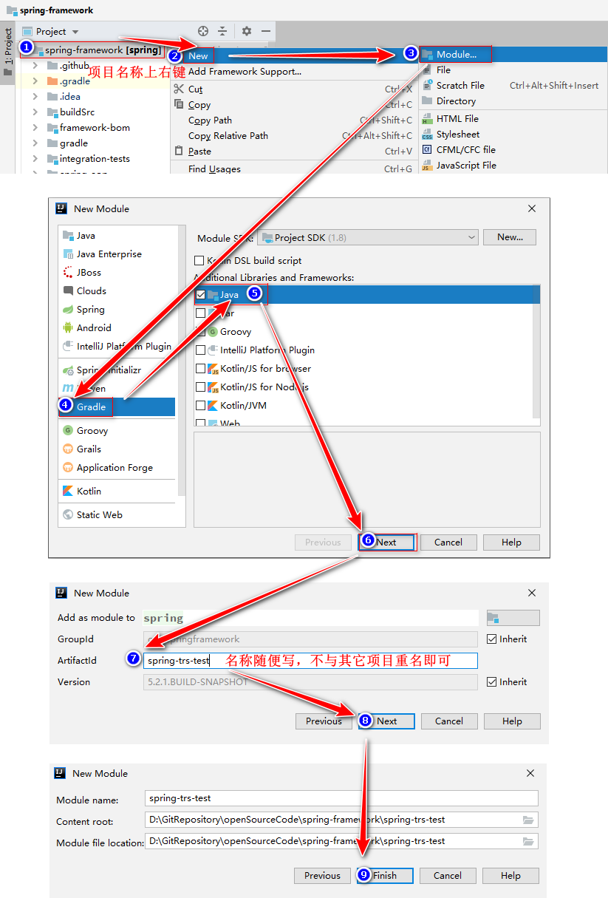
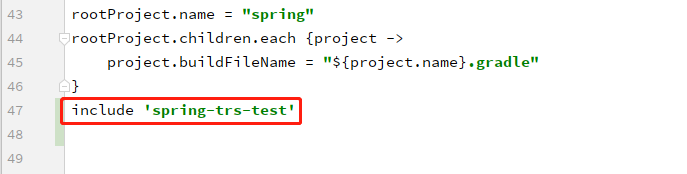

# IDEA中为spring源码创建一个gradle测试模块
### 1. 按图中步骤创建一个子模块；

在spring源码根目录的`setting.gradle`文件末尾已自动添加刚才创建的子模块名称  

参考资料：[Spring源码阅读之在spring源码中创建一个gradle测试模块](https://blog.csdn.net/u010999809/article/details/94293328)