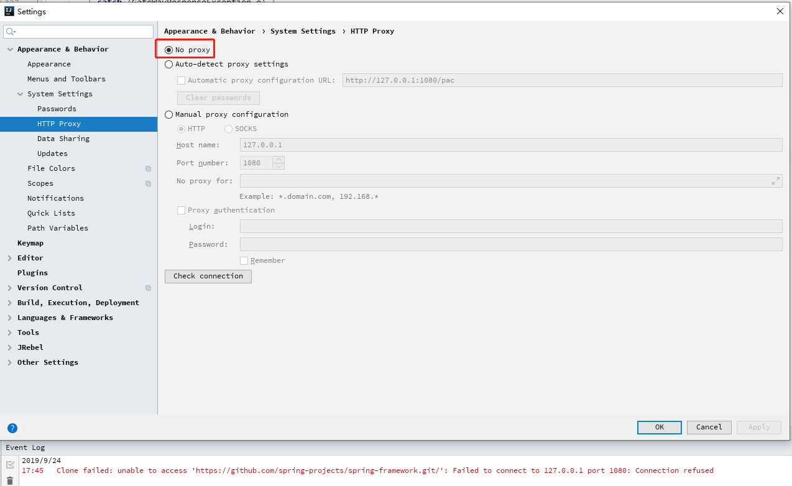
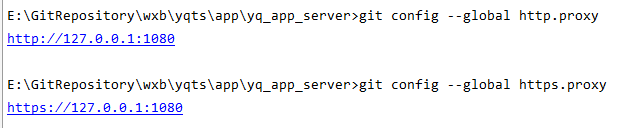

新一轮的封网管控导致配置的SSR失效后，在退出SSR后，IDEA的git相关功能：clone、pull、push都不可用了，报错如下。

git clone 出错：
```yml
Clone failed: unable to access 'https://github.com/spring-projects/spring-framework.git/': Failed to connect to 127.0.0.1 port 1080: Connection refused
```

在设置界面设置不用代理不生效，依然报错：


## 百度查到是因为设置了git全局配置的原因
命令行输入以下两个命令：
```yml
git config --global http.proxy
git config --global https.proxy
```

命令显示如下结果



## 解决办法
去除git的全局代理配置
```yml
git config --global --unset http.proxy
git config --global --unset https.proxy
```