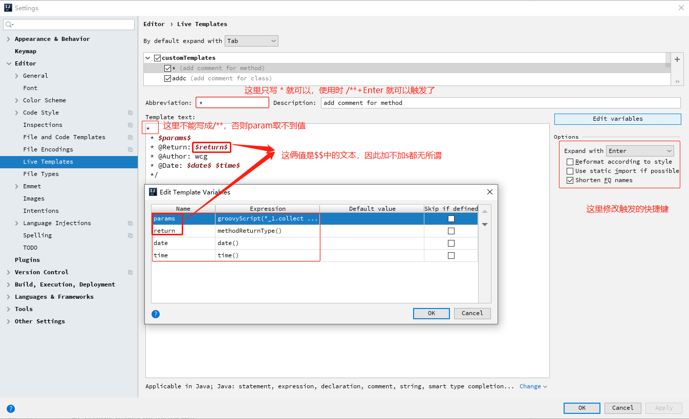
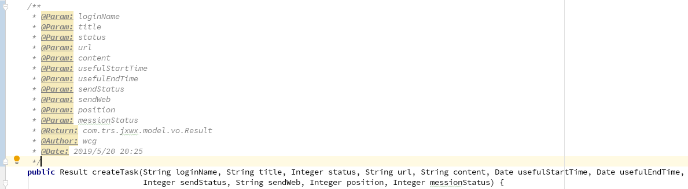

# idea2019设置Java类方法注释
目前所能搜索到的设置param的groovyScript脚本千篇一律，不够简洁，设置的方法也只是简单的复制粘贴，我在尝试修改param不为空的情况下走了好多弯路。。。

这里只贴出使用到的 groovyScript脚本代码：  
```js
groovyScript("_1.collect { '@Param: ' + it}.join('\\n * ') + ''", methodParameters())
```


最终效果：  
