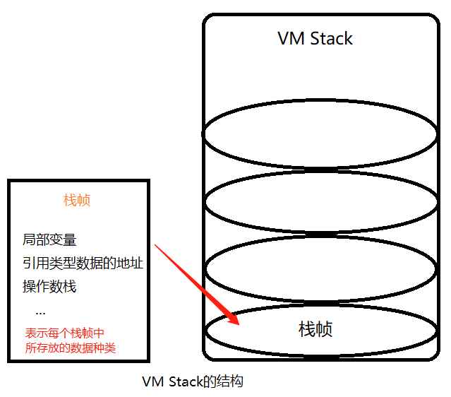
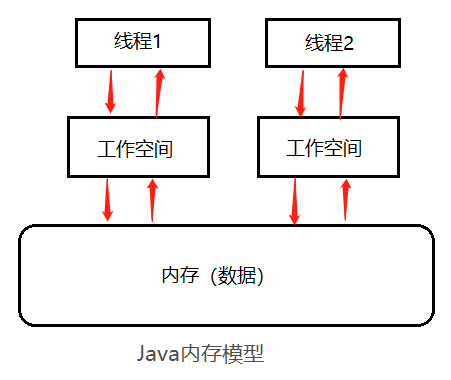
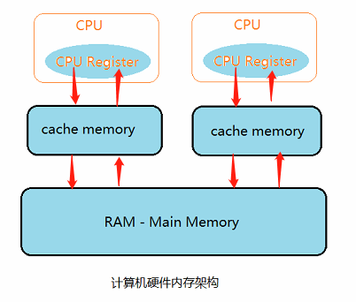
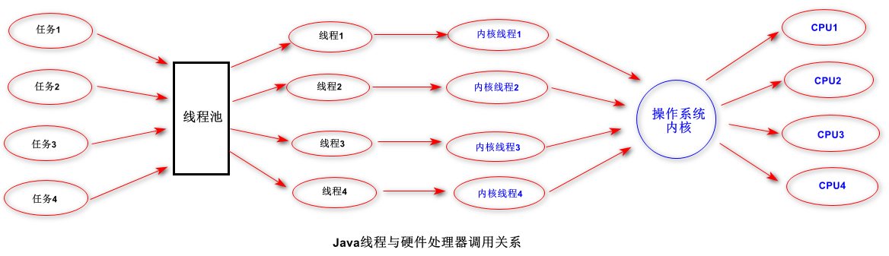
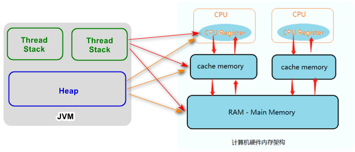

主要内容：
- 线程与JVM
- Java内存区域与Java内存模型的区别
- 硬件内存架构与Java内存模型
- Java内存模型与并发特征的保证
# 1. 基本概念
- **程序**：完成某件任务的代码序列（静态）
- **进程**：程序在某些数据上的一次运行（动态）
- **线程**：一个进程可能包含一个或多个线程（是占用资源的独立单位）
# 2. JVM与线程
JVM何时启动？
>当一个类被调用时，会先启动JVM线程，然后再由这个JVM线程负责创建其他的线程（包含main线程）。

那线程在JVM中是如何运行的呢？

这里就需要先明确下Java内存区域的概念了。
# 3. JVM内存区域
首先说明，JVM内存区域并不是从实际物理内存上划分出来的区域，只是一种从逻辑上抽象出来的虚拟区域。

  

在这种抽象区域里，  
- **方法区**：主要存放`类信息`、`常量`、`static变量`、`JIT` （信息共享）；
- **Java堆区**：主要存放`实例对象`、`GC`  （信息共享）；
- **VM Stack**：Java方法在运行时的内存模型；

- **Program Counter**：程序计数器，属于线程的私有数据，保存的是线程待执行的下一条指令的地址；
- **Native Method Stack**：本地方法栈，与JVM的native method有关。
# 4. Java内存模型——JMM（规范）
JVM内存区域与JMM并不是同一个概念，
- JMM 是一种规范，一种抽象出来的模型；
- JVM内存区域是根据JMM划分出来的一种虚拟结构。  

## 4.1 主内存：存放`共享信息`；
## 4.2 工作内存/工作空间：存放`私有信息`
- 基本类型数据：直接分配到工作空间；
- 引用类型变量的地址存放在工作空间，而引用的对象存放在堆中
## 4.3 工作方式：
- 线程修改`私有数据`，直接在工作空间修改；
- 线程修改`共享数据`，有可能引起线程不安全问题，需要先把数据复制到工作空间，在工作空间修改完后，再刷新到内存。
>线程1修改共享数据时，将该数据（x=1）先复制到工作空间中，在线程1的工作空间中将x值加1变成2，
如果此时（线程1还未将x的新值刷新到内存中）线程2恰好来读x的值，那么线程2复制到它的工作空间中的值仍然是1，
此时就出现了线程不安全的问题——脏读。

为了避免出现这种脏读问题，

# 5. 硬件内存架构与Java内存模型
## 5.1 硬件架构

>当一个CPU需要访问主存时，会先读取一部分主存数据存储到CPU缓存，进而在读取CPU缓存到寄存器。
当CPU需要写数据到主存时，同样需要先将寄存器数据flush到CPU缓存，然后再在某些节点将缓存数据flush到主存。
这种硬件架构和运行流程会由于`并发处理不同步`而引起`缓存一致性`问题：

**解决方案：**  
- 总线加锁：粗粒度控制，会降低CPU的吞吐量；
- 缓存一致性协议（MESI）：当CPU在cache memory中操作数据时，如果该数据是共享变量，数据在cache读到寄存器中进行修改，并更新内存数据；
此时会使用`cache line（信号线）`将其它CPU缓存中的数据置为无效，其他CPU就会从主存中去读取数据。

## 5.2 Java线程与硬件处理器

## 5.3 Java内存模型与硬件内存架构的关系
由于Java内存模型和硬件内存架构并不一致，硬件内存架构中并没有区分栈和堆；从硬件上看，不管是栈还是堆，
大部分数据都会存到主存中，当然一部分堆和栈的数据也可能被存到CPU寄存器中。Java内存模型与硬件内存模型是一个交叉关系。  

当对象和变量存储到计算机的各个内存区域时，必然会面临一些问题，其中最主要的两个问题是：  
### 5.3.1. 共享对象对各个线程的可见性
当多线程同时操作一个共享对象时，如果没有合理的使用`volatile`和`synchronization`关键字，一个线程对共享对象的
更新可能对其他线程不可见。
>共享对象存储在主存中，一个CPU中的线程读取主存数据到CPU缓存，然后对共享对象做了更改，但CPU缓存中的更改后的对象还未flush到主存，此时线程对共享对象的更改对其他CPU中的线程是不可见的。如果这时另一个CPU的线程读取该共享对象（未更改）到它自己的CPU缓存中进行操作，势必会引起数据的不一致问题。

要解决共享对象可见性问题，可以使用`volatile`关键字来修饰对象或变量。  
>`volatile`可保证变量直接从主存读取，而对变量的更新也会直接写到主存中。  
`volatile`原理是基于CPU内存屏障指令实现的。

### 5.3.2. 多个线程对共享对象的竞争
如果多个线程共享一个对象，若它们同时修改这个共享对象，就会产生竞争现象。
>线程A和线程B共享一个对象obj，假设线程A从主存读到obj.count变量到自己的CPU缓存，同时线程B也读取流obj.count的值到它自己的CPU缓存中，现在线程A和B都对obj.count做加1的操作。此时，obj.count加1操作在两个线程各自的CPU缓存中被执行了2次。  
如果这两次操作是串行执行的，那么obj.count变量会在原始值基础上再加2；  
但如果这两次操作是并行执行的，不管线程A、B谁先flush计算结果到主存中最终主存中的Obj.count变量的值只会在原来的基础上加1，而不是加2。

要解决共享对象竞争问题，可以使用`synchronization`关键字来修饰代码块。  
>synchronization代码块可以保证同一时刻只能有一个线程操作共享对象；  
synchronization代码块也可保证代码块中的所有变量都会从主存中读取，当线程退出代码块时，对所有变量的更新将会flush到主存，不管这些变量是不是volatile类型的。

## 5.4 支撑Java内存模型的基础原理
### 5.4.1 指令重排序
在执行程序时，为了提高性能，编译器和处理器会对指令做重排序。但是JMM确保在不同的编译器和不同的处理器平台上，
通过插入特定类型的`Memory Barrier`来禁止特定类型的编译器和处理器进行重排序的操作，为上一层提供一致的内存可见性保证。
- 编译器优化重排序：编译器在不改变单线程程序语义的前提下，可以重新安排语句的执行顺序；
- 指令集并行重排序：如果不存在数据依赖性，处理器可以改变语句对应机器指令的执行顺序；
- 内存系统的重排序：处理器使用缓存和读写缓冲区，使得加载和存储操作看上去可能是在乱序中进行。

### 5.4.2 数据依赖性
如果两个操作访问同一个变量，其中一个为写操作，此时这两个操作之间存在数据依赖性；  
编译器和处理器不会改变存在数据依赖关系的两个操作的执行顺序，即不会重排序。

### 5.4.3 as-if-serial
不管如何重排序，单线程下的执行结果不能被改变； 
编译器、Runtime和处理器都必须遵守`as-if-serial`语义。

### 5.4.4 Memory Barrier——内存屏障
内存屏障，又称内存栅栏，是一个CPU指令，它的作用是：
- 保证特定操作的执行顺序；
- 影响某些数据（或者某条指令的执行结果）的内存可见性。

内存屏障所做的另一件事是`强制flush出各种CPU Cache`。如一个`Write-Barrier`（写入屏障）将刷出所有在Barrier`之前写入`cache的数据。因此，任何CPU上的线程都能读取到这些数据的最新版本。

如果一个变量被`volatile`修饰，JMM会在写入这个字段之后插进一个`Write-Barrier`指令，
并在读取这个字段之前插入一个`Read-Barrier`指令。这意味着，如果写入一个`volatile`变量，就可以保证：
- 一个线程写入变量a后，任何线程访问该变量都会拿到最新值；
- 在写入变量a之前的写入操作，其更新的数据对于其他线程是可见的。因为`Memory Barrier`会强制flush缓存中所有先前的写入结果。

### 5.4.5 happens-before
从jdk1.5开始，Java使用新的`JSR-133`内存模型，基于`happens-before`的概念来阐述操作之间的可见性。
- 程序顺序规则：一个线程中的每个操作，happens-before于该线程中任意的后续操作；
- 监视器锁规则：对一个锁的解锁操作，happens-before于随后对这个锁的加锁操作；
- volatile域规则：对一个volatile域的写操作，happens-before于任意线程后续对这个volatile域的读操作；
- 传递性规则：如果A happens-before B，且B happens-before C，那么 A happens-before C。

[【注意】：]()  
两个操作之间具有`happens-before`关系，并不意味着前一个操作必须要在后一个操作之前执行！！
仅要求前一个操作的执行结果对于后一个操作是可见的，且前一个操作按顺序排在后一个操作之前。

在jvm中，如果一个操作执行的结果需要对另一个操作可见，那么这两个操作之间必需要存在`happens-before`的关系，这样的两个操作既可以在同一个线程，也可以在2个不同的线程中。

[【参考资料】]()：  
- [全面理解Java内存模型](https://blog.csdn.net/suifeng3051/article/details/52611310)
- [深入理解 Java 内存模型（一）——基础](https://infoq.cn/article/java-memory-model-1)