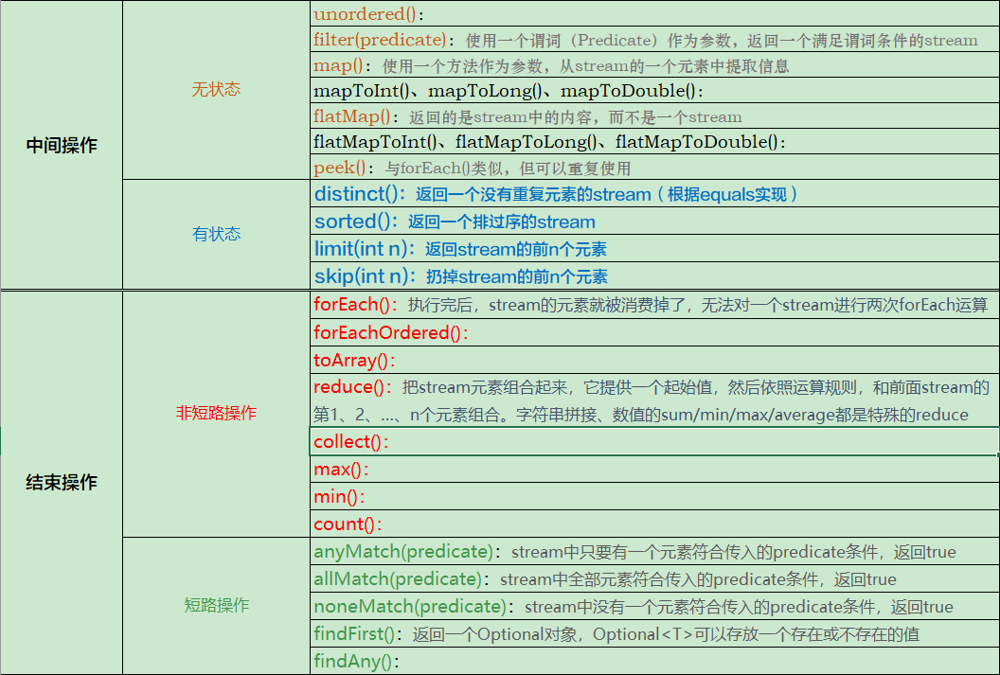

# 流的创建
1. 由Collection、数组生成：
```java
Collection.stream();
Collection.paralleStream();

String[] guns = "AK47,M24,98k,M4a1".split(",");
Stream stream = Stream.of(guns);
Stream stream = Arrays.stream(guns);
Stream stream = Arrays.asList(guns).stream();

Stream stream = Stream.of("a","b","c","d");
```
2. 由BufferedReader生成
```java
//从文件查找某个单词
File.lines(Path.get("d:\11.text"))
    .map(line -> line.split("\\s+"))  // Stream<String[]>
    .flatMap(Arrays::stream)  //Stream<String>
    .distinct() //Stream<String>
    .forEach(System.out::println);

java.io.BufferedReader.lines();
```
3. 从静态工厂：
```java
IntStream.range();
File.walk();
```
4. 自己构建
```java
java.util.Spliterator
```
5. 其它
```java
Random.ints();
BitSet.stream();
Pattern.splitAsStream(CharSequence sequence);
JarFile.stream();
```
# stream常见操作
- 中间操作（Intermediate Operation）：一个流后可以跟0或多个intermediate操作，其目的主要是打开流，做出某种程度的数据过滤、映射等操作，然后返回一个新的流，交给下一个操作使用。这类操作都是惰性化的，也就是说，仅仅调用了这类方法，但并没有开始执行。  
>中间操作可分为两种类型：
>- 无状态操作：不需要知道集合中其它元素的状态，每个元素之间是相互独立的，比如map(), filter()等操作 ；
>- 有状态操作：需要知道集合中其他元素的状态才能进行，比如sort()、distinct()等。

- 终止操作（Terminal Operation）：一个流只能有一个terminal操作，当这个操作执行后，流就无法再被操作。此操作开始执行后，才会真正开始流的遍历，并最终生成一个结果。
>终止操作可分为两种类型：
>- 短路操作：不需要处理完所有元素即可结束整个过程；
>- 非短路操作：非短路操作是需要处理完所有元素后才能结束整个过程。

