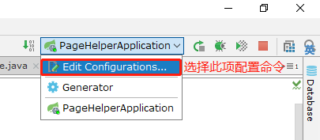
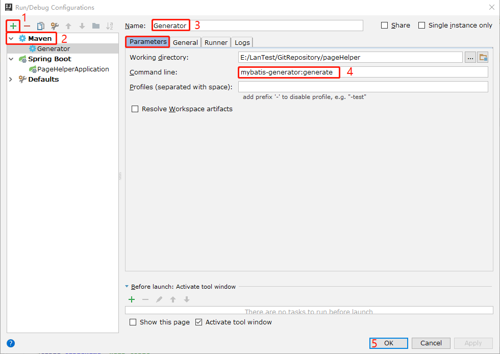
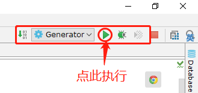

# SprinBoot2.0整合Mybatis
1. 引入相关依赖：
`pom.xml`
```xml
<dependency>
    <groupId>org.springframework.boot</groupId>
    <artifactId>spring-boot-starter-web</artifactId>
</dependency>
<dependency>
    <groupId>org.springframework.boot</groupId>
    <artifactId>spring-boot-starter-test</artifactId>
    <scope>test</scope>
</dependency>
<!-- mybatis-springboot -->
<dependency>
    <groupId>org.mybatis.spring.boot</groupId>
    <artifactId>mybatis-spring-boot-starter</artifactId>
    <version>1.3.2</version>
</dependency>
<!-- mysql -->
<dependency>
    <groupId>mysql</groupId>
    <artifactId>mysql-connector-java</artifactId>
</dependency>
<!-- mybatis-generator逆向工程 -->
<dependency>
    <groupId>org.mybatis.generator</groupId>
    <artifactId>mybatis-generator-core</artifactId>
    <version>1.3.2</version>
</dependency>
```
2. 配置数据库连接：`application.properties` 
```yml
# 数据库连接配置
spring.datasource.url=jdbc:mysql://localhost:3306/mysql?useUnicode=true&characterEncoding=utf8&useSSL=false&autoReconnect=true&allowMultiQueries=true
spring.datasource.username=root
spring.datasource.password=111111
spring.datasource.driver-class-name=com.mysql.jdbc.Driver
```
3. mybatis逆向生成代码配置：`generatorConfig.xml`  
```xml
<?xml version="1.0" encoding="UTF-8" ?>
<!DOCTYPE generatorConfiguration PUBLIC "-//mybatis.org//DTD MyBatis Generator Configuration 1.0//EN" "http://mybatis.org/dtd/mybatis-generator-config_1_0.dtd" >

<generatorConfiguration>
    <!-- 配置mysql 驱动jar包路径.用了绝对路径 -->
    <classPathEntry location="E:\LanTest\GitRepository\pageHelper\src\main\resources\generator\mysql-connector-java-5.1.43.jar"/>

    <context id="myContent" targetRuntime="MyBatis3">
        <!-- 防止生成的代码中有很多注释，加入下面的配置控制 -->
        <commentGenerator>
            <property name="suppressAllComments" value="true" />
            <property name="suppressDate" value="true" />
        </commentGenerator>

        <!-- 数据库连接 -->
        <jdbcConnection driverClass="com.mysql.jdbc.Driver"
                        connectionURL="jdbc:mysql://localhost:3306/mysql"
                        userId="root" password="111111">
        </jdbcConnection>

        <javaTypeResolver >
            <property name="forceBigDecimals" value="false" />
        </javaTypeResolver>

        <!-- 数据表对应的model层  -->
        <javaModelGenerator targetPackage="com.ethan.pagehelper.model.po" targetProject="src\main\java">
            <property name="enableSubPackages" value="true" />
            <property name="trimStrings" value="false" />
        </javaModelGenerator>

        <!-- sql mapper 映射配置文件 -->
        <sqlMapGenerator targetPackage="mapper" targetProject="src\main\java">
            <property name="enableSubPackages" value="true" />
        </sqlMapGenerator>

        <!-- mybatis3中的mapper接口 -->
        <javaClientGenerator type="XMLMAPPER" targetPackage="com.ethan.pagehelper.dao"  targetProject="src\main\java">
            <property name="enableSubPackages" value="true" />
        </javaClientGenerator>

        <!-- 数据表进行生成操作 schema:相当于库名; tableName:表名; domainObjectName:对应的DO -->
        <table tableName="help_topic"
               enableCountByExample="true" enableUpdateByExample="true"
               enableDeleteByExample="true" enableSelectByExample="true"
               selectByExampleQueryId="true">
        </table>
    </context>
</generatorConfiguration>
```
5. 执行逆向命令：  
此处只适用于`IDEA`编译器：  




6. 添加相应的Controller和Service类：  
`Controller`
```java
package com.ethan.pagehelper.controller;
import com.ethan.pagehelper.service.HelpTopicService;
import org.springframework.beans.factory.annotation.Autowired;
import org.springframework.web.bind.annotation.GetMapping;
import org.springframework.web.bind.annotation.RequestMapping;
import org.springframework.web.bind.annotation.RestController;
import java.util.Map;

@RestController
@RequestMapping("/helpTopic")
public class HelpTopicController {

    @Autowired
    private HelpTopicService helpTopicService;

    @GetMapping("/list")
    public Map<String, Object> list(int pageNo, int pageSize){
        return helpTopicService.listHelpTopics(pageNo, pageSize);
    }
}
```
`Service`
```java
package com.ethan.pagehelper.service;

import com.ethan.pagehelper.dao.HelpTopicMapper;
import com.ethan.pagehelper.model.po.HelpTopic;
import com.ethan.pagehelper.model.po.HelpTopicExample;
import com.github.pagehelper.PageHelper;
import com.github.pagehelper.PageInfo;
import org.springframework.beans.factory.annotation.Autowired;
import org.springframework.stereotype.Service;

import java.util.HashMap;
import java.util.List;
import java.util.Map;

@Service
public class HelpTopicService {
    @Autowired
    private HelpTopicMapper helpTopicMapper;

    public Map<String, Object> listHelpTopics(int pageNo, int pageSize){
        Map<String, Object> map = new HashMap<String, Object>();
        PageHelper.startPage(pageNo, pageSize, true);
        List<HelpTopic> list = helpTopicMapper.selectByExample(new HelpTopicExample());
        //List<HelpTopic> list = helpTopicMapper.findHelpTopics();
        PageInfo<HelpTopic> pageInfo = new PageInfo<>(list);
        long total = pageInfo.getTotal();
        map.put("list", list);
        map.put("count", total);
        return map;
    }
}
```
7. SpringBootApplication.java启动类上添加@MapperScan注解，配置包扫描路径。  
```java
package com.ethan.pagehelper;

import org.mybatis.spring.annotation.MapperScan;
import org.springframework.boot.SpringApplication;
import org.springframework.boot.autoconfigure.SpringBootApplication;

@SpringBootApplication
@MapperScan("com.ethan.pagehelper.dao")
public class PageHelperApplication {
	public static void main(String[] args) {
		SpringApplication.run(PageHelperApplication.class, args);
	}
}
```

按以上步骤可以正常启动项目，但在处理get请求时出错：  
```yml
org.apache.ibatis.binding.BindingException: Invalid bound statement (not found): com.ethan.pagehelper.dao.HelpTopicMapper.selectByExample
	at org.apache.ibatis.binding.MapperMethod$SqlCommand.<init>(MapperMethod.java:227) ~[mybatis-3.4.6.jar:3.4.6]
	at org.apache.ibatis.binding.MapperMethod.<init>(MapperMethod.java:49) ~[mybatis-3.4.6.jar:3.4.6]
	at org.apache.ibatis.binding.MapperProxy.cachedMapperMethod(MapperProxy.java:65) ~[mybatis-3.4.6.jar:3.4.6]
	at org.apache.ibatis.binding.MapperProxy.invoke(MapperProxy.java:58) ~[mybatis-3.4.6.jar:3.4.6]
	at com.sun.proxy.$Proxy62.selectByExample(Unknown Source) ~[na:na]
	at com.ethan.pagehelper.service.HelpTopicService.listHelpTopics(HelpTopicService.java:23) ~[classes/:na]
	at com.ethan.pagehelper.controller.HelpTopicController.list(HelpTopicController.java:20) ~[classes/:na]
```
这里需要注意一个问题：  
>springboot默认只识别（扫描）java/路径下的 `*.java` 文件，也即默认情况下无法扫描到位于的 `src/main/java/` 路径下的 `*Mapper.xml`文件。正确的方式是将 `*Mapper.xml` 映射文件放到 `resource/` 路径下。  

上述错误就是因为找不到 `*Mapper.xml` 文件的位置导致的！  

## 解决此问题有两种方式：  
- 将mapper文件夹放到src/resource路径下。在 `generatorConfig.xml` 文件中，将生成的 `*Mapper.xml` 文件放在 `src/main/resource`下；
```xml
<!-- sql mapper 映射配置文件 -->
<sqlMapGenerator targetPackage="mapper"  targetProject="src\main\resources">
    <property name="enableSubPackages" value="true" />
</sqlMapGenerator>
```
并在 `application.properties` 中添加配置：
```yml
# 配置mapper文件扫描路径
mybatis.mapper-locations=classpath:mapper/*.xml
```


- 依旧将mapper文件夹放到 `src/main/java/`路径下，但需要在 `application.properties` 中添加配置：  
```yml
# 配置mapper文件扫描路径
mybatis.mapper-locations=classpath:com/ethan/pagehelper/mapper/*.xml
```
在 `pom.xml` 文件中添加路径配置：  
```xml
<build>
    <resources>
        <resource>
            <directory>src/main/resources</directory>
        </resource>
        <resource>
            <directory>src/main/java</directory>
            <includes>
                <include>**/*.xml</include>
            </includes>
            <filtering>true</filtering>
        </resource>
    </resources>
    <plugins>
        <plugin>
            <groupId>org.springframework.boot</groupId>
            <artifactId>spring-boot-maven-plugin</artifactId>
        </plugin>
    </plugins>
</build>
```