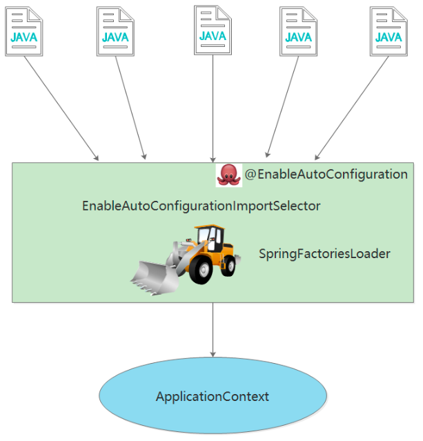

# SpringBoot、SpringCloud、SpringMVC
**1. 定义**：
1. 快速开发框架；
2. 帮助快速整合第三方常用框架；
3. 采用注解方式来简化xml配置；
4. 最终以Java应用程序的方式来执行。

**2. 原理**：  
1. 底层依靠Maven继承的方式实现；  
2. 完全采用注解，Spring3.0后采用注解方式启动SpringMVC；  
3. 内置Http服务器，通过Java命令创建并启动tomcat。

**3. 微服务**：  
1. 一种轻量级RPC远程通讯技术，采用Http+Json（Restful）；  
2. 服务治理；
3. SpringCloud依赖于SpringBoot实现微服务，内部使用SpringMVC编写微服务接口。

**4. SpringMVC**：  
1. SpringBoot的web组件集成SpringMVC框架；


**pom.xml**:  
 ```xml
<!-- 整合了第三方常用框架的依赖信息 -->
<parent>
    <groupId>org.springframework.boot</groupId>
    <artifactId>spring-boot-starter-parent</artifactId>
    <version>2.0.4.RELEASE</version>
    <relativePath>
</parent>

<dependencies>
    <!-- spring-boot-starter-web 整合了SpringMVC，实现方式：Maven的依赖继承。
        相当于把第三方常用的依赖框架在parent项目中事先封装好，再使用springboot提供的依赖信息，关联整合的jar包-->
    <dependency>
        <groupId>org.springframework.boot</groupId>
        <artifactId>spring-boot-starter-web</artifactId>
        <!-- 这里不写版本号，是因为在parent中已经把版本信息封装进去了 -->
    </dependency>
</dependencies>
 ```

**启动类注解**：  
1. 使用`@EnableAutoConfiguration + @ComponentScan("com....")`组合的方式，对指定的控制器包路径进行扫描，如果多个`Controller`分别在3个或3个以上的包路径下，则`basePackages`就需要写很长一串，写起来不方便。
```java
@EnableAutoConfiguration
@ComponentScan(basePackages = {"com.ethan.user.controller", "com.ethan.role.controller"})
public class App(){
    public static void main(String[] args){
        //程序入口，启动springboot项目，创建内置tomcat容器，使用tomcat加载springMVC，注解启动类
        SpringApplication.run(App.class, args);
    }
}
```

2. 直接使用`@SpringBootApplication`注解，等同于`@EnableAutoConfiguration + @ComponentScan("com....")`，但使用`@SpringBootApplication`注解不用在额外指定controller所在路径，它默认扫描该类所在的同级包（包含子包）。
>可通过basePackages等属性来细粒度定制@ComponentScan自动扫描范围，如果不指定，默认Spring框架会从声明@ComponentScan的类所在的package进行扫描。因此，SpringBoot的启动类最好放在root package下。
```java
@SpringBootApplication
public class App(){
    public static void main(String[] args){
        SpringApplication.run(App.class, args);
    }
}
```

3. `@EnableAutoConfiguration`，借助@Import支持，收集和注册特定场景相关的bean定义，将所有符合自动配置条件的bean定义加载到IOC容器。  
借助`@EnableAutoConfigurationImportSelector`，@EnableAutoConfiguration可以帮助SpringBoot应用将所有符合条件的@Configuration配置都加载到当前SpringBoot创建并使用的IOC容器。  
借助Spring框架原有的一个工具类：`SpringFactoriesLoader`的支持，@EnableAutoConfiguration可以智能的自动进行配置。  
```java
@Target(ElementType.TYPE)
@Retention(RetentionPolicy.RUNTIME)
@Documented
@Inherited
@AutoConfigurationPackage
@Import(AutoConfigurationImportSelector.class)
public @interface EnableAutoConfiguration {}
```

  

@EnableAutoConfiguration得以生效的关键组件图：  

在`spring-boot-autoconfigure-1.5.2.RELEASE.jar`中，@EnableAutoConfiguration自动配置过程：  
>从classpath中搜寻所有的 `META-INF/spring.factories` 配置文件，并将其中的 `org.springframework.boot.autoconfiguration.EnableAutoConfiguration` 对应的配置项通过`反射`实例化为对应的标注了@Configuration的 `JavaConfig`形式的IOC容器配置类，然后汇总为一个加载到IOC容器中。