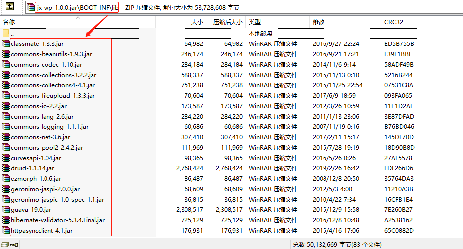

# 问题还原
由于项目引用的依赖比较多，打的包体积大概60M左右，由于生产环境对上传带宽进行了限制，
导致每次上传jar包都要20多分钟，因此需要减小最终打包的体积。

怎么减小体积呢？把项目的jar包提取出来就可以大幅度减小jar包体积，在执行jar包只需要
加一个参数：指定依赖jar包的位置即可。
`java -Dloader-path=/home/trs/libs -jar *.jar` 

# 具体实现：
1. pom.xml文件修改配置，导出所有依赖的jar包到/target下的指定目录里
```xml
<plugins>
  <!-- 使用命令：mvn dependency:copy-dependencies，复制项目依赖的jar包到 ./target/lib 目录下 -->
  <plugin>
      <artifactId>maven-dependency-plugin</artifactId>
      <configuration>
          <outputDirectory>${project.build.directory}/lib</outputDirectory><!--指定输出路径-->
          <excludeTransitive>false</excludeTransitive><!-- 是否排除间接依赖的包 -->
          <stripVersion>true</stripVersion><!--复制出来的jar文件去除版本信息-->
      </configuration>
  </plugin>
</plugins>
```
2. 在项目根目录下执行命令：`mvn dependency: copy-dependencies`，将所有依赖的jar包提取到/target/lib目录下；

3. 继续修改pom.xml文件里的<plugins>配置:
```xml
<!-- springboot打包模块 -->
<plugin>
  <groupId>org.springframework.boot</groupId>
  <artifactId>spring-boot-maven-plugin</artifactId>
  <configuration>
    <layout>ZIP</layout>
    <!--去除在生产环境中不变的依赖-->
    <excludeGroupIds>
      org.springframework,
      org.springframework.boot,
      org.springframework.data,
      org.springframework.session,
      org.apache.geronimo.components,
      org.apache.avalon.framework,
      org.apache.httpcomponents,
      org.apache.geronimo.specs,
      org.apache.tomcat.embed,
      org.apache.xmlgraphics,
      org.apache.xmlbeans,
      org.apache.commons,
      org.apache.tomcat,
      org.apache.xbean,
      org.apache.axis,
      org.apache.poi,
      org.mybatis.spring.boot,
      org.projectlombok,
      org.jboss.logging,
      org.hibernate,
      org.mybatis,
      org.docx4j,
      org.jfree,
      org.slf4j,
      org.antlr,
      org.jsoup,
      org.json,
      org.yaml,
      commons-collections,
      commons-fileupload,
      commons-beanutils,
      commons-discovery,
      commons-logging,
      commons-codec,
      commons-lang,
      commons-net,
      commons-io,
      com.fasterxml,
      com.github.virtuald,
      com.fasterxml.jackson,
      com.fasterxml.jackson.core,
      com.google.code.findbugs,
      com.google.code.gson,
      com.google.protobuf,
      com.google.guava,
      com.baidu.aip,
      com.sun.mail,
      com.alibaba,
      com.trs,
      javax.validation,
      ch.qos.logback,
      uk.org.lidalia,
      net.sf.ezmorph,
      net.sf.json-lib,
      net.arnx,
      bundle,
      mysql,
      axis,
      antlr,
      jdom,
      stax
    </excludeGroupIds>
  </configuration>
</plugin>
```

这里在添加 `excludeGroupIds` 的内容时，可以参考打好的包里 `/BOOT-INF/lib` 目录下
所出现的依赖jar包，但凡在这里出现的都应该提取出来，最终效果就是 /lib文件夹不存在。


如果添加号 `excludeGroupIds` 的内容后，可以打包试一下，看看`/BOOT-INF/lib`目录下
是否还存在jar包，有的话就把这个jar报的groupId添加到pom.xml文件中。


最终减肥后的jar包大小为 456Kb！！！+