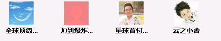

## 一、项目需求：
由于在线根据用户头像路径到服务器获取头像比较耗时、耗资源，决定建立一个微服务，单独处理图片请求。

1. 根据用户唯一标识，查询用户头像的相对路径；
2. 根据头像服务的协议头前缀+头像存储的相对路径拼接成一个完整的url；
3. 获取头像，将头像处理成字节流，放入缓存，每个人对应一个键值对，用户标识为键，头像的字节流（byte[]）为值。
4. 缓存有效时间10天，每次请求过来，先看缓存中是否存在，不存在的话再按前几步处理得到流，放入缓存。

## 二、初步实现
1. Controller层
```java
@GetMapping("/stream")
public void getAvatarStream(HttpServletResponse response,
  @RequestParam(value="gChKey", required=true) String gChKey){
  byte[] avatarStream = avatarService.getAvatarStream(gChKey);
  response.setContentType("multipart/form-data");
  ServletOutputStream outputStream = null;
  try {
    outputStream = response.getOutputStream();
    outputStream.write(avatarStream);
    outputStream.flush();
  } catch (IOException e) {
    log.error("用户头像IO异常：", e);
  } finally {
    try {
      outputStream.close();
    } catch (IOException e) {
      log.error("字节输出流关闭异常：", e);
    }
  }
}
```
2. Service层
```java
public byte[] getAvatarStream(String gChKey){
  byte[] imgByte = null;
  if(cacheService.exists(CACHE_KEY.TRS_CLOUD_AVATAR_CACHE_STREAM + gChKey)){
    return cacheService.getToObject(CACHE_KEY.TRS_CLOUD_AVATAR_CACHE_STREAM + gChKey, byte[].class);
  }
  
  List<String> gChKeyList = new ArrayList<String>(1);
  gChKeyList.add(gChKey);
  List<Map<String,String>> userMapList = getUserMapList(gChKeyList);
  if(ObjectUtil.isEmpty(userMapList)){
    return null;
  }
  
  Map<String, String> userMap = userMapList.get(0);
  String iconPath = userMap.get("iconPath");
  String imgPath = avatarURLPrefix + iconPath;
  imgByte = getAvatar(imgPath);
  cacheService.putToJson(CACHE_KEY.TRS_CLOUD_AVATAR_CACHE_STREAM + gChKey, imgByte, avatarTTL);//缓存时间10天
  return imgByte;
}

private byte[]  getAvatar(String avatarURL){
  byte[] byteImage = null;
  try {
    URL url = new URL(avatarURL);
    BufferedImage image = ImageIO.read(url);
    ByteArrayOutputStream baos = new ByteArrayOutputStream();
    ImageIO.write(image, "jpg", baos);
    byteImage = baos.toByteArray();
  } catch (MalformedURLException e) {
    log.error("初始化头像获取URL异常：", e);
  } catch (IOException e) {
    log.error("图片IO异常：", e);
  }
  return byteImage;
}
```

## 三、遇到的问题
这样处理虽然得到了头像，但有些灰色背景的头像背景色有一层红色的阴影（图中第二个）：  


正常显示应该是：  


网上查了一下，说是在使用 `ImageIO.read(url)`方法时，会丢失图片的 `ICC`信息，导致重写后的图片
上蒙上一层红色。然后按网上提供的解决方案使用JDK自带的`Toolkit.getDefaultToolkit().getImage(avatarURL)`进行处理：  
```java
private byte[]  getAvatar(String avatarURL){
  byte[] byteImage = null;
  try {
    Image src = Toolkit.getDefaultToolkit().getImage(avatarURL);
    BufferedImage image = toBufferedImage(src);
    ByteArrayOutputStream baos = new ByteArrayOutputStream();
    ImageIO.write(image, "jpg", baos);
    byteImage = baos.toByteArray();
  } catch (MalformedURLException e) {
    log.error("初始化头像获取URL异常：", e);
  } catch (IOException e) {
    log.error("图片IO异常：", e);
  }
  return byteImage;
}

private BufferedImage toBufferedImage(Image image) {
  if (image instanceof BufferedImage) {
    return (BufferedImage) image;
  }
  // This code ensures that all the pixels in the image are loaded
  image = new ImageIcon(image).getImage();
  BufferedImage imgBuff = null;
  GraphicsEnvironment ge = GraphicsEnvironment.getLocalGraphicsEnvironment();
  try {
    int transparency = Transparency.OPAQUE;
    GraphicsDevice gs = ge.getDefaultScreenDevice();
    GraphicsConfiguration gc = gs.getDefaultConfiguration();
    imgBuff = gc.createCompatibleImage(image.getWidth(null), image.getHeight(null), transparency);
  } catch (HeadlessException e) {
    // The system does not have a screen
    log.error("系统屏幕检测异常：", e);
  }
  if (imgBuff == null) {
    // Create a buffered image using the default color model
    int type = BufferedImage.TYPE_INT_RGB;
    imgBuff = new BufferedImage(image.getWidth(null), image.getHeight(null), type);
  }
  // Copy image to buffered image
  Graphics g = imgBuff.createGraphics();
  // Paint the image onto the buffered image
  g.drawImage(image, 0, 0, null);
  g.dispose();
  return imgBuff;
}
```

但这种处理方法依然有问题，报错如下：  
```yml
19-05-06 10:21:39.176 [http-nio-8020-exec-8] ERROR t.cloud.avatar.service.AvatarService-213 -系统屏幕检测异常：
java.awt.HeadlessException: null
  at sun.java2d.HeadlessGraphicsEnvironment.getDefaultScreenDevice(HeadlessGraphicsEnvironment.java:77)
  at trs.cloud.avatar.service.AvatarService.toBufferedImage(AvatarService.java:208)
  at trs.cloud.avatar.service.AvatarService.getAvatar(AvatarService.java:177)
  at trs.cloud.avatar.service.AvatarService.getAvatarStream(AvatarService.java:126)
  at trs.cloud.avatar.controller.AvatarController.getAvatarStream(AvatarController.java:62)
  at sun.reflect.NativeMethodAccessorImpl.invoke0(Native Method)
  at sun.reflect.NativeMethodAccessorImpl.invoke(NativeMethodAccessorImpl.java:62)
  at sun.reflect.DelegatingMethodAccessorImpl.invoke(DelegatingMethodAccessorImpl.java:43)
  at java.lang.reflect.Method.invoke(Method.java:483)
  at org.springframework.web.method.support.InvocableHandlerMethod.doInvoke(InvocableHandlerMethod.java:189)
  ...
19-05-06 10:21:39.177 [http-nio-8020-exec-8] ERROR t.c.c.handler.CommonExceptionHandler-38 -IllegalArgumentException:
java.lang.IllegalArgumentException: Width (-1) and height (-1) cannot be <= 0
  at java.awt.image.DirectColorModel.createCompatibleWritableRaster(DirectColorModel.java:1016)
  at java.awt.image.BufferedImage.<init>(BufferedImage.java:331)
  at trs.cloud.avatar.service.AvatarService.toBufferedImage(AvatarService.java:218)
  at trs.cloud.avatar.service.AvatarService.getAvatar(AvatarService.java:177)
  at trs.cloud.avatar.service.AvatarService.getAvatarStream(AvatarService.java:126)
  at trs.cloud.avatar.controller.AvatarController.getAvatarStream(AvatarController.java:62)
  at sun.reflect.NativeMethodAccessorImpl.invoke0(Native Method)
  at sun.reflect.NativeMethodAccessorImpl.invoke(NativeMethodAccessorImpl.java:62)
  at sun.reflect.DelegatingMethodAccessorImpl.invoke(DelegatingMethodAccessorImpl.java:43)
  at java.lang.reflect.Method.invoke(Method.java:483)
  at org.springframework.web.method.support.InvocableHandlerMethod.doInvoke(InvocableHandlerMethod.java:189)
```

这种报错的原因是，这种处理图片的方法在windows这种图形化界面的服务器上使用没问题，但作为生产环境的话，一般都是使用linux这种不带图形界面的系统，如果非要使用这种方法，网上的解决方案是[在服务器上安装软件](https://blog.csdn.net/hxy520882011/article/details/84060391)，这个操作不靠谱，我这个是微服务，如果多台机器调用，那就需要在每台调用机器上安装，因此这种方案行不通！

网上还有一种解决方案[使用JPEGCodec重绘图片](https://www.jianshu.com/p/b800296641dd)
```java
JPEGImageDecoder decoder = JPEGCodec.createJPEGDecoder(in);
retImage = decoder.decodeAsBufferedImage();
```
但在jdk7中， `JPEGCodec` 已被删除，在jdk8中无法使用，这种方案也是行不通。

## 最终解决方案 ##
```java
 URL url = new URL(avatarPath);
  // 把图片读到内存
  BufferedImage imgBuffer = ImageIO.read(url);
  // 重绘图片，以防图片背景变红
  BufferedImage image = new BufferedImage(imgBuffer.getWidth(), imgBuffer.getHeight(), BufferedImage.TYPE_INT_RGB);
  image.createGraphics().drawImage(imgBuffer, 0, 0, Color.WHITE, null);
  ByteArrayOutputStream baos = new ByteArrayOutputStream();
  // 处理重绘后的图片
  ImageIO.write(image, "jpg", baos);
  // 头像转成字节流
  imgByte = baos.toByteArray();
```
