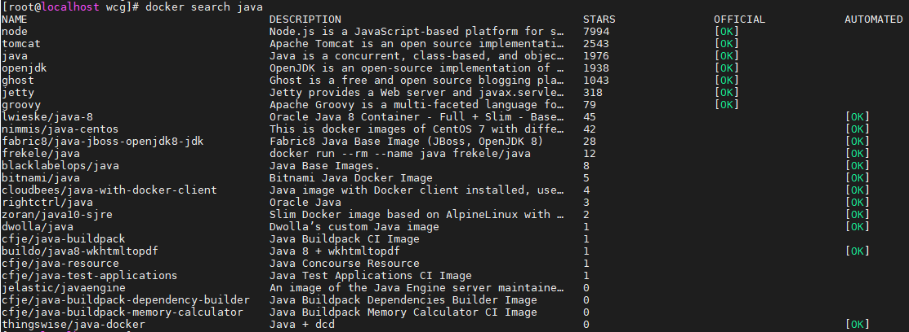
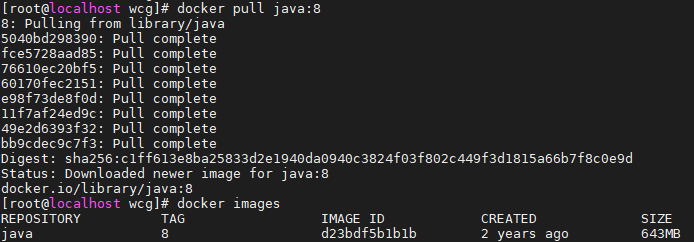
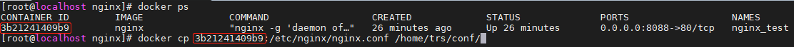

# Docker安装&环境配置
## 环境准备：
- win10下的vmvare虚拟机15
- centos7_1708

## 1. 虚拟机安装、激活

## 2. 虚拟机配置ip
- 虚拟机网络连接设置为`NAT模式`；
- 修改配置文件：`vi /etc/sysconfig/network-scripts/idcfg-ens33`，将最后一项的`ONBOOT=NO`改为`ONBOOT=yes`，保存；
- 重启网络配置：`systemctl restart network`
- 查看虚拟机ip：`ip a`，`ens33`项对应的`192.168.*.*`即为虚拟机IP；
- 使用SSH工具连接虚拟机

## 3. 安装docker
- 查看centos版本信息：`uname -r`，版本必须不小于`3.10.0`；
- 清理老版本docker，一般不需要这一步：
  ```bash
  yum remove docker docker-common docker-selinux docker-engine
  yum remove docker-ce
  rm -rf /var/lib/docker
  ```
- 安装依赖包
  ```bash
  #安装前可查看device-mapper-persistent-data和lvm2是否已经安装
  rpm -qa|grep device-mapper-persistent-data
  rpm -qa|grep lvm2

  # 如果已有device-mapper-persistent-data和lvm2，可不用执行这个命令
  yum install -y yum-utils device-mapper-persistent-data lvm2
  ```
- 设置yum源
  ```bash
  yum-config-manager --add-repo https://download.docker.com/linux/centos/docker-ce.repo
  ```
- 更新yum软件包索引
  ```bash
  yum makecache fast
  ```
- 安装最新版本docker
  ```bash
  yum install docker-ce -y

  #安装指定版本docker-ce可使用以下命令查看
  yum list docker-ce.x86_64 --showduplicates | sort -r

  # docker开机自启配置
  systemctl enable docker 

  # 安装完成之后可以使用命令查看
  docker version
  ```
## 4. 配置镜像加速
推荐使用阿里云的免费镜像加速服务，也可使用`时速云`、`网易云`等加速服务。
- 使用支付宝/淘宝账户登录阿里云[容器镜像服务](https://cr.console.aliyun.com/cn-hangzhou/instances/mirrors);
- 左侧菜单栏底部`镜像中心 → 镜像加速器`，找到对应账号的`加速器地址`，并按`操作文档`配置镜像加速器；

## 5. 配置docker
- 搜索java镜像：`docker search java`
- 
  

- 下载java8镜像：`docker pull java:8`
- 
  

- 下载`MySQL`镜像：`docker pull mysql`
  
- 部署mysql
  1. 创建需要挂在的目录`mkdir -p /home/trs/mysql/conf /home/trs/mysql/data /home/trs/mysql/logs`；
  2. 在/home/trs/mysql/conf/目录下新建文件`my.conf`，并添加内容：`character-set-server=utf8`；
  3. 启动MySQL：
      ```yml
      # 为了方便阅读，分行显示，实际输入时直接输
      docker run 
      --name mysql_test 
      -p 3309:3306 
      -v /home/trs/mysql/conf:/etc/mysql/mysql.conf.d/ 
      -v /home/trs/mysql/conf:data:/var/lib/mysql 
      -v /home/trs/mysql/conf:/logs 
      -e MYSQL_ROOT_PASSWORD=123456 
      -d 
      mysql

      # 可以简单点
      docker run --name mysql_test -p 3309:3306 -e MYSQL_ROOT_PASSWORD=123456 -d mysql
      ```
  4. 进入容器：`docker exec -it mysql_container_id(容器ID) bash`登录，或使用Navicat登录数据库；
   
- 下载`nginx`镜像：`docker pull nginx`
  
- 部署nginx
  1. 在宿主机中创建nginx目录，用于存放nginx配置相关的文件；
      ```yml
      mkdir -p /home/trs/nginx/www /home/trs/nginx/logs /home/trs/nginx/conf
      ```
      - **www** 目录将映射为nginx容器配置的虚拟目录；
      - **logs** 目录将映射为nginx容器的日志目录；
      - **conf** 目录里的配置文件将映射为nginx容器的配置文件，方便管理。


  2. 拷贝容器内的Nginx配置文件到宿主机的`/home/trs/nginx/conf`：
      ```yml
      # 查看容器中正在运行的服务，获取nginx运行时的容器ID
      docker ps 

      # 拷贝配置文件，这里的3b21241409b9是上一步的容器ID
      docker cp 3b21241409b9:/etc/nginx/nginx.conf /home/trs/conf/
      ```
      

  3. 部署nginx
      ```yml
        # 为了方便阅读，分行显示
        docker run \
        --name nginx_test \
        -p 8082:80 \
        -v /home/trs/nginx/www:/usr/share/nginx/html \
        -v /home/trs/nginx/conf/nginx.conf:/etc/nginx/nginx.conf \
        -v /home/trs/nginx/logs:/var/log/nginx \
        -d \
        nginx
      ```
   【命令说明】
   - `-p 8082:80`：将容器的80端口映射到宿主机的8082端口；
   - `--name nginx_test`：将容器命名为`nginx_test`；
   - `-v /home/trs/nginx/www:/usr/share/nginx/html`：将我们在宿主机中创建的`www`目录挂载到容器的`/usr/share/nginx/html`，此处的`html`是一个自建的html文件；
   - `-v /home/trs/nginx/conf/nginx.conf:/etc/nginx/nginx.conf`：将我们自己创建的 nginx.conf 挂载到容器的 /etc/nginx/nginx.conf；
   - `-v /home/trs/nginx/logs:/var/log/nginx`：将我们自己创建的 logs 挂载到容器的 /var/log/nginx；
   - `nginx`：最后的nginx指定nginx的镜像名。

  4. 在`/home/trs/nginx/www`目录下新建一个`index.html`文件，内容按照html标准写就行。
   
  5. 相关命令
      ```yml
      # 重新载入 NGINX
      docker kill -s HUP nginx_test

      # 重启 NGINX 容器
      docker restart nginx_test
      ```

## 6. 添加自定义镜像服务
