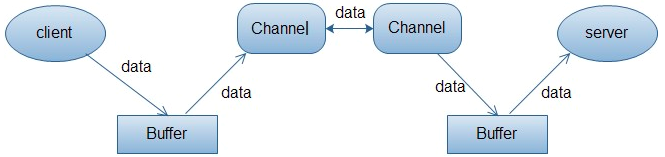

# Java NIO
[TOC]
## 1. Channel：通道。  
可类比于传统IO中读取一个文件的内容使用多个stream。
```Java
public class TestStream {
    @Test
    public void test(){
        File file = new File("README.md");
        //这里的InputStream就相当于为读取文件提供一个通道。
        InputStream is = new FileInputStream(file);
        byte[] buf = new byte[1024];
        is.read(buf);
        is.close();
    }
}
```
虽然可与传统IO中的stream进行类比，但Channel还是有很大区别的：  
- Stream是`单向`的，InputStream只能进行读操作，OutputStream只能进行写操作；
- Channel是`双向`的，既可以读，又可以写。

常用的几种通道：  
- `FileChannel`：使用FileChannel可以从文件读取数据，或向文件写入数据；
- `SocketChannel`：以TCP方式向网络连接的两端读、写数据；
- `ServerSocketChannel`：监听客户端发起的TCP连接，并为每个TCP连接创建一个新的SocketChannel进行数据的读写操作；
- `DatagramChannel`：以UDP协议来向网络连接的两端读写数据。

## 2. Buffer：缓冲区  
其实质是一个`容器`，一个`连续数组`。Channel提供从文件、网络获取数据的渠道，但读取和写入的数据都必须经由Buffer暂存。  



上图描述了从一个客户端向服务端发送数据，然后服务端接收数据的过程。  
客户端发送数据时，必须先将数据存入Buffer缓冲区中，然后再将Buffer中的内容写入Channel通道；  
服务端接收数据时，同样先从Channel将数据读取到Buffer，再从Buffer中取出数据进行处理。

在NIO中，Buffer是一个顶级抽象父类，常用的Buffer子类有：  
- `ByteBuffer`
- `IntBuffer`
- `chartBuffer`
- `LongBuffer`
- `DoubleBuffer`
- `FloatBuffer`
- `ShortBuffer`  

上面几种Buffer子类，对文件读写来说都可能被用到，但对于`网络读写`来说，用得最多的还是`ByteBuffer`类。

## 3. Selector：选择器  
NIO的核心类，Selector通过轮询能检测多个注册通道上是否有事件发生，如果有事件发生，便获取事件，然后针对每个事件进行相应的响应处理。  
这样一来，只用一个单线程就能管理多个通道，也即是管理多个连接，这使得只有在连接真正有读写事件发生时，才会调用函数来进行读写，就大大减少了系统开支，不必为每个连接都创建一个线程，不用去维护多线程，避免了多线程上下文之间的切换所带来的系统开销。  
与Selector有关的一个关键类是`SelectionKey`，一个SelectionKey表示一个到达的事件，这2个类构成了服务端处理业务的关键逻辑。
