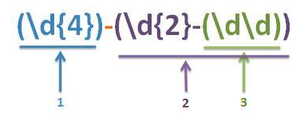
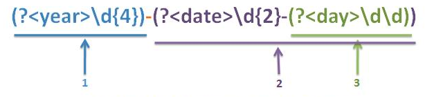
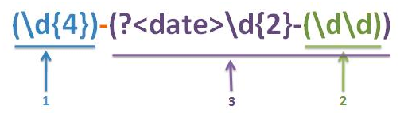

# 正则表达式
一个正则表达式通常被称为一个`模式（pattern）`，用来描述或匹配一系列符合某个语法规则的字符串。
## 1. 基本语法
### 1.1 选择符
竖线 `|` 代表选择（集合），具有最低优先级。
| 选择符 | 作用 | 样例 |
| :--: | :-- | :-- |
| `|` | 前后的字符串都可匹配到 | `gray|grey`可以匹配grey或gray |
### 1.2 数量限定符
某个字符后的数量限定符用于限定前面这个字符允许出现的个数。最常见的数量限定符包括：`+` 、`?` 和 `*`（不加数量限定则代表出现一次，且仅出现一次）。
| 数量限定符 | 作用 | 样例 |
| :--: | :-- | :-- |
| `+` | 前面的字符至少出现一次 | `goo+gle` 可以匹配google、gooogle、goooogle等 |
| `?` | 前面的字符最多出现一次 | `colou?r` 可以匹配color、colour这两个字符串 |
| `*` | 前面的字符可以不出现，也可以出现一次或多次 | `0*42` 可以匹配42、042、0042、000042等 |
### 1.3 匹配符
| 匹配符 | 作用 | 样例 |
| :--: | :-- | :-- |
| `()` | 定义操作符的范围和优先级 | `(grand)?father` 可以匹配father和grandfather |

### 1.4 PCRE表达式全集
正则表达式有多种不同风格，下表是在`PCRE`中元字符及其在正则表达式上下文中的行为的一个完整列表。适用于Perl、Python、Java编程语言。
| 字符 | 作用 |
| :--: | :-- |
| `\` | 将下一个字符标记为一个特殊字符，或一个原义字符（`Identity Escape`，有`^$()*+?.[\{|`共12个），或向后引用，或一个八进制转义符 |
| `^` | 匹配输入字符串的起始位置，如果设置了RegExp的Multiline属性，`^` 也匹配 `\n` 或 `\r` 之后的位置 |
| `$` | 匹配输入字符串的结束位置，如果设置了RegExp的Multiline属性，`$` 也匹配 `\n` 或 `\r` 之后的位置 |
| `?` | 匹配前面的子表达式0次或1次，等价于 `{0,1}` |
| `*` | 匹配前面的子表达式0次或多次，等价于 `{0,}` |
| `+` | 匹配前面的子表达式1次或多次，等价于 `{1,}` |
| `{n}` | n 是一个`非负整数`，匹配确定的n次 |
| `{n,}` | n 是一个`非负整数`，至少匹配n次 |
| `{n,m}` | n和m 均是一个`非负整数`，其中 `n<m`。表示至少匹配n次，且最多匹配m次。注意`逗号与两个数字间不能有空格` |
| `?` | 非贪心量化（`Non-greedy quantifiers`）：当该字符紧跟在任何一个其他重复修饰符（`*`、`+`、`?`、`{n}`、`{n,}`、`{n,m}`）后面时，匹配模式时非贪婪的。`非贪婪模式尽可能少的匹配所搜索的字符串` |
| `.` | 匹配除 `\r`、`\n` 之外的任何单个字符。要匹配包括 `\r`、`\n` 在内的任何字符，可以使用 `(.|\r|\n)` |
| `(pattern)` | 匹配`pattern`并获取匹配到的字符串。该字符串用于向后引用。所获取的匹配内容可以从产生的`Mather`集合中拿到。如果需要匹配圆括号，可使用 `\(` 和 `\)`。可携带数量后缀 |
| `(?:pattern)` | 匹配`pattern`但不获取匹配到的字符串，属于非获取匹配，也即该匹配不需要获取匹配到的内容供以后使用。如`industry(?:y|ies)`就是一个比`industry|industries`更简单的表达式|
| `(?=pattern)` | 正向肯定预查(look ahead positive assert), 在任何匹配pattern的字符串开始处匹配查找字符串，是非获取匹配。预查不消耗字符，也就是说，在一个匹配发生后，在最后一次匹配之后立即开始下一次匹配的搜索，而不是从包含预查的字符之后开始。如`windows(?=95|98|NT|2000)`能匹配`windows2000`中的“windows”，但不能匹配`windows3.1`中的“windows”|
| `(?!pattern)` | 正向否定预查(look ahead negative assert), 在任何不匹配pattern的字符串开始处匹配查找字符串，是非获取匹配。预查不消耗字符。如`windows(?!95|98|NT|2000)`能匹配`windows3.1`中的“windows”，但不能匹配`windows2000`中的“windows”|
| `(?<=pattern)` | 反向肯定预查(look behind positive assert)，与正向肯定预查类似，只是方向相反。如`(?<=95|98|NT|2000)windows`能匹配“2000windows”中的“windows”，但不能匹配“2000windows”中的“windows”|
| `(?<!pattern)` | 反向否定预查，与正向否定预查类似，只是方向相反。如`(?<!95|98|NT|2000)windows`能匹配“3.1windows”中的“windows”，但不能匹配“2000windows”中的“windows”|
| `x|y` | 没有包围在()里，其范围是整个正则表达式。如`z|food`能匹配“z”或“food”。`(?:z|f)ood`则匹配“zood”或“food”|
| `[abc]` | 字符集合，匹配所包含的任意一个字符。特殊字符仅有反斜线`\`保持特殊含义，用于转义字符，其他特殊符号，如星号、加号，各种括号等均作为普通字符。脱字符`^`如果出现在首位则表示`负值字符集合`；如果出现在字符串中间，则仅作为普通字符。连字符`-`如果出现在字符串中间表示字符范围，如果出现在首位或末尾则仅作为普通字符。如`[abc]`可以匹配“plain”中的“a” |
| `[^xyz]` | 排除型字符集合，匹配未列出的任意`字符`。如`[^abc]`可以匹配"plain"中的“plin”|
| `[a-z]` | 字符范围。匹配指定范围内的小写英文字符 |
| `[^a-z]` | 排除型的字符范围。匹配任何不在指定范围内的任意字符 |
| `\b` | 匹配一个单词的边界，也即单词与空格间的位置。如`er\b`可以匹配`never`中的"er"，但不能匹配`verb`中的"er" |
| `\B` | 匹配非单词边界。如`er\b`可以匹配`verb`中的"er"，但不能匹配`never`中的"er" |
| `\d` | 匹配一个数字字符，等价于`[0-9]`。注意Unicode正则表达式会匹配全角数字字符 |
| `\D` | 匹配一个非数字字符，等价于`[^0-9]` |
| `\f` | 匹配一个换页符，等价于`\x0c`和`cL` |
| `\n` | 匹配一个换行符，等价于`\x0a`和`cJ` |
| `\r` | 匹配一个回车符，等价于`\x0d`和`cM` |
| `\t` | 匹配一个制表符，等价于`\x09`和`cl` |
| `\v` | 匹配一个垂直制表符，等价于`\x0b`和`cK` |
| `\s` | 匹配任何空白字符，包括`空格、制表符、换页符等`，等价于`[\f|\n|\r|\t|\v]` |
| `\S` | 匹配任何空白字符，包括`空格、制表符、换页符等`，等价于`[^\f|\n|\r|\t|\v]` |
| `\w` | 匹配包括下划线的任意单词字符，等价于`[A-Za-z0-9]` |
| `\W` | 匹配任何非单词字符，等价于`[^A-Za-z0-9]` |
| `\cx` | 匹配由x指明的控制字符。x的值必须为`A-Z`或`a-z`之一。否则，将c视为一个原义的“c”字符。控制字符的值等于x的值最低5比特（即对32(`10进制`)的余数）。例如`\cM`匹配一个`Control-M`或`回车符`。`\ca`等效于`\u0001`, `\cb`等效于`\u0002`, 等等 |
| `[:name:]` | 增加`命名字符类`中的字符串表达式。只能用于`方括号表达式` |
| `[=elt=]` | 增加当前`locale`下排序等价于字符`elt`的元素。只能用于方括号表达式。如`[=a=]`可能会增加ä、á、à、ă、ắ、ằ、ẵ、ẳ、â、ấ、ầ、ẫ、ẩ、ǎ、å、ǻ、ä、ǟ、ã、ȧ、ǡ、ą、ā、ả、ȁ、ȃ、ạ、ặ、ậ、ḁ、ⱥ、ᶏ、ɐ、ɑ |
| `[.elt.]` | 增加排序元素`elt`到表达式中，只能用于方括号表达式。如29个字母表的西班牙语， "CH"作为单个字母排在字母C之后，因此会产生如此排序“cinco, credo, chispa”|

参考[WIKI-正则表达式](https://zh.wikipedia.org/wiki/%E6%AD%A3%E5%88%99%E8%A1%A8%E8%BE%BE%E5%BC%8F)

## 2. 捕获组
使用小括号`()`指定一个子表达式后，匹配这个子表达式的文本（此分组捕获的内容）可以在表达式或其它程序中做进一步的处理。
在匹配过程中，对于使用小括号括起来的子表达式，引擎会在正则表达式匹配成功时记录下当前所有这些捕获组对应的匹配结果。

捕获组由两种形式：
- 普通捕获组：`(Expression)`，大多数支持正则表达式的语言都支持；
- 命名捕获组：`(?<name>Expression)`，Java在jdk7以后支持，`.NET`、`PHP`、`Python`等部分语言支持；

### 2.1 捕获组编号规则
编号规则是指用数字为捕获组编号的规则。
不管是普通捕获组还是命名捕获组，编号为0的捕获组，唯一标识正则表达式整体。

#### 2.1.1 普通捕获组编号规则
在只有普通捕获组的情况下，捕获组的编号按照`(`出现的顺序，`从左到右`，从`1`开始进行编号。

用以上正则表达式：`(\d{4})-(\d{2}-(\d\d))`， 匹配字符串：`2019-09-04`，匹配结果如下：

| 捕获组编号 | 命名 | 捕获组 | 匹配内容 |
| :--: | :--: | :-- | :--: |
| 0 | - | `(\d{4})-(\d{2}-(\d\d))` | 2019-09-04 |
| 1 | - | `(\d{4})` | 2019 |
| 2 | - | `(\d{2})-(\d\d)` | 09-04 |
| 3 | - | `(\d\d)` | 04 |

### 2.1.2 命名捕获组编号规则
命名捕获组通过显式命名，可通过组名直接访问指定组，而不需要遍历组编号，也减少了在正则表达式扩展中，捕获组的增加或减少对引用结果导致的不可控因素。

命名捕获组也参与编号，在只有命名捕获组的情况下，捕获组的编号也按`(`出现的顺序，`从左到右`，从`1`开始进行编号。

使用`(?<year>\d{4})-(?<date>\d{2}-(?<day>\d\d))`匹配字符串：`2019-09-04`:

| 捕获组编号 | 命名 | 捕获组 | 匹配内容 |
| :--: | :--: | :-- | :--: |
| 0 | - | `(?<year>\d{4})-(?<date>\d{2}-(?<day>\d\d))` | 2019-09-04 |
| 1 | year | `(?<year>\d{4})` | 2019 |
| 2 | date | `(?<date>\d{2}-(?<day>\d\d))` | 09-04 |
| 3 | day | `(?<day>\d\d)` | 04 |

### 2.1.3 普通捕获组与命名捕获组混合编号规则
当一个正则表达式中，普通捕获组与命名捕获组同时出现时，捕获组的编号规则稍显复杂。

- 对于其中的命名捕获组，随时都可以通过组名进行访问；
- 对于普通捕获组，则只能在确定其编号后，通过编号进行访问。

混合方式的捕获组编号规则，首先按照普通捕获组中`(`出现的先后顺序，`从左到右`，由`1`开始进行编号；
当普通捕获组编号完成后，再按命名捕获组中`(`出现的先后顺序，`从左到右`，接着普通捕获组的编号值继续进行编号。

也即：**先忽略命名捕获组，对普通捕获组进行编号，当普通捕获组完成编号后，再延续普通捕获组的编号对命名捕获组进行编号。**

正则表达式：`(\d{4})-(?<date>\d{2}-(\d\d))`, 对字符串`2019-09-04`进行匹配、分组：

| 捕获组编号 | 命名 | 捕获组 | 匹配内容 |
| :--: | :--: | :-- | :--: |
| 0 | - | `(\d{4})-(?<date>\d{2}-(\d\d))` | 2019-09-04 |
| 1 | year | `(\d{4})` | 2019 |
| 3 | date | `(?<date>\d{2})-(\d\d)` | 09-04 |
| 2 | day | `(\d\d)` | 04 |

## 2.2 捕获组的引用
对捕获组的引用，一般有以下几种：
- 正则表达式中，对前面捕获组捕获的内容进行引用，称为**反向引用**；
- 正则表达式中，`(?(name)yes|no)`的条件判断结构；
- 在程序中，对捕获组捕获内容的引用。

### 2.1 反向引用
捕获组`(Expression)`在匹配成功时，会将子表达式匹配到的内容，保存到`内存`中一个用数字编号的组里，可简单认为是对一个局部变量进行了赋值操作，此时可通过反向引用的方式，引用这个局部变量的值。

- 一个捕获组在匹配成功之前，它的内容是不确定的，一旦匹配成功，它的内容就确定了，反向引用的内容也就确定了；
- 反向引用必须要与捕获组一起使用。如果没有捕获组，而直接使用反向引用，不同语言的处理方式不一致，有的语言会抛异常，有的语言会当作普通的转义处理。