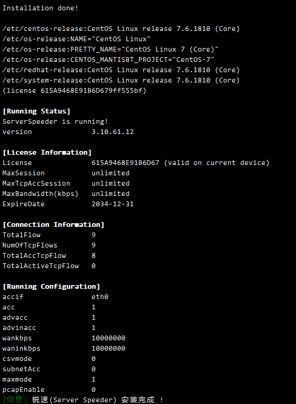

# 64位centos7的VPS搭建ssr
使用[逗比](https://dou-bi.io)的一键脚本，傻瓜式安装
```sh
[root@vultr vpn]# wget -N --no-check-certificate https://raw.githubusercontent.com/ToyoDAdoubi/doubi/master/ssr.sh && chmod +x ssr.sh && bash ssr.sh
```

最简单有效的配置方式：
```
服务器端口: 只要能保住不会被其他程序占用就可以，
密码: 随意设置,
加密方式: aes-256-cfb,
协议: origin,
协议参数: 直接回车就行,
混淆方式: plain,
混淆参数: 直接回车就行
```
安装完成后，在当前目下会出现一个`ssr.sh`脚本，执行命令：
```sh
# 打开ssr配置面板
[root@vultr vpn]# ./ssr.sh

# 配置内容
  ShadowsocksR 一键管理脚本 [v2.0.38]
  ---- Toyo | doub.io/ss-jc42 ----

  1. 安装 ShadowsocksR
  2. 更新 ShadowsocksR
  3. 卸载 ShadowsocksR
  4. 安装 libsodium(chacha20)
————————————
  5. 查看 账号信息
  6. 显示 连接信息
  7. 设置 用户配置
  8. 手动 修改配置
  9. 切换 端口模式
————————————
 10. 启动 ShadowsocksR
 11. 停止 ShadowsocksR
 12. 重启 ShadowsocksR
 13. 查看 ShadowsocksR 日志
————————————
 14. 其他功能
 15. 升级脚本

  ——说明：SSR默认只输出错误日志，此项可切换为输出详细的访问日志
```
输入`1` 执行`安装`，安装完成后，再次执行`./ssr.sh` ，选择 `14 其他功能`配置锐速加速破解版。  

```yml
 14. 其他功能
 15. 升级脚本
 
 当前状态: 已安装 并 已启动
 当前模式: 单端口

请输入数字 [1-15]：14

  你要做什么？
	
  1. 配置 BBR
  2. 配置 锐速(ServerSpeeder)
  3. 配置 LotServer(锐速母公司)
  注意： 锐速/LotServer/BBR 不支持 OpenVZ！
  注意： 锐速/LotServer/BBR 不能共存！
————————————
  4. 一键封禁 BT/PT/SPAM (iptables)
  5. 一键解封 BT/PT/SPAM (iptables)
  6. 切换 ShadowsocksR日志输出模式
  ——说明：SSR默认只输出错误日志，此项可切换为输出详细的访问日志

(默认: 取消):2

你要做什么？
 1. 安装 锐速
 2. 卸载 锐速
————————
 3. 启动 锐速
 4. 停止 锐速
 5. 重启 锐速
 6. 查看 锐速 状态
 
 注意： 锐速和LotServer不能同时安装/启动！

(默认: 取消):1

# 安装时报错
>>>This kernel is not supported. Trying fuzzy matching...

Serverspeeder is not supported on this kernel! View all supported systems and kernels here: https://www.91yun.org/serverspeeder91yun 
[错误] 锐速(Server Speeder) 安装失败 !
```
我是用的是centos7，内核不支持锐速，需要更换内核才可以。
## 更换centos7内核
1. 更新内核
```sh
[root@vultr vpn]# rpm -ivh http://soft.91yun.org/ISO/Linux/CentOS/kernel/kernel-3.10.0-229.1.2.el7.x86_64.rpm --force
```
2. 查看内核是否安装成功
```sh
[root@vultr vpn]# rpm -qa | grep kernel
...
kernel-tools-libs-3.10.0-957.1.3.el7.x86_64
kernel-tools-3.10.0-957.1.3.el7.x86_64
kernel-3.10.0-957.1.3.el7.x86_64
kernel-3.10.0-229.1.2.el7.x86_64
kernel-3.10.0-957.el7.x86_64
```
3. 重启服务器
```sh
# 重启
[root@vultr vpn]# reboot

# 进入系统后，查看内核是否更换成功
[root@vultr vpn]# uname -r
3.10.0-229.1.2.el7.x86_64
```
4. 执行`./ssr.sh`，进入`14` 安装锐速


## 配置开机自启
脚本本身已经配置好，无需额外配置。