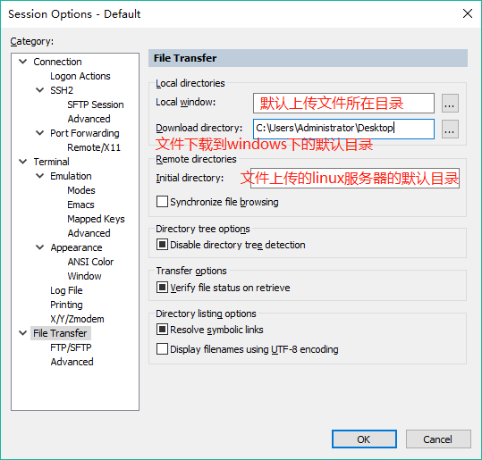

# Linux下文件/文件夹压缩后下载到windows系统
## 目的
将从MySQL中导出的数据库表的表结构和表数据导出到windows下，因为导出的文件不止一个，因此将多个文件放到新文件夹`sql`下，然后开始操作：
```bash
# 在指定目录下创建sql文件夹
$ cd ~
$ mkdir sql

# 将表结构和表数据导出到该文件夹下
$ mysqldump -uuser_name -p db_name table_name > data.sql

# 压缩sql文件夹到sql.tar.gz文件
$ tar -czvf sql.tar.gz sql

# 将sql.tar.gz下载到windows系统，默认下载到 C:\Users\*（用户名）\Downloads 目录下
$ sz sql.tar.gz
```
也可以手动设置下载到windows的目录：  
在SecureCRT下设置默认的上传和下载的目录：`option -> session options -> file transfer`
