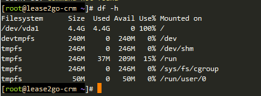
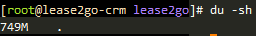
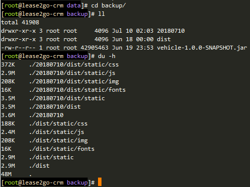

# Linux查看磁盘空间使用情况
## 1. 查看整体磁盘使用情况： `df -h`
```bash
$ df -h
Filesystem      Size  Used Avail Use% Mounted on
/dev/vda1       4.4G  4.4G     0 100% /
devtmpfs        240M     0  240M   0% /dev
tmpfs           246M     0  246M   0% /dev/shm
tmpfs           246M   37M  209M  15% /run
tmpfs           246M     0  246M   0% /sys/fs/cgroup
tmpfs            50M     0   50M   0% /run/user/0
```


## 2. 查看当前目录磁盘使用量：'du -sh'


## 3. 查看当前目录下子目录的大小：'du -h'
