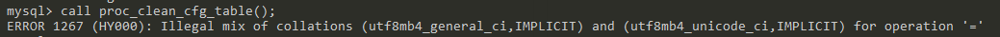
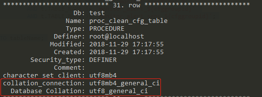
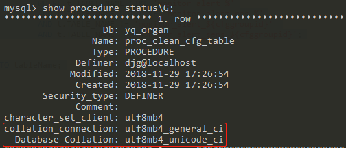
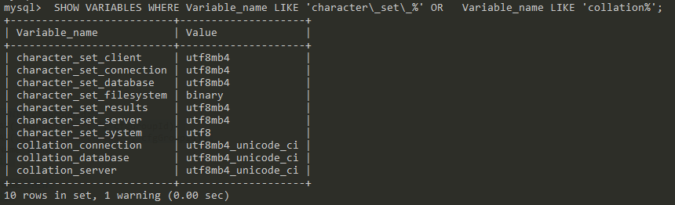

# mysql存储过程字符序与字符集不一致导致异常
今天在执行MySQL的一个存储过程时，本机上的MySQL数据库运行正常，公司服务器上的MySQL执行一直报错：
```bash
ERROR 1267 (HY000): Illegal mix of collations (utf8mb4_general_ci,IMPLICIT) and (utf8mb4_unicode_ci,IMPLICIT) for operation '='
```


执行的存储过程如下：
```sql
CREATE DEFINER=`***`@`localhost` PROCEDURE `proc_clean_cfg_table`()
BEGIN
DECLARE num int(11);
DECLARE cfgGroupId int(11);
DECLARE countNum int(11);
DECLARE done INT DEFAULT 0;
DECLARE tableName VARCHAR(100) DEFAULT '';
DECLARE sql_clean_builder VARCHAR(10000) DEFAULT '';
DECLARE cur_cfgGroupId CURSOR FOR select t.cfg_group_id from alert_config_group t;
DECLARE cur_tableName CURSOR FOR select t.TABLE_NAME FROM information_schema.TABLES AS t 
																	WHERE t.TABLE_NAME REGEXP 'monitor_alert_[0-9]' OR t.TABLE_NAME REGEXP 'monitor_alert_sens_[0-9]';
DECLARE CONTINUE HANDLER FOR NOT FOUND SET done = 1;
SELECT count(*) into num from alert_config_group t;
SELECT count(*) into countNum from information_schema.TABLES AS t 
																WHERE t.TABLE_NAME REGEXP 'monitor_alert_[0-9]' OR t.TABLE_NAME REGEXP 'monitor_alert_sens_[0-9]';
OPEN cur_tableName;
	out_loop: LOOP
	FETCH cur_tableName INTO tableName;

	IF done THEN
		LEAVE out_loop;
	END IF;
	SET @countName1 = 0;
	SET @countName2 = 0;

	OPEN cur_cfgGroupId;
		SET done = 0;
		REPEAT
		FETCH cur_cfgGroupId INTO cfgGroupId;
		SET @t_name_1 = CONCAT('monitor_alert_', cfgGroupId);
		SET @t_name_2 = CONCAT('monitor_alert_sens_', cfgGroupId);
		IF @t_name_1 = tableName THEN
			SET @countName1 = 1;
		END IF;
		IF @t_name_2 = tableName THEN
			SET @countName2 = 1;
		END IF;
		IF num = 1 THEN
			set done =1;
		END IF;
		SET num = num - 1;
		UNTIL done END REPEAT;
	CLOSE cur_cfgGroupId;
	
	IF @countName1 = 0 AND @countName2 = 0 THEN
		SET sql_clean_builder = CONCAT('DROP TABLE IF EXISTS `', tableName, '`;');
		SET @_sql = sql_clean_builder;
		PREPARE sql_builder from @_sql;
		EXECUTE sql_builder;
	END IF;
	SET done = 0;

	SET countNum = countNum - 1;
	END LOOP out_loop;
	CLOSE cur_tableName;
END
```

看报的错误是字符序不同导致的，就比较了一下本机MySQL中存储的存储过程与服务器上的存储过程区别，服务器上的这个存储过程是由本机导出的sql拿到服务器去执行产生的。
### 本机上该存储过程的字符序

### 服务器上该存储过程的字符序


可以看到，本机上该存储过程的`collation_connection`属性值与`Database_Collation`属性值是相同的，执行时没有报错；
服务器上同一存储过程的这两个属性值时不同的，执行时报错。
因此，初步判断是由于字符序不同引发的这个问题。

使用命令查看数据库编码：
>SHOW VARIABLES WHERE Variable_name LIKE 'character\_set\_%' OR Variable_name LIKE 'collation%';

### 本机数据库：

### 服务器数据库：


## 在对数据库字符集、字符序编码进行配置、服务重启后，发现无论怎么配，问题依然存在，显然这个问题根源不在此处。

后来，在大神帮助下，使用层层剔除的手段，从外向内依次注掉层级代码，然后执行剩下的代码，在注掉两个条件判断，即
```sql
OPEN cur_cfgGroupId;
	SET done = 0;
	REPEAT
	FETCH cur_cfgGroupId INTO cfgGroupId;

	SET @t_name_1 = CONCAT('monitor_alert_', cfgGroupId);
	SET @t_name_2 = CONCAT('monitor_alert_sens_', cfgGroupId);

	-- IF @t_name_1 = tableName THEN
		-- SET @countName1 = 1;
	-- END IF;
	-- IF @t_name_2 = tableName THEN
		-- SET @countName2 = 1;
	-- END IF;

	IF num = 1 THEN
		set done =1;
	END IF;
	SET num = num - 1;
	UNTIL done END REPEAT;
CLOSE cur_cfgGroupId;
```
这一段代码后，该存储过程就可以顺利执行了！想来应该是比较时两个字符串的比较出了问题，`tableName`是外层循环的当前行游标值，问题应该不在这里；于是把`@t_name_1`替换成'aaa'后在执行，不报错了！
然后就想着不再用@t_name_1这种临时变量，索性直接把`CONCAT('monitor_alert_', cfgGroupId)`扔过去，即
```sql
OPEN cur_cfgGroupId;
	SET done = 0;
	REPEAT
	FETCH cur_cfgGroupId INTO cfgGroupId;
	
	IF CONCAT('monitor_alert_', cfgGroupId) = tableName THEN
		SET @countName1 = 1;
	END IF;
	IF CONCAT('monitor_alert_sens_', cfgGroupId) = tableName THEN
		SET @countName2 = 1;
	END IF;
	
	IF num = 1 THEN
		set done =1;
	END IF;
	SET num = num - 1;
	UNTIL done END REPEAT;
CLOSE cur_cfgGroupId;
```
问题解决！  

**但是！！！**[问题原因出在哪呢？](#)
想着是不是我对@varName有什么误解，就上网查了下这种变量的用法：

>@varName: 这种变量称为`会话变量`，也叫`用户变量`，属于`全局变量`，代表整个会话过程都起作用，也就是说只要在同一个会话（某个应用的一个连接过程）内，这种变量可在被调用的存储过程和代码之间共享数据。例如，可以两个互相调用的存储过程中共用一个会话变量 `@a`，在存储过程1中赋值，在被调用的存储过程中可以直接取到 `@a`的值。

在存储过程中，使用动态语句，预处理时，动态内容必须赋给一个会话变量。
```sql
set @v_sql= CONCAT('DROP TABLE IF EXISTS monitor_alert_', id);
PREPARE stmt FROM @v_sql;  
EXECUTE stmt;     
```
