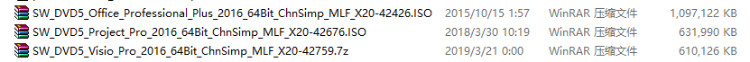
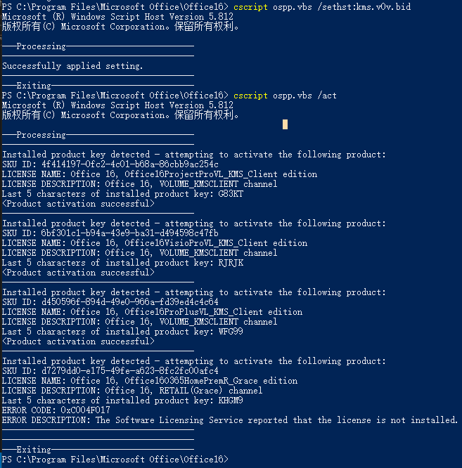

# win10自带office365升级到专业增强版

## 1. 卸载自带已激活的office365
- `设置 → 应用 → 应用与功能 → Microsoft office desktop app → 卸载`；
- `设置 → 应用 → 应用与功能 → Microsoft OneDrive → 卸载`；
- `设置 → 应用 → 应用与功能 → Microsoft OneNote → 卸载`；

## 2. 安装批量授权（VOL）版Microsoft Office
此处以[Microsoft Office2016 Pro Plus专业增强版](https://pan.baidu.com/s/10ZmHBwzA1OdZiZCJp58LOQ)为例，资源提取码: **8yf2**

- 安装Office 2016基础套件：Word，Excel，PowerPoint，Outlook；
- 安装Project 2016；
- 安装Visio 2016；

注意：最好等三个都安装完毕后，再统一进行激活。

## 3. 激活Office
- `开始菜单上单击鼠标右键 → Windows PowerShell(管理员)(A)`，打开命令行窗口；
- 打开命令行后，切换到Microsoft Office的安装目录，这里采用默认的安装位置，因此需要切换到：`C:\Program Files\Microsoft Office\Office16`；
- 执行以下命令：
  ```yml
  # 使用该命令报错时，使用下面的俩命令
  cscript ospp.vbs /sethst:kms.v0v.bid && cscript ospp.vbs /act

  # 使用上面的命令执行报错时，拆分成两个命令执行
  cscript ospp.vbs /sethst:kms.v0v.bid
  cscript ospp.vbs /act
  ```
  

这里最后一个激活时好像出了点问题，不过不影响，实际查看激活成功！

## 3. 查看Office 2016激活情况
- 1. 打开Word/Excel/PowerPoint/OutLook/Visio/Project；
- 2. 找到`文件→ 账户 → 产品信息`，如果显示`激活的产品`，表示已成功激活。
- 


