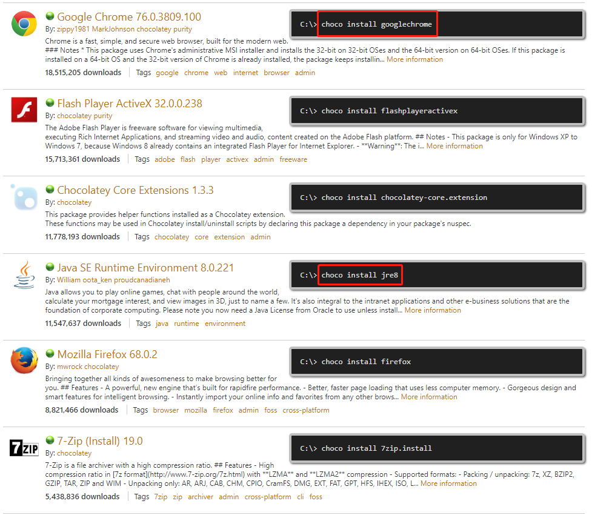

首先安利一个windows下使用命令行下载软件的工具：`Chocolatey软件包管理系统`，这玩意类似于npm。

一句命令安装chocolately：
```yml
@powershell -NoProfile -ExecutionPolicy unrestricted -Command "iex ((new-object net.webclient).DownloadString('https://chocolatey.org/install.ps1'))" && SET PATH=%PATH%;%ALLUSERSPROFILE%\chocolatey\bin
```

Chocolatey工作过程：
通过Chocolatey下载的软件都是官方正版，Chocolatey只是把软件的官方下载路径封装到Chocolatey中，通过命令直接安装到系统。默认下载最新版本！
```yml
# 完整命令
choco install software_name
# 简写命令
cinst software_name
```

截止到目前，通过Chocolatey可以安装的软件有 `6984`个，具体可用的package可参见官网的
[packages列表](https://chocolatey.org/packages)。


真正好用的地方也就在此，像Google chrome浏览器正常情况下需要翻墙才能下载、更新
有了chocolatey后，只需要`cinst googlechrome`即可完成更新或下载+自动安装的操作。

既然说到这里了，就再记录一个可以免翻墙下载最新版Google chrome浏览器的分享站：
[异次元软件](https://www.iplaysoft.com/tools/chrome/)


现在如果去Oracle官网下载jdk，必须先注册一个账号，特麻烦，有了chocolately就避免这一麻烦了！
