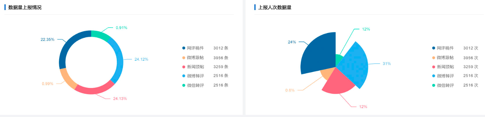
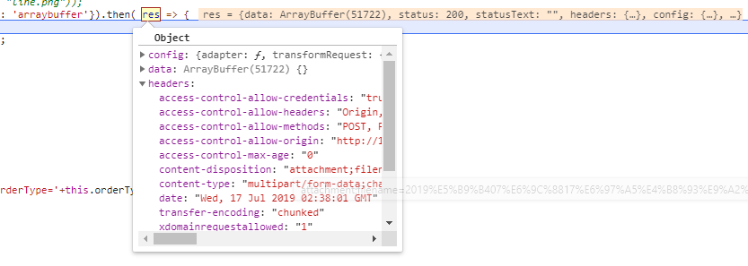
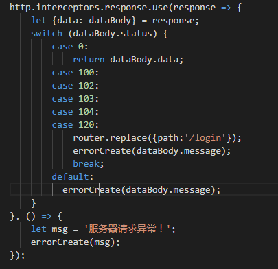

# 环境
vue-cli3 + axios + springboot
# 需求
项目中有一个统计分析页，要求将其中的几个echarts图导出到word文档中，图形如下：  
  
服务端集成的是Jfreechart无法直接实现这种效果，若要实现须改动源码，费时费力，
最终决定在前端传回生成的echarts图到服务端，然后将图片插入到word模版中。中间
在前端上耗费大量时间，其中过程不再细述，直接上最终实现。
# 实现
## 实现方式
1. 一次请求直接返回word文件流；
2. 分步处理：
    - 发送请求，服务端根据请求生成临时文件，返回临时文件存放路径；
    - 前端根据返回的临时文件路径异步获取临时文件的二进制流，然后服务端删除临时文件。

## 前端部分
1. 由于回传的参数既有普通字符串参数，又有图片，此处使用FormData进行处理。
此处也可使用传统方式进行处理，图片转成base64编码回传即可，服务端以字符串进行接收；

2. 使用post请求进行处理，因此需添加`{responseType: 'arraybuffer'}`这一配置。
```html
<template>
  <div>
    <a ref="exportLink"></a>
  </div>
</template>
```
```js
/* 导出echarts到word */
exportEcharts(){
  this.formData.set("taskName", this.title);
  this.formData.set("orderType", this.orderType);
  this.formData.set("description", this.description);
  this.formData.append("images", dataURLtoFile(this.pieChart.getDataURL(), "pie.png"));
  this.formData.append("images", dataURLtoFile(this.ringChart.getDataURL(), "ring.png"));
  this.$http.post('/orderSpecial/export/echarts', this.formData, {responseType: 'arraybuffer'}).then( res => {
    //获取文件名，因为文件名乱码问题，服务端对文件名进行URLEncoder编码，此处使用decodeURI进行解译
    let fileName = decodeURI(res.headers['content-disposition'].split('=')[1]);
    let blob = new Blob([res.data]);//此处的res.data是文件流
    let objURL = URL.createObjectURL(blob);
    this.$refs.exportLink.download = fileName;
    this.$refs.exportLink.href = objURL;
    this.$refs.exportLink.click();
  }).catch(e=>{
    console.error(e);
  })
},
```

起初浏览器控制台一直报错，看了一下前端的统一异常拦截配置没有对`arraybuffer`进行处理：  
  
因此添加对这种类型的处理
```js
function isArrayBuffer(val) {
  return Object.prototype.toString.call(val) === '[object ArrayBuffer]';
}
http.interceptors.response.use(response => {
  let {data: dataBody} = response;
  switch (dataBody.status) {
    case 0:
      return dataBody.data;
    case 100:
    case 102:
    case 103:
    case 104:
    case 120:
      router.replace({path:'/login'});
      errorCreate(dataBody.message);
      break;
    default:
      if(isArrayBuffer(dataBody)){
        return response;
      }
      errorCreate(dataBody.message);
  }
}, () => {
  let msg = '服务器请求异常！';
  errorCreate(msg);
});
```
## 服务端代码
```java
@ResponseBody
@PostMapping("/export/echarts")
public void exportEchartsReport(HttpServletRequest request, HttpServletResponse response,
  @RequestParam("images") MultipartFile[] images){
  try {
    //从request中取出前台传回的参数信息
    String reportDate = DateFunction.getStrDateFormat("yyyy年MM月dd日", DateFunction.getZeroHour(new Date()));
    String taskName = request.getParameter("taskName");
    String description = request.getParameter("description");
    String orderType = request.getParameter("orderType");
    
    //组装word文档数据
    WordData wordData = new WordData();
    //添加文字数据
    wordData.addTextField("taskName", taskName);
    wordData.addTextField("description", description);
    wordData.addTextField("dateNow", reportDate);
    
    //添加图片数据
    for (MultipartFile image : images) {
      try {
        String imageName = image.getOriginalFilename();
        if (StringUtil.isEqualByLoose(imageName, "ring.png")) {
          wordData.addImageField("ringChart", image.getInputStream(), 400, 300);
        }
        if (StringUtil.isEqualByLoose(imageName, "pie.png")) {
          wordData.addImageField("pieChart", image.getInputStream(), 400, 300);
        }
        if (StringUtil.isEqualByLoose(imageName, "line.png")) {
          wordData.addImageField("lineChart", image.getInputStream(), 400, 300);
        }
      } catch (IOException e) {
        log.error("图片IO异常：", e);
      }
    }

    if (ObjectUtil.isEmpty(wordData)) {
      log.info("生成专题分析的word报告时，wordData为空，生成word任务终止！");
      return;
    }

    //将模版数据处理成流
    ByteArrayOutputStream tempOutputStream = (ByteArrayOutputStream) WordFactory.reportByTemplate(wordTemplate, wordData);
    
    //设置响应内容、格式
    String fileName = reportDate + "专题分析报告_" + orderType + ".doc";
    response.setContentType("multipart/form-data");
    response.addHeader("Content-Disposition", "attachment;filename=" + URLEncoder.encode(fileName, "utf-8"));
    
    ServletOutputStream outputStream = response.getOutputStream();
    outputStream.write(tempOutputStream.toByteArray());
    outputStream.flush();
  } catch (Exception e) {
    log.error("导出专题分析word报告时出现异常：", e);
  }
}
```