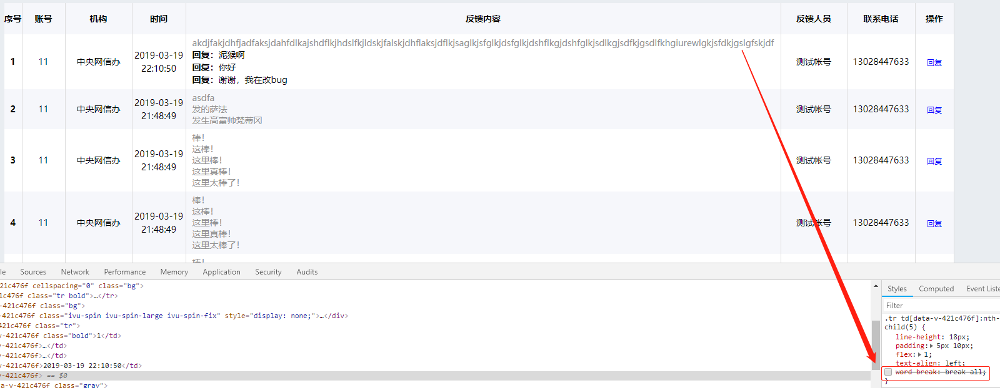
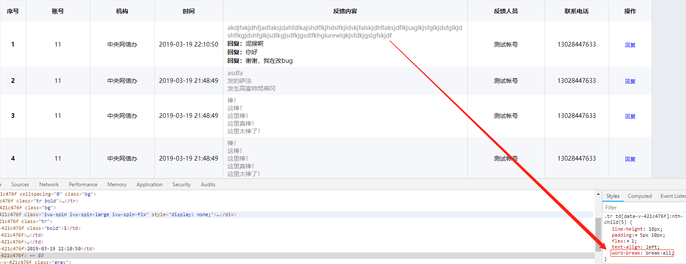

项目中碰到的一个布局问题，在一个表格里，除内容列外，其余列宽度固定，内容列采用 `flex: 1` 的形式处理，

当内容列内的文本绝大数为英文字母或数字时，文本宽度超出列宽后不会自动换行，而是将内容列撑大。如下图：



这种问题是由于浏览器对中文、英文(数字)的解析方式不同导致的，英文/数字不会自动换行，需要给DIV添加一个属性

```css
div {
  flex: 1;
  word-break: break-all;
}
```
效果如下：  
