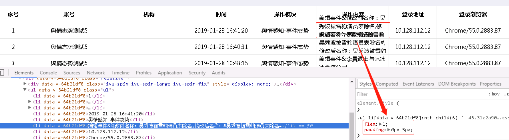
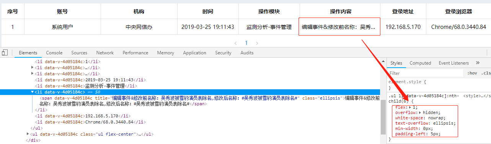

在用ul渲染表格时，多列固定宽度，一列设 `flex: 1;` ，但发现文本长度过长时会发送文字溢出的现象：  


原始代码如下：
```css
.ellipsis {
  overflow: hidden;
  white-space: nowrap;
  text-overflow: ellipsis;
}
.ul {
  display: flex;
  flex-direction: row;
  border-bottom: 1px solid #ddd;

  &.head {
    font-weight: bold;
    align-items: center;
    background: #f6f7fb;
  }

  li {
    height: 40px;
    .flex-center;
    border-right: 1px solid #ddd;
  }

  li:nth-child(1){
    width: 60px;
  }
  li:nth-child(2){
    width: 200px;
  }
  li:nth-child(3){
    width: 200px;
  }
  li:nth-child(4){
    width: 160px;
  }
  li:nth-child(5){
    width: 160px;
  }
  li:nth-child(6){
    flex: 1;
    padding-left: 5px;
  }
  li:nth-child(7){
    width: 120px;
  }
  li:nth-child(8){
    width: 170px;
    border-right: 0;
  }
}
```

解决办法： 为 `li` 设置一个最小宽度0  
```css
li:nth-child(6){
  flex: 1;
  .ellipsis;
  min-width: 0px;
  padding-left: 5px;
}
```

效果图：  
