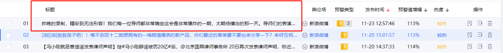

# flex实现列表宽度自适应
项目中的列表需要实现如下图所示效果：

其中，除标题列外，其余列宽度固定。  

之前的做法就是利用`calc`属性使标题列宽度自适应文字长度，超出部分省略，即：
```html
<template>
    <div>
        <ul class="flex">
            <li>全选</li>
            <li>序号</li>
            <li>标题</li>
            <li>舆论场</li>
            <li>预警类型</li>
            <li>发布时间</li>
            <li>预警值增幅</li>
            <li>操作</li>
        </ul>
    </div>
</template>
<style lang="less" scoped>
    .flex{
        width: 100%;

        li:nth-child(1){
            width: 20px;
        }
        li:nth-child(2){
            width: 20px;
        }
        li:nth-child(3){
            width: calc(~"100% - 640px");
        }
        li:nth-child(4){
            width: 100px;
        }
        li:nth-child(5){
            width: 100px;
        }
        li:nth-child(6){
            width: 150px;
        }
        li:nth-child(7){
            width: 100px;
        }
        li:nth-child(8){
            width: 150px;
        }
    }
</style>
```
这种解决方案在有些情况下会带来性能问题，而且如果标题列内又要细分几块的话，在计算宽度时就会相当麻烦。

使用`flex-grow`可以比较完美的解决这种问题！
```css
.flex{
    width: 100%;
    display: flex;
    flex-direction: row;
    align-items: center;

    li:nth-child(1){
        width: 20px;
    }
    li:nth-child(2){
        width: 20px;
    }
    li:nth-child(3){
        flex-grow: 1;
    }
    li:nth-child(4){
        width: 100px;
    }
    li:nth-child(5){
        width: 100px;
    }
    li:nth-child(6){
        width: 150px;
    }
    li:nth-child(7){
        width: 100px;
    }
    li:nth-child(8){
        width: 150px;
    }
}
```