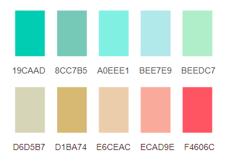

# 舒适的十种RGB配色

| 16进制值 | R | G | B |
| :--: | :--: | :--: | :--: |
| 19CAAD |  25 | 202 | 173 |
| 8CC7B5 | 140 | 199 | 181 |
| A0EEE1 | 160 | 238 | 225 |
| BEE7E9 | 190 | 231 | 233 |
| BEEDC7 | 190 | 237 | 199 |
| D6D5B7 | 214 | 213 | 183 |
| D1BA74 | 209 | 186 | 116 |
| E6CEAC | 230 | 206 | 172 |
| ECAD9E | 236 | 173 | 158 |
| F4606C | 244 |  96 | 108 |
