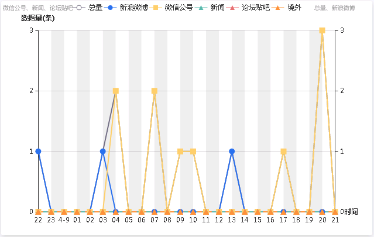
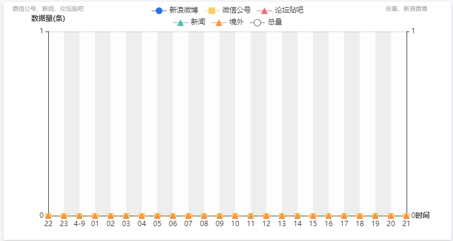

项目中的echarts图例由于增加了一个数据项，导致小屏下本来一行的图例与title重叠：  


想要的效果：  


直接上代码：  
```js
// legend由对象变为数组，然后分别控制每个数组元素的位置为居中即可
legend: [{
  x: 'center',
  top: '1%',
  textStyle: {
    fontSize: 11
  },
  data: ['新浪微博', '微信公号', '论坛贴吧'],
},{
  x: 'center',
  top: '6%',
  textStyle: {
    fontSize: 11
  },
  data: ['新闻', '境外', '总量']
}],
```