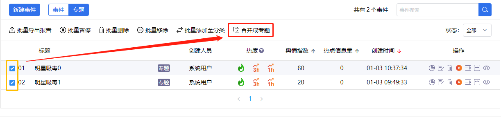

# Promise使用
## 使用场景

前提：选中的两条事件已经被合并到其他专题下，  然后再点击“合并成专题”按钮，  
此时需要后台检测一下两条事件的合并状态是否发生改变，如果未改变，则提示无法合并，  
如果发生改变，则弹出合并对话框。  
js代码如下：
```javascript
// 如果所选事件全部已经被合并到其它专题
clickMergeBtn(){
  this.isMergedToOtherSubject(this.boxGroup).then((mergeState)=>{
    if(mergeState){
      this.$Message.error({content: "不能执行该操作！", duration: 3, closable: false});
      return;
    }
    this.margeSubject = true; // 弹出合并对话框
  })
}，
/* 验证所选事件是否全部已经被合并到其它专题 */
isMergedToOtherSubject(selectEventIds){
  let validateUrl = gl.serverURL + '/monitor/subject/validateMergeState';
  let validateParams = {eventIdList: selectEventIds.toString()};
  return this.$http.get(validateUrl, {params: validateParams}).then(resp=>{
    let ret = resp.body;
    let status = ret.status;
    return status === 0 ? true : false;
  });
},
```
