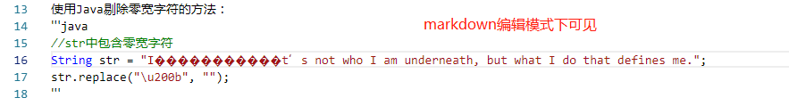

# 零宽字符
零宽度字符是一些不可见的，不可打印的字符。它们存在于页面中主要用于调整字符的显示格式，下面就是一些常见的零宽度字符及它们的unicode码和原本用途：

- [U+200B](#)：零宽度空格符 (zero-width space)，用于较长单词的换行分隔；
- [U+EEFF](#)：零宽度非断空格符 (zero width no-break space): 用于阻止特定位置的换行分隔；
- [U+200D](#)：零宽度连字符 (zero-width joiner): 用于阿拉伯文与印度语系等文字中，使不会发生连字的字符间产生连字效果；
- [U+200C](#)：零宽度断字符 (zero-width non-joiner): 用于阿拉伯文，德文，印度语系等文字中，阻止会发生连字的字符间的连字效果；
- [U+200E](#)：左至右符 (left-to-right mark): 用于在混合文字方向的多种语言文本中（例：混合左至右书写的英语与右至左书写的希伯来语），规定排版文字书写方向为左至右；
- [U+200F](#)：右至左符 (right-to-left mark): 用于在混合文字方向的多种语言文本中，规定排版文字书写方向为右至左。

Java中常见的零宽字符是`U+200B`，这种字符最常出现的地方是数据库，大多是在句首，根据该字段判重时会发现有很多明明一样的汉字，但使用模糊查询总量时，查出来的数量不一样。有图形界面的可以通过键盘的方向键观察到该类字符的存在。

使用Java剔除零宽字符的方法：
```java
//str中包含零宽字符
String str = "I‏‍‏‌‏‎‍​‏‏‌‏‌‏​‏‌‌‌‍‎‍​‏‏‏‎‎​‏‏‌‏‌‏​‌‎‏‏‍‍​‏‏‎‎‎‍​‌‎‌​‏‍​‏‍​‌‏‎​‌‏‎​‌‎​‏​‌‎‌t’s not who I am underneath, but what I do that defines me.";
str.replace("\u200b", "");
```

这种字符在markdown的编辑模式下可见：

