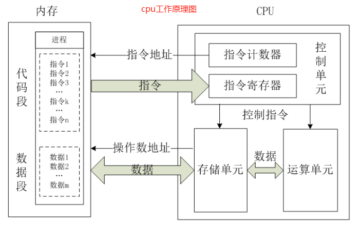
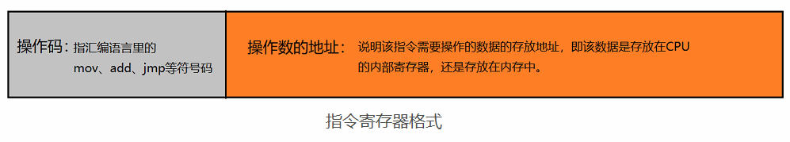

不管什么内存模型，最终还是在计算机硬件上运行，有必要了解计算机硬件的内存架构。

- 现在计算机一般都有2个以上的CPU，每个CPU还有多个核心，线程会在各个CPU核心中并行运行；
- CPU内部会有一组CPU寄存器、CPU缓存（一级、二级、三级缓存）、RAM主存；
- 存储速度比较：CPU寄存器 > CPU缓存（一级 > 二级 > 三级）> RAM;
- 存储大小：CPU寄存器（64 bit）< CPU缓存[一级（64K）< 二级（256K）< 三级（8M）] < 4G/8G/16G。
>当一个CPU需要访问主存时，会先读取一部分主存数据存储到CPU缓存，进而在读取CPU缓存到寄存器。
当CPU需要写数据到主存时，同样需要先将寄存器数据flush到CPU缓存，然后再在某些节点将缓存数据flush到主存。
# 1. cpu工作原理
一个典型的CPU（X86）由`运算器`、`控制器`和`寄存器`等器件组成，这些器件依靠`内部总线`相连。
- 内部总线：实现CPU内部各器件之间的联系；
- 外部总线：实现CPU和主板上其他器件之间的联系。

# 2. CPU的运行流程
- 取指令：CPU的控制器从内存读取一条指令放入`指令寄存器`，指令寄存器的格式是这样的：

- 指令译码：指令寄存器中的指令通过译码，决定该指令应进行何种操作（确定指令里的操作码）、操作数在哪里（确定操作数的地址）；
- 执行指令：分两个阶段，`取操作数`，`进行运算`;
- 修改指令计数器：确定下一条指令的地址。