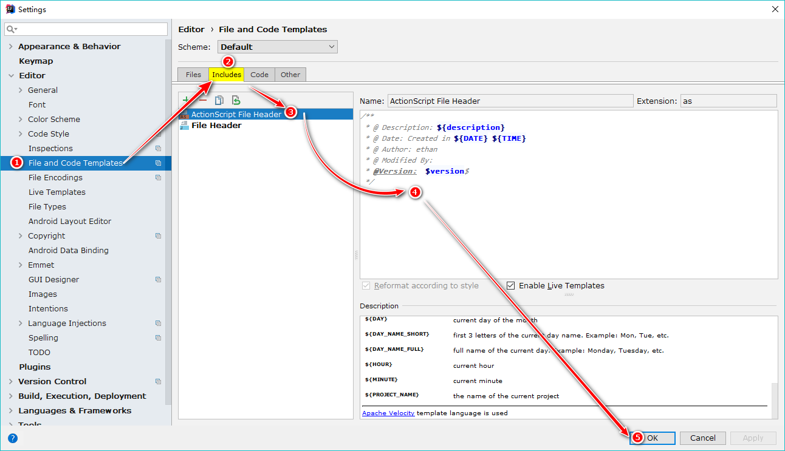
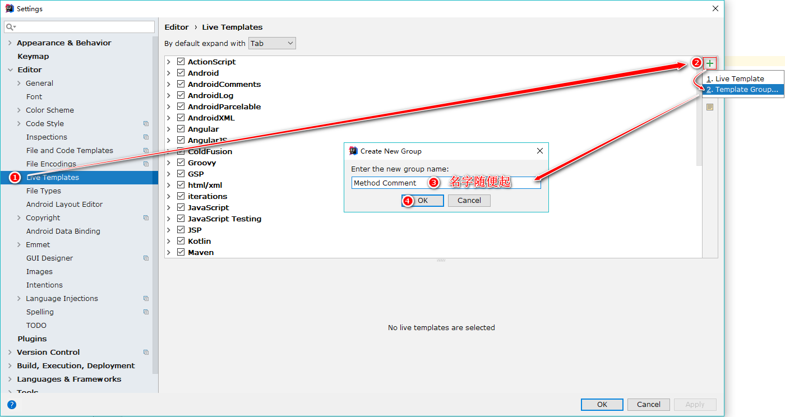
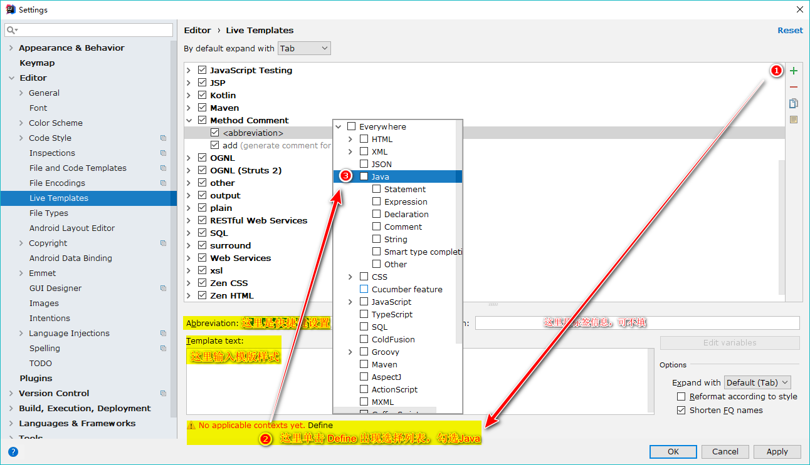
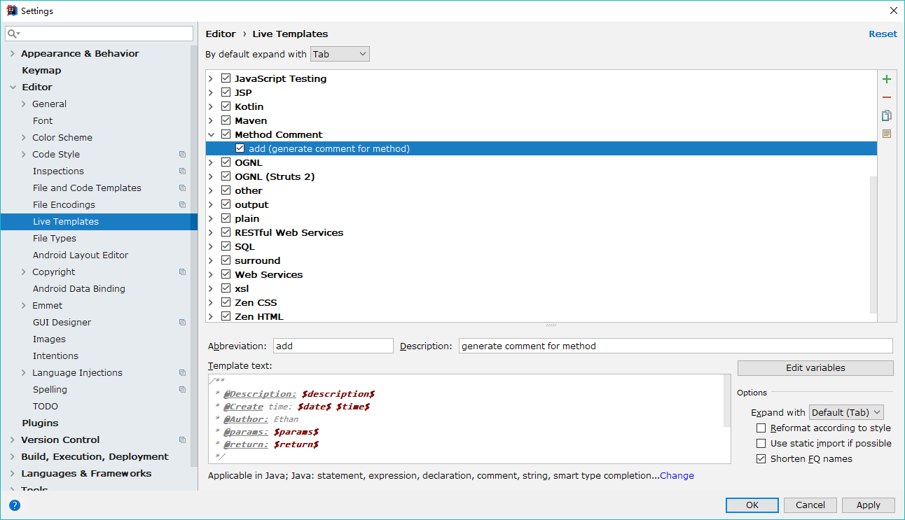
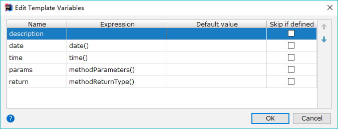

# IDEA为类和方法添加注释模版
## 1. 为类添加注释模版：
### File -> Setting -> Editor -> File and Code Templates -> Includes -> ActionScript File Header 
```java
/**
 * @Description: ${description}
 * @Created in: ${DATE} ${TIME}
 * @Author: Ethan
 * @Modified By: 
 */
```


## 2. 为方法添加注释模版：
1. 菜单: File -> Setting -> Editor -> Live Template  


2. 选中新添加的Method Comment组，点击 [+](#)，选择[1.Live Template](#)：  
  

3. 添加快捷键和模版：
  
```java
/**
 * @Description: $description$
 * @Create time: $date$ $time$
 * @Author: Ethan
 * @params: $params$
 * @return: $return$
 */
 ```

4. 设置参数信息：  


5. 保存！