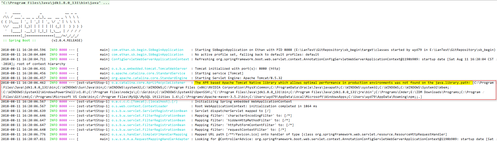
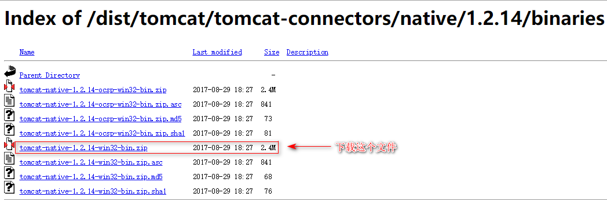
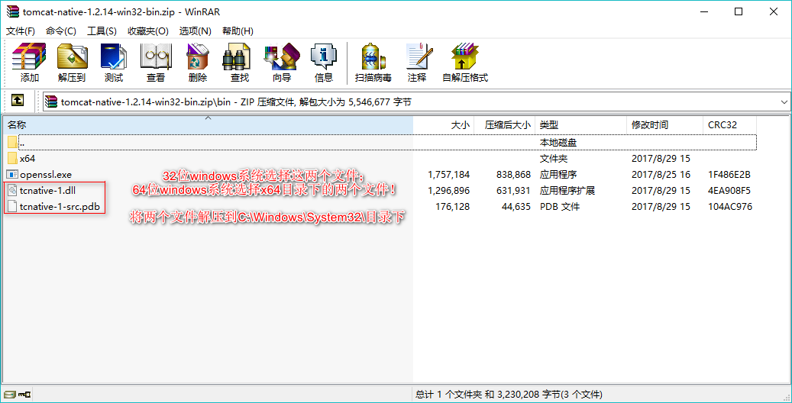
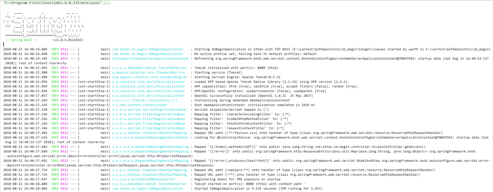

# 启动springboot2.0项目时报错：The APR based Apache Tomcat Native library which allows optimal performance in ...

## 启动一个springboot2.0项目，项目可以正常启动并运行，但老是在初始化tomcat容器前提示出错：
```java
2018-08-11 16:20:06.431  INFO 8088 --- [           main] o.s.b.w.embedded.tomcat.TomcatWebServer  : Tomcat initialized with port(s): 8080 (http)
2018-08-11 16:20:06.456  INFO 8088 --- [           main] o.apache.catalina.core.StandardService   : Starting service [Tomcat]
2018-08-11 16:20:06.457  INFO 8088 --- [           main] org.apache.catalina.core.StandardEngine  : Starting Servlet Engine: Apache Tomcat/8.5.32
2018-08-11 16:20:06.462  INFO 8088 --- [ost-startStop-1] o.a.catalina.core.AprLifecycleListener   : The APR based Apache Tomcat Native library which allows optimal performance in production environments was not found on the java.library.path: [C:\Program Files\Java\jdk1.8.0_131\bin;C:\WINDOWS\Sun\Java\bin;C:\WINDOWS\system32;C:\WINDOWS;C:\Program Files (x86)\NVIDIA Corporation\PhysX\Common;C:\ProgramData\Oracle\Java\javapath;C:\WINDOWS\system32;C:\WINDOWS;C:\WINDOWS\System32\Wbem;C:\WINDOWS\System32\WindowsPowerShell\v1.0\;C:\Program Files\nodejs\;C:\Go\bin;C:\WINDOWS\System32\OpenSSH\;"C:\Program Files\Java\jdk1.8.0_131\bin;C:\Program Files\Java\jdk1.8.0_131\jre\bin";C:\Programs\Cmder;E:\IDM Downloads\Programs;C:\Program Files\Git\cmd;C:\Programs\Microsoft VS Code\bin;C:\Program Files\MySQL\MySQL Utilities 1.6\;C:\Programs\Apache-maven-3.5.2\bin;C:\Users\wyd79\AppData\Local\Microsoft\WindowsApps;C:\Users\wyd79\AppData\Roaming\npm;;.]
2018-08-11 16:20:06.567  INFO 8088 --- [ost-startStop-1] o.a.c.c.C.[Tomcat].[localhost].[/]       : Initializing Spring embedded WebApplicationContext
2018-08-11 16:20:06.567  INFO 8088 --- [ost-startStop-1] o.s.web.context.ContextLoader            : Root WebApplicationContext: initialization completed in 1864 ms
```
详细错误信息如下图：  



## 网上查了一下，在[CSDN博文](https://blog.csdn.net/qq_38455201/article/details/80776446)里看到一种解决办法， 原因是系统环境缺少两个tomcat相关的文件：`tcnative-1.dll`，`tcnative-1-src.pdb`。

>[APR](#)：Apache Portable Runtime，Apache可移植库运行时，一个支持库的Apache web服务器，它提供了一组映射到底层操作系统的API。如果重装系统不支持特定功能，APR经提供仿真功能，程序员通过APR使程序真正实现跨平台移植。

这两个文件作用：
1. Tomcat可以使用APR提供优越的可伸缩性、性能，以便更好的与本地服务器技术进行集成；
2. 提升对ssl的处理效率。

点击下载 [tomcat-native-1.2.14-ocsp-win32-bin.zip](http://archive.apache.org/dist/tomcat/tomcat-connectors/native/1.2.14/binaries/tomcat-native-1.2.14-ocsp-win32-bin.zip)


**使用方法**：  
下载后解压两个文件到 `C:\Windows\System32` 目录下，然后重新启动项目就可以了！


重启后，项目启动正常：
