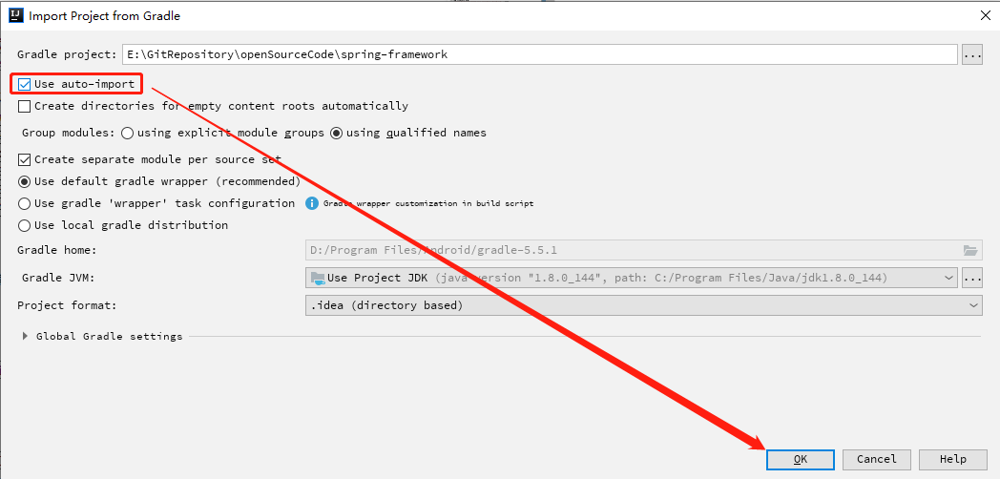
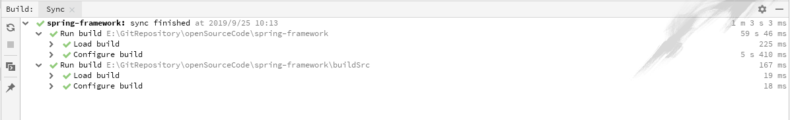
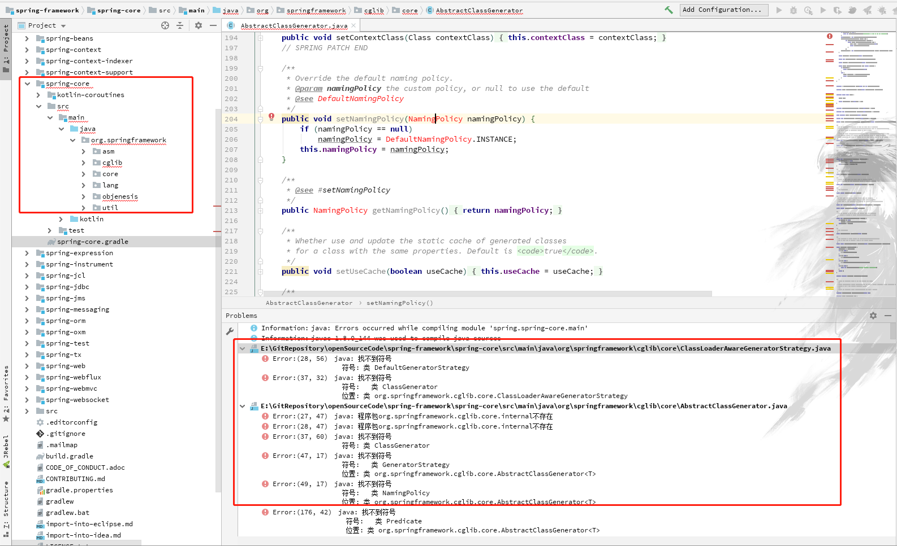
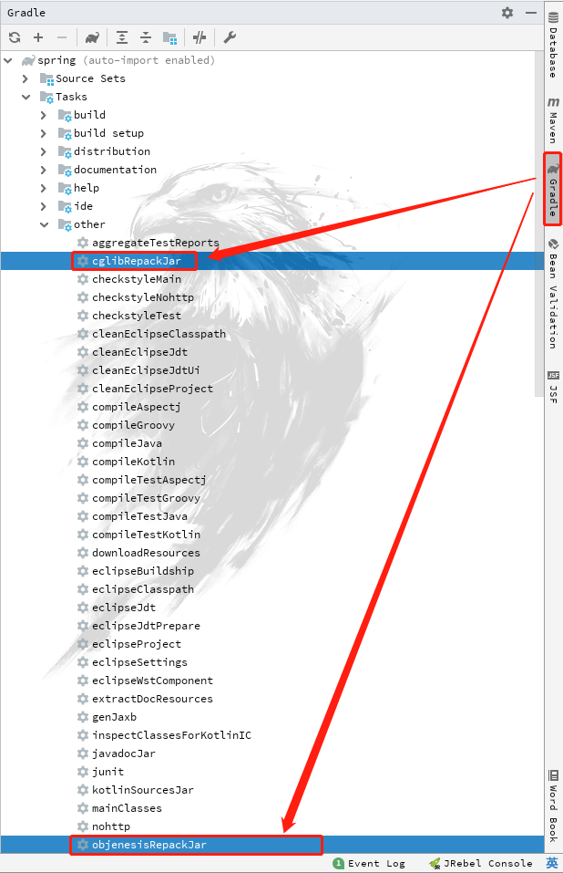
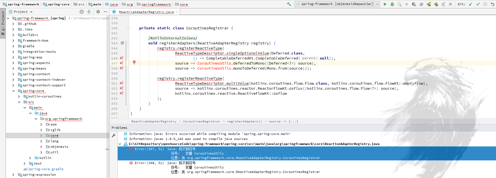
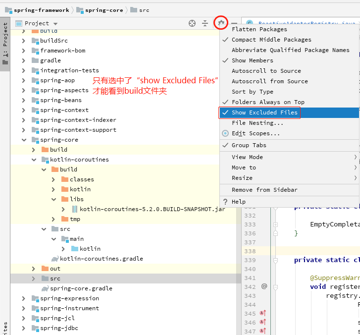
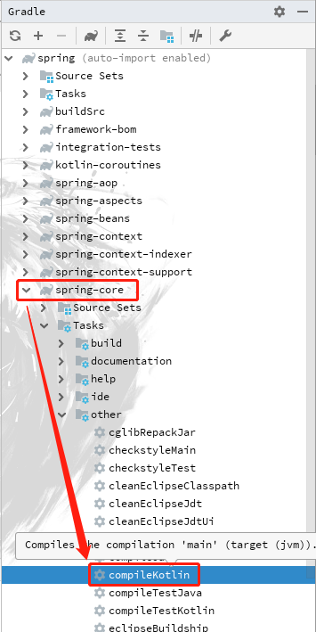
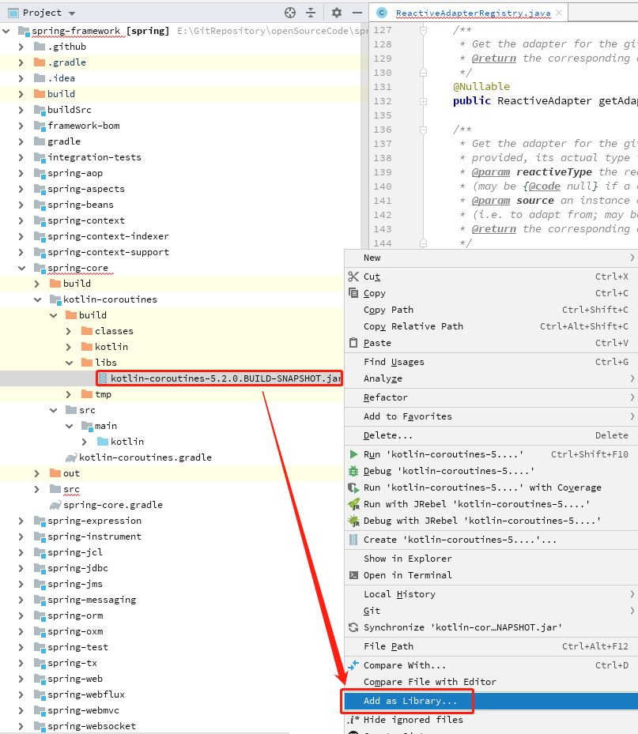
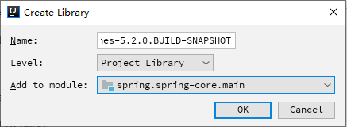

# IDEA编译spring源码
## 1. 从[spring-framework](https://github.com/spring-projects/spring-framework)的github仓库中拷贝项目地址
`https://github.com/spring-projects/spring-framework.git`
## 2. IDEA选择从git导入新项目

## 3. 导入时除项目存放路径外，全部使用默认选项
其中在设置`gradle`的导入对话框中，选中`use auto-import`，其它默认。

这里我最初使用本地已配置的gradle配置，导入后报的错千奇百怪，还找不到解决方案，后来参考
[Spring源码深度解析(第二版)](https://www.baidupcs.com/rest/2.0/pcs/file?method=batchdownload&app_id=250528&zipcontent=%7B%22fs_id%22%3A%5B286422015135976%5D%7D&sign=DCb740ccc5511e5e8fedcff06b081203:3SwA7naSRXi2HWPCdynCx3Tk%2FV0%3D&uid=3809086102&time=1569464735&dp-logid=6202562137236216027&dp-callid=0&vuk=3809086102&zipname=%E3%80%8ASpring%E6%BA%90%E7%A0%81%E6%B7%B1%E5%BA%A6%E8%A7%A3%E6%9E%90%EF%BC%88%E7%AC%AC2%E7%89%88%EF%BC%89%E3%80%8B_%E9%83%9D%E4%BD%B3_2019-01-01.zip)，发现直接使用默认的gradle配置（系统推荐）就没那么多奇怪的问题了。

## 4. 导入项目后，等待项目自动构建完成
构建的时候需要下载gradle，以及其他一些依赖，耗时较久，耐心等待构建完成。下面的截图由于是二次构建，所以时间短。

## 5. 构建完成后，修复`cglib`和`objenesis`报错
### **报错截图**

### **报错原因**
为避免第三方class冲突，Spring把最新的`cglib`和`objenesis`重新打包，但并没有在源码里提供这部分代码，而是直接将其放到单独的jar包中，导致拉取的代码编译出错。为了解决这个问题，需要把缺失的jar包补回来。

### **解决方法**
在idea的`gradle`侧边栏里依次找到：`spring->Tasks->other->cglibRepackJar/objenesisRepackJar`的两个任务项，双击运行，等待自动打包完成，然后重新构建一下，这个报错就会被修复。

此处的两个任务主要是对`cglib`和`objenesis`重新打包，并将打好的包自动放到相应的位置。

现在还剩一个问题待解决

由于`CoroutinesUtils`是kotlin的一个工具类，spring源码包读取不到导致报错。

**解决办法**
- `Project`侧边栏右上角设置（齿轮图标），选中`Show Excluded Files`，为的是显示出`build`文件夹；
  

- 如果仍然没有`build`文件夹，则在`Gradle`侧边栏中执行Task：`compileKotlin`
  

- 找到`spring-framework\spring-core-coroutines\build\libs`下面的`spring-core-coroutines-5.2.0.BUILD-SNAPSHOT.jar`；
-
- 选中jar包，右键现在`Add as Library`，将jar包导入依赖；
  

- 在`Create Library`对话框中的`Add to Module`项选择`spring-core.main`，其他不变，然后确认；
  

- 选中工具栏`Build`—> `Rebuild Project`，重新构建项目。
