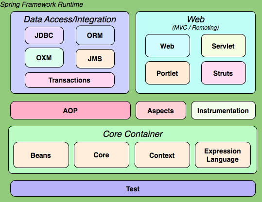
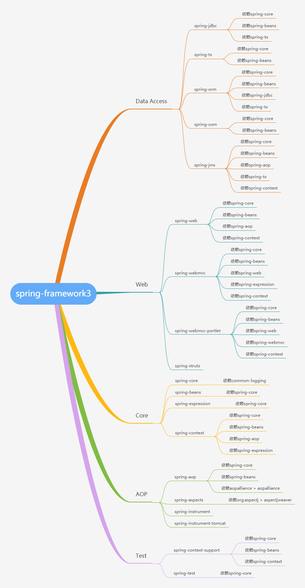
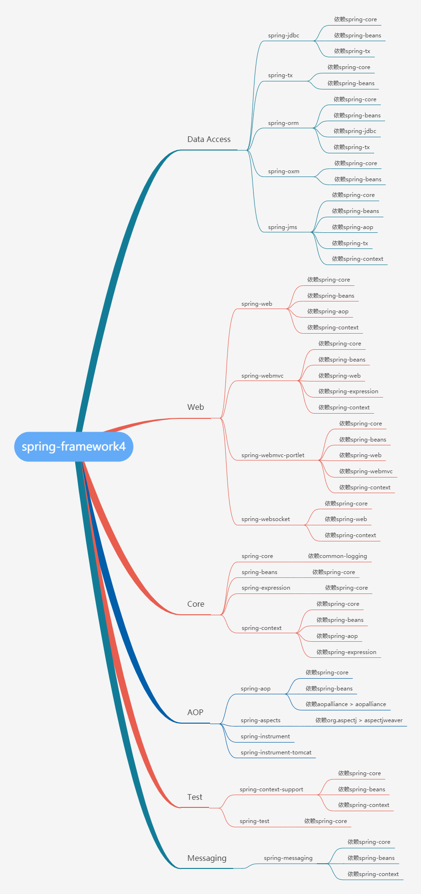

# 一、spring3
spring的jar包只有20各左右，每个jar包都有相应功能，一个jar包还可能依赖了其它jar包，搞清楚他们的依赖关系，配置maven/gradle就可以简洁明了。以`spring 3.2.12.RELEASE`版本为例说明：

- 在普通的Java工程里使用spring框架，只需要引入`spring-context`即可；
- 在web工程里引入`spring mvc`框架，只需要引入`spring-webmvc`即可。

## 1.1 spring3的结构图如下

spring3划分为5个部分：
- `Core Container`
- `AOP`
- `Data Access/Integration`
- `Web`
- `Test`

在maven中，所有这些jar的`groupId`均为`org.springframework`，每个jar有一个不同的`artifactId`，另外，`instumentation`有2jar，还有一个`spring-context-support`图中没有列出。因此spring3中的jar一共有19个。

### 1、Core Container
核心容器提供spring框架的基本功能，其主要组件是`BeanFactory`，是工厂程模式的实现。BeanFactory使用IOC模式将应用程序的配置和依赖性规范与实际的应用程序代码分离开。`core container`包含四个模块：
1. `spring-core`：控制反转IOC与依赖注入DI的实现；
2. `spring-beans`：BeanFactory与Bean的装配实现；
3. `spring-context`：向spring框架提供上下文信息，Spring 上下文包括企业服务，例如：JNDI、EJB、电子邮件、国际化、校验和调度功能；
4. `spring-expression`：spring表达式语言；

### 2、AOP
`AOP`包含4个模块：
1. `spring-aop`：为基于 Spring 应用程序中的对象提供事务管理服务。通过使用 Spring AOP，不用依赖 EJB 组件，就可以将声明性事务管理集成到应用程序中；
2. `spring-aspects`：集成AspectJ；
3. `spring-instrument`：提供一些类级的工具支持，以及ClassLoader级的实现，用于服务器；
4. `spring-instrument-tomcat`：针对tomcat的instrument实现。

### 3、Data Access
`Data Access`包含5个模块：
1. `spring-jdbc`：jdbc支持；
2. `spring-tx`：事务控制；
3. `spring-orm`：Spring 框架插入了若干个 ORM 框架，从而提供了 ORM 的对象关系工具，其中包括 JDO、Hibernate 和 iBatis SQL Map；
4. `spring-oxm`：对象xml映射；
5. `spring-jms`：Java消息服务。

## 4、Web
`Web`包含4个模块：
1. `spring-web`：Web 上下文模块建立在应用程序上下文模块之上，为基于 Web 的应用程序提供了上下文。Web 模块还简化了处理多部分请求以及将请求参数绑定到域对象的工作；
2. `spring-webmvc`：mvc实现；
3. `spring-webmvc-portlet`：基于portlet的mvc实现；
4. `spring-struts`：与struts的集成，不推荐使用，spring4中不再提供。

### 5、Test
`Web`包含4个模块：
1. `spring-test`：提供Junit与Mock测试功能；
2. `spring-context-support`：spring额外支持包，比如邮件服务、视图解析等。

## 1.2 `spring-framework3`的整体架构及其依赖关系如下图：

# 二、spring4
## 2.1 spring-framework4结构图：

## 2.2 spring-framework4 整体架构及其依赖关系

## 2.3 spring-framework3 与 spring-framework4区别
- spring4增加了对`Java SE8`，`Groovy2`，`Java EE7`的一些方面，以及对`WebSocket`的支持;
- spring4去掉了`struts`模块（spring-struts包）。这是因为大量的web应用均已使用spring-mvc，而`struts1.x`架构太过落后，`struts2.x`是struts自身提供了和spring的集成包，但由于之前版本的struts2存在很多致命漏洞，影响其使用度，不过这个问题在struts2.3.16版本有所改善；
- spring4的web部分去除`struts`模块，添加了`websocket`模块，增加了对`websocket`、`sockJS`以及`STOMP`的支持，另外还提供了基于`SockJS`的回调方案，以适应不支持websocket协议的浏览器；
- spring4增添了`Messaging`模块，提供了对`stomp`的支持，以及用于路由和处理来自`websocket`客户端的STOMP消息的注解编程模型。此外，soring-messaging中还包含了spring-integration项目中的核心抽象类，如`Message`、`MessageChannel`、`MessageHandler`;
- 增加新的 @RestController 注解，这样就不需要在每个 @RequestMapping 方法中添加 @ResponseBody 注解;
- 添加 AsyncRestTemplate，在开发 REST 客户端时允许非阻塞异步支持;
- spring4框架支持时区管理，比如 LocalContext;
- spring-core 模块里引入一个新的 SocketUtils 类，用于扫描本地可使用的 TCP 和 UDP 服务端口。一般用于测试需要 socket 的情况，比如测试开启内存 SMTP 服务，FTP 服务，Servlet 容器等;
- pring-test 模块里的几乎所有注解都能被用做元注解去创建自定义注解，来减少跨测试集时的重复配置