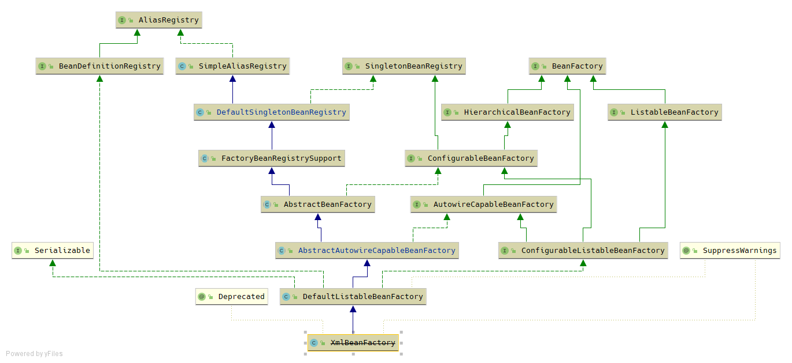
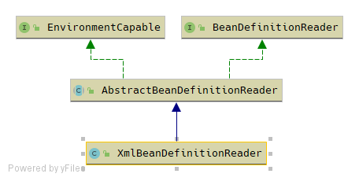

# 容器加载相关类

## spring中两个核心类

### 一、`DefaultListableBeanFactory`

图中每个类的作用如下：

1. `AliasRegistry`：定义对`alias`的简单增删改等操作；
2. `SimpleAliasRegistry`：主要使用map作为alias的缓存，并对实现接口`AliasRegistry`；
3. `SingletonBeanFactory`：定义对单例的注册及获取；
4. `BeanFactory`：获取bean和bean的各种属性；
5. `DefaultSingletonBeanRegistry`：实现`SingletonBeanRegistry`的各方法；
6. `HierarchicalBeanFactory`：继承`BeanFactory`，在`BeanFactory`定义的功能基础上增加了对`parentFactory` 的支持；
7. `BeanDefinitionRegistry`：定义对`BeanDefinition`的各种增删改操作；
8. `FactoryBeanRegistrySupport`：在`DefaultSingletonBeanRegistry`基础上增加了对`FactoryBean`的特殊处理功能；
9. `ConfigurableBeanFactory`：提供配置Factory的各种方法；
10. `ListableBeanFactory`：根据各种条件获取bean的配置清单；
11. `AbstractBeanFactory`：综合`FactoryBeanRegistrySupport`和`ConfigurableBeanFactory`的功能；
12. `AutowireCapableBeanFactory`：提供创建bean、自动注入、初始化及应用bean的后置处理器；
13. `AbstractAutowireCapableBeanFactory`：综合`AbstractBeanFactory`，并对接口`AutowireCapableBeanFactory`进行实现；
14. `ConfigurableListableBeanFacatory`：`BeanFactory`配置清单，指定忽略类型及接口等；
15. `DefaultListableBeanFactory`：综合上面所以功能，主要对bean注册后的处理;
16. `XmlBeanFactory`：对`DefaultListableBeanFactory`类进行扩展，主要用于从XML文件中读取`BeanDefinition`，对于注册及获取bean都是使用从父类`DefaultListableBeanFactory`继承的方法去实现，而唯独与父类不同的个性化实现是增加了`XmlBeanDefinitionReader`类型的reader属性。在`XmlBeanFactory`中主要使用reader对资源文件进行读取和注册。

### 二、`XmlBeanDefinitionReader`

- `ResourceLoader`：定义资源加载器，主要应用于根据给定的资源文件地址返回对应的`Resource`；
- `BeanDefinitionReader`：主要定义资源文件读取并转换为`BeanDefinition`的各个功能；
- `EnvironmentCapable`：定义获取`Environment`方法；
- `DocumentLoader`：定义从资源文件加载到转换为`Document`的功能；
- `AbstractBeanDefinitionReader`：对`EnvironmentCapable`、`BeanDefinitionReader`类定义的功能进行实现；
- `BeanDefinitionDocumentReader`：定义读取`Document`并注册`BeanDefinition`功能；
- `BeanDefinitionParserDelegate`：定义解析`Element`的各种方法。

配置文件读取的大致流程如下：

1. 通过继承自`AbstractBeanDefinitionReader`中的方法，使用`ResourceLoader`将资源文件路径转换为对应的`Resource`文件；
2. 通过`DocumentLoader`对`Resource`文件进行转换，将`Resource`文件转换为`Document`文件；
3. 通过实现接口`BeanDefinitionDocumentReader`的`DefaultBeanDefinitionDocumentReader`类对`Document`进行解析，并使用`BeanDefinitionParserDelegate`对`Element`进行解析。