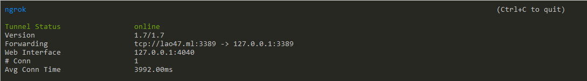
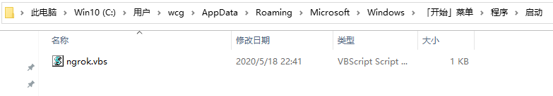
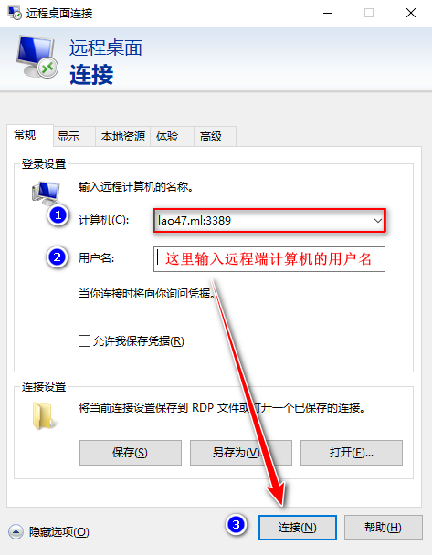
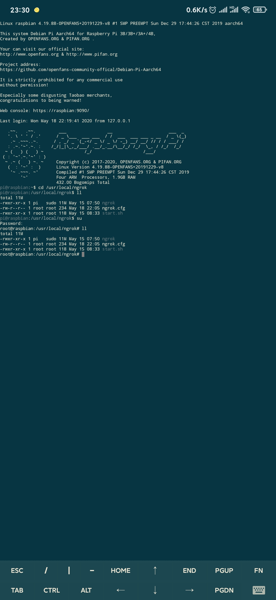

# centos7搭建ngrok服务

## 环境准备

- 腾讯云vps-centos7 amd64
- go
- git

## 搭建步骤

### 1、使用git下载ngrok项目

如果使用命令下载慢，可以先在本地下载好，再上传到vps；

```sh
git clone https://github.com/inconshreveable/ngrok.git
```

为了方便归档，下载好的ngrok项目文件，我放到了`/usr/local`目录下。

**之后的命令，如无特殊说明，均是在`/usr/local/ngrok/`目录下执行。**

### 2、配置域名

#### 2.1、到`freenom`申请免费域名，此次使用`lao47.ml`为例说明；

#### 2.2 到`cloudflare`对申请到的域名进行解析；


### 3、生成证书

在`/usr/local/ngrok/`目录下，执行以下命令（配置好域名后，可一次性复制到vps执行）：

```sh
NGROK_DOMAIN="lao47.ml"
openssl genrsa -out rootCA.key 2048
openssl req -x509 -new -nodes -key rootCA.key -subj "/CN=$NGROK_DOMAIN" -days 5000 -out rootCA.pem
openssl genrsa -out device.key 2048
openssl req -new -key device.key -subj "/CN=$NGROK_DOMAIN" -out device.csr
openssl x509 -req -in device.csr -CA rootCA.pem -CAkey rootCA.key -CAcreateserial -out device.crt -days 5000
```

复制证书到配置目录：

```sh
\cp rootCA.pem assets/client/tls/ngrokroot.crt -f
\cp device.crt assets/server/tls/snakeoil.crt  -f
\cp device.key assets/server/tls/snakeoil.key -f
```

### 4、编译、构建ngrok服务端程序

```sh
make release-server
```

构建完成后，在`./bin`目录下会多出一个`ngrokd`文件。

耗时较久，需耐心等待。

如果中间报错，不要急，重新执行一次`make release-server`就好！

### 5、编译ngrok客户端程序

根据客户端的运行环境，编译不同的客户端程序：

```sh
GOOS=linux GOARCH=amd64 make release-client
GOOS=windows GOARCH=amd64 make release-client
GOOS=linux GOARCH=arm make release-client
```

windows/arm平台生成的文件在`./bin/`目录下对应的文件夹内；

linux平台客户端在`./bin/`目录—`ngrok`

不同平台使用不同的 GOOS 和 GOARCH：

`GOOS`：客户端程序运行的的操作系统 （windows，linux，darwin）；

`GOARCH`：操作系统对应的系统架构（386、amd64、arm）。

- Linux 平台 32 位系统：GOOS=linux GOARCH=386
- Linux 平台 64 位系统：GOOS=linux GOARCH=amd64
- Windows 平台 32 位系统：GOOS=windows GOARCH=386
- Windows 平台 64 位系统：GOOS=windows GOARCH=amd64
- MAC 平台 32 位系统：GOOS=darwin GOARCH=386
- MAC 平台 64 位系统：GOOS=darwin GOARCH=amd64
- ARM 平台：GOOS=linux GOARCH=arm

### 6、配置ngrok服务端

#### 6.1、在当前目录新建`start.sh`文件

文件内容如下：

```sh
/usr/local/ngrok/bin/ngrokd -domain="lao47.ml" -httpAddr=":3000" -httpsAddr=":3100" -tunnelAddr=":3200" -log="./ngrok.log" > /dev/null 2>&1 &
```

这里简单解释下各参数的含义：

> /usr/local/ngrok/bin/ngrokd：指定第四步生成的服务端程序位置；
>
> -httpAddr：反向代理http站点的端口；
>
> -httpsAddr：反向代理https站点的端口；
>
> -tunnelAddr：ngrok客户端连接ngrok服务端的服务端口（配置内网穿透的客户端使用此端口号）。

#### 6.2、给start.sh文件执行权限

```sh
# 当前目录是/usr/local/ngrok
chmod 755 start.sh
```

#### 6.3、新建ngrok服务启动脚本

```sh
vim /etc/init.d/ngrok
```

将下面的内容复制进去：

```sh
#!/bin/sh
NGROK_PATH=/usr/local/ngrok
case "$1" in
    start)
        echo "start ngrok service.."
        sh ${NGROK_PATH}/start.sh
        ;;
    *)
    exit 1
    ;;
esac
```

保存文件。

#### 6.4、给/etc/init.d/ngrok文件执行权限

```sh
chmod 755 /etc/init.d/ngrok
```

#### 6.5、设为开机自启服务

```sh
chkconfig --add /etc/init.d/ngrok
```

### 7、防火墙开放端口号

```sh
firewall-cmd --zone=public --add-port=3000-3200/tcp --permanent
```

### 8、启动服务端

```sh
#启动服务
service ngrok start
```

### 9、查看自启的服务是否有ngrok

```sh
[root@VM_0_17_centos ngrok]# chkconfig
Note: This output shows SysV services only and does not include native
      systemd services. SysV configuration data might be overridden by native
      systemd configuration.

      If you want to list systemd services use 'systemctl list-unit-files'.
      To see services enabled on particular target use
      'systemctl list-dependencies [target]'.

netconsole      0:off   1:off   2:off   3:off   4:off   5:off   6:off
network         0:off   1:off   2:on    3:on    4:on    5:on    6:off
nginx           0:off   1:off   2:on    3:on    4:on    5:on    6:off
ngrok           0:off   1:off   2:on    3:on    4:on    5:on    6:off
```

出现最后一行，说明成功！

### 10、配置win10客户端

#### 10.1、 新建`ngrok`文件夹

我选择了在`C:\Programs\ngrok`路径，然后将第5步生成的客户端程序`ngrok.exe`拷贝到此目录下；


#### 10.2、新建`ngrok.cfg`配置文件

在`C:\Programs\ngrok`路径下新建`ngrok.cfg`文件，并将以下内容添加进去：

> 注意，配置文件采用yaml语法，用2个空格缩进，不要用Tab键缩进，我用Tab键缩进无法启动！

```yml
# 服务器地址配置：域名:端口号
server_addr: "lao47.ml:3200"
trust_host_root_certs: false
tunnels:
  # 配置win10远程桌面连接
  mstsc:
    remote_port: 3389      
    proto:
      tcp: "127.0.0.1:3389"
```

#### 10.3、新建`start.bat`文件

在`C:\Programs\ngrok`路径下新建`start.bat`文件内容如下：

```sh
ngrok -config=ngrok.cfg start mstsc
```

#### 10.4、双击`start.bat`启动脚本

启动成功会显示如下：


#### 10.5、设置win10下开机自启

1. 新建文件`ngrok.vbs`，内容如下：

   ```bash
   set ws=WScript.CreateObject("WScript.Shell") 
   ws.Run "C:\Programs\ngrok\start.bat /start",0 
   ```

2. 将`ngrok.vbs`放到`C:\Users\用户名\AppData\Roaming\Microsoft\Windows\Start Menu\Programs\Startup`下
   

> 这里可以有两个位置客可放：
>
> - `C:\Users\用户名\AppData\Roaming\Microsoft\Windows\Start Menu\Programs\Startup`：存放在当前登录用户专有的路径下，登录其他账号时不会自启；
> - `C:\ProgramData\Microsoft\Windows\Start Menu\Programs\StartUp`：对所有用户生效，放在此处需要额外授权，win10来说，一般都是单账号使用，如果需要放到此处，授权方式请自行百度。

#### 10.6、远程桌面登录



### 11、配置树莓派客户端

#### 11.1、切换到root账户

root账户权限足，**以下命令均在/usr/local/`目录下执行**。

#### 11.2、新建ngrok文件夹

```sh
mkdir /usr/local/ngrok
```

#### 11.3、新建ngrok.cfg文件

```sh
# 切换到/usr/local/目录
cd /usr/local/ngrok

# 创建并编辑ngrok.cfg配置文件
vim /usr/local/ngrok/ngrok.cfg
```

输入以下内容：

```yml
server_addr: "lao47.ml:3200"
trust_host_root_certs: false

tunnels:
  # 配置http连接
  http:
    subdomain: www
    proto:
      http: 80
  
  # 配置http连接
  https:
    subdomain: www
    proto:
      https: 81
  
  # 配置ssh连接
  ssh:
    remote_port: 8022
    proto:
      tcp: 22
```

#### 11.4、设置开机自启

这里模仿服务启动的方式设置开机自启

1. 新建ngrok服务的启动文件`ngrok.service`：

   ```sh
   vim /etc/systemd/system/ngrok.service
   ```

2. 粘贴以下内容到`ngrok.service`中：

   ```sh
   [Unit]
   Description=ngrok
   After=network.target
   [Service]
   Type=simple
   ExecStart=/usr/local/ngrok -config=/usr/local/ngrok/ngrok.cfg start http https ssh
   [Install]
   WantedBy=multi-user.target
   ```

3. 运行ngrok服务

   ```sh
   systemctl start ngrok
   ```

4. 查询ngrok的运行状态

   ```sh
   systemctl status ngrok
   ```

5. 实现开机自启

   ```sh
   systemctl enable ngrok
   ```

#### 11.5、远程SSH连接树莓派

这里演示Android手机端ssh连接树莓派，连接工具：`JuiceSSH`。

1. 新建SSH连接，因为我已经建好了，所以这里展示的是更新界面：
   

2. `认证`一项里，选择`新建认证`，认证就是填写树莓派的登录账号及对应密码，这里登录pi账号演示：
   
3. 配置完成，等进来看看吧！
   

### 12、查看VPS正在运行的服务

```sh
[root@VM_0_17_centos ~]# netstat -ntlp | grep ngrok
tcp6    0    0 :::8022       :::*      LISTEN      2998/ngrokd
tcp6    0    0 :::3000       :::*      LISTEN      2998/ngrokd
tcp6    0    0 :::3100       :::*      LISTEN      2998/ngrokd
tcp6    0    0 :::3389       :::*      LISTEN      2998/ngrokd
tcp6    0    0 :::3200       :::*      LISTEN      2998/ngrokd
```


