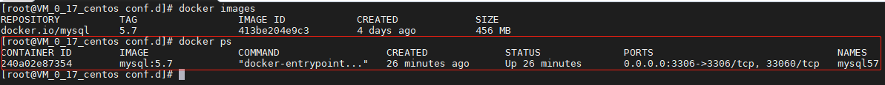
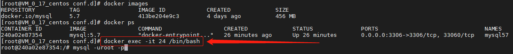
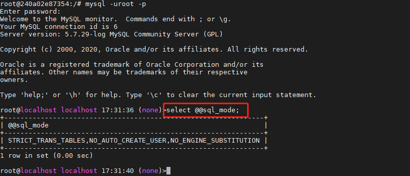

# docker安装MySQL57

## 1. 配置阿里云镜像源加速

1. 注册阿里云账号；

2. 登录阿里云账号，并创建镜像仓库；
   

3. 镜像仓库创建好后，在`镜像加速器`复制配置代码；
   

4. 在`centos7`中执行命令：

   ```sh
   # 编辑配置文件
   vim /etc/docker/daemon.json
   ```

   将第3步复制的代码粘贴到`daemon.json`文件中保存；

5. 重新加载docker进程配置文件，并重启docker服务。

   ```sh
   # 重载配置文件
   sudo systemctl daemon-reload
   # 重启docker服务
   sudo systemctl restart docker
   ```

## 2. 安装`MySQL5.7`

1.  拉取官方镜像

   ```sh
   docker pull mysql:5.7
   ```

2. 查看镜像

   ```sh
   $ docker images
   REPOSITORY          TAG     IMAGE ID            CREATED             SIZE
   docker.io/mysql     5.7     413be204e9c3        4 days ago          456 MB
   ```

3. 创建`MySQL`相关目录，用于挂载外部配置文件和数据目录

   ```sh
   mkdir /opt/mysql
   mkdir /opt/mysql/data
   mkdir /opt/mysql/conf.d
   touch /opt/mysql/my.cnf
   ```

4. 编辑配置文件`my.cnf`，将以下配置复制进去

   ```sh
   vim /opt/mysql/my.cnf
   ```

   配置文件内容：

   ```properties
   [client]
   port= 3306
   socket  = /tmp/mysql.sock
   default-character-set = utf8mb4
   
   ## The MySQL server
   [mysqld]
   port = 3306
   socket  = /tmp/mysql.sock
   user = mysql
   skip-external-locking
   skip-name-resolve
   #skip-grant-tables
   #skip-networking
   
   ## dir
   #basedir=/usr/local/mysql
   datadir=/var/lib/mysql
   tmpdir=/var/lib/mysql
   secure_file_priv=/var/lib/mysql
   
   ## some app
   log-error=mysql.err
   pid-file=/var/lib/mysql/mysql.pid
   local-infile=1
   event_scheduler=0
   federated
   default-storage-engine=InnoDB
   #default-time-zone= '+8:00'
   log_timestamps=SYSTEM
   character-set-client-handshake = FALSE
   character-set-server = utf8mb4
   collation-server = utf8mb4_general_ci
   init_connect='SET NAMES utf8mb4'
   #5.6
   explicit_defaults_for_timestamp=true
   #fulltext
   innodb_optimize_fulltext_only
   ft_min_word_len=1
   #ft_max_word_len
   innodb_ft_min_token_size=1
   
   ## memory allocate and myisam configure
   max_connections=3000
   #back_log=200
   max_connect_errors=10000
   key_buffer_size = 16M
   max_allowed_packet = 16M
   table_open_cache = 10240
   sort_buffer_size = 2M
   read_buffer_size = 2M
   read_rnd_buffer_size = 2M
   join_buffer_size=2M
   myisam_sort_buffer_size = 4M
   #net_buffer_length = 2M
   thread_cache_size = 24
   query_cache_type=1
   query_cache_size=256M
   query_cache_limit=32M
   tmp_table_size=1G
   max_heap_table_size=1G
   #thread_concurrency =48
   
   ## replication
   server-id = 19216810951
   log-bin=mysql-bin
   binlog_format=mixed
   max_binlog_size=1G
   #binlog_cache_size=512M
   log_slave_updates=true
   log_bin_trust_function_creators=true
   expire_logs_days=15
   replicate-ignore-db=mysql
   replicate-ignore-db=test
   replicate-ignore-db=information_schema
   replicate-ignore-db=performance_schema
   replicate-wild-ignore-table=mysql.%
   replicate-wild-ignore-table=test.%
   replicate-wild-ignore-table=information_schema.%
   replicate-wild-ignore-table=performance_schema.%
   lower_case_table_names = 1
   #read_only=1
   master_info_repository=TABLE
   relay_log_info_repository=TABLE
   
   ## slow-query
   long_query_time=1
   slow_query_log=1
   slow_query_log_file=/var/lib/mysql/slow-query.log
   interactive_timeout=600
   wait_timeout=600
   #log_queries_not_using_indexes=1
   
   ## innodb configure
   innodb_file_per_table
   #innodb_file_format=Barracuda
   #innodb_io_capacity=200
   innodb_data_home_dir = /var/lib/mysql
   #innodb_data_file_path = ibdata1:2000M;ibdata2:10M:autoextend
   innodb_log_group_home_dir = /var/lib/mysql
   innodb_buffer_pool_size =4G
   # Set .._log_file_size to 25 % of buffer pool size
   innodb_log_file_size = 1G
   innodb_log_files_in_group = 3
   innodb_log_buffer_size = 32M
   #innodb_lock_wait_timeout = 50
   innodb_flush_log_at_trx_commit = 1
   sync_binlog=0
   sql-mode="STRICT_TRANS_TABLES,NO_AUTO_CREATE_USER,NO_ENGINE_SUBSTITUTION"
   
   ##########################################
   [mysqldump]
   quick
   max_allowed_packet = 16M
   
   [mysql]
   no-auto-rehash
   default-character-set = utf8mb4
   prompt=\\U \\h \\R:\\m:\\s \\d>
   
   [myisamchk]
   key_buffer_size = 20M
   sort_buffer_size = 20M
   read_buffer = 2M
   write_buffer = 2M
   
   [mysqlhotcopy]
   interactive-timeout
   ```

5. 使用以下命令启动容器，使用时请先去除注释内容

   > `docker run`：只有在第一次运行时使用，将镜像放到容器中，以后再次启动容器时，只需使用`docker start`即可，也即它相当于执行了两个命令：
   >
   > - docker create   # 将镜像放到容器中
   > - docker start #启动容器，变成运行中的容器
   >
   > `docker start`：用于启动已经存在的容器
   
   ```sh
   docker run \
   -d \ #后台启动
   --restart=always \ #docker重启时，MySQL跟着重启
   --privileged=true \	# 容器内的root拥有真正的root权限，否则容器内root只是外部普通用户权限
   --name mysql57 \ # MySQL容器名称
   -p 3306:3306 \ #指定端口号，第一个为宿主机对应的端口号，第二个为MySQL在容器内对外开放的端口号
   -v /etc/localtime:/etc/localtime:ro \ #容器的时间与宿主机时间同步
   -v /opt/mysql/data/:/var/lib/mysql \ # 映射数据目录（前面的为宿主机目录，后面为容器内目录）
   -v /opt/mysql/conf.d:/etc/mysql/conf.d \ # 映射配置文件目录
   -v /opt/mysql/my.cnf:/etc/mysql/my.cnf \ #映射配置文件
   -e MYSQL_ROOT_PASSWORD=123456 \ # 设置root账号密码
   mysql:5.7 # 容器所属镜像名称
   ```

## 3. 验证是否安装成功

1. 查看MySQL容器运行状态

   ```sh
   docker ps
   ```

   

2. 进入容器

   ```sh
   # 这里的24为上图中容器的ID，只要不重复，使用ID的前几位就行
   docker exec -it 24 /bin/bash
   ```

   

3. 登录`mysql`

   ```sh
   mysql -uroot -p123456
   ```

   

## 4. 完成安装，可以使用Navicat登录了！