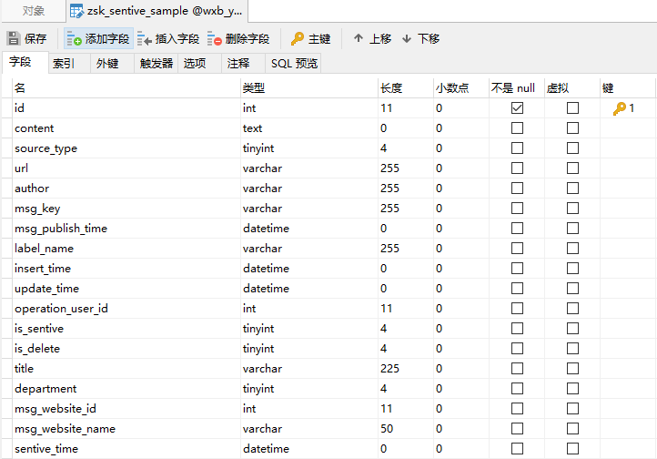
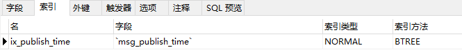
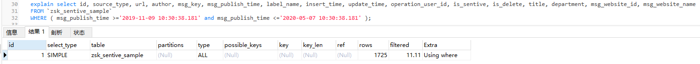
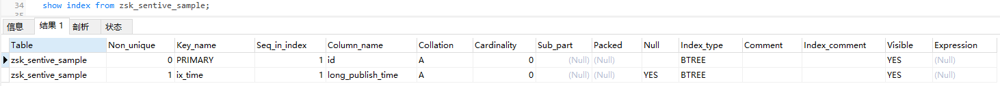

# mysql时间索引无效

## 背景

MySQL业务库有张表`zsk_sentive_sample`，InnoDB引擎，数据量`49850`条，其中对`msg_publish_time`字段添加了索引。



索引字段：



在进行查询时只使用`msg_publish_time`进行查询：

```sql
select * FROM `zsk_sentive_sample` WHERE msg_publish_time between '2019-11-09 10:30:38.181' and '2020-05-07 10:30:38.181';
```





## 原因

- 符合条件的数据条数超过总条数的30%时，会使用全表扫描；

## 处理

有两种处理方式：

- 添加一个字段(bigint)，用来存储该时间值的毫秒值，然后删除原来的索引，再对此新建字段建立索引；
- 直接修改`msg_publish_time`的字段属性`datetime` -->`bigint`。

## 分析

- 对时间字段加索引时，字段的属性的查询性能大小依次是`bigint > timestamp > datetime`;

  