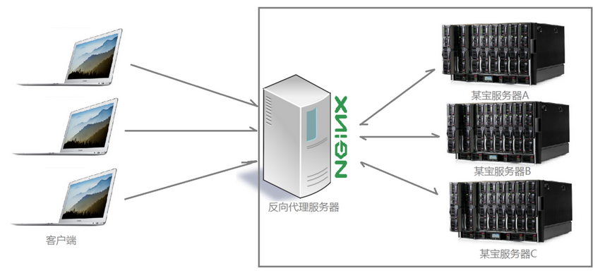
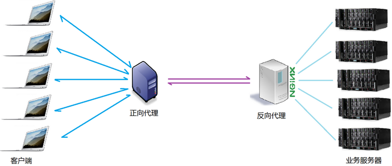

# 2.1 正向代理
> 多客户端 -> 1个服务端

举个例子来说，当你遇到一个问题在百度上找不到想要的答案时，有人推荐你到谷歌上找找看，但问题来了，由于GreatWall的限制，国内无法使用谷歌服务，这时候你会考虑FQ使用谷歌服务，像什么“赛风”、“蓝灯”、SSR等VPN工具，其实这些VPN就等同于一个正向代理服务器。拿SSR来说，

> 你发送一个请求到SSR代理服务器，SSR再携带这个请求访问谷歌的服务器，然后SSR将访问到的数据结果回传给你。其实就是这样一个过程：
**PC发送请求 => SSR正向代理服务器 => 谷歌服务器 => 返回结果给SSR => PC**

# 2.2 反向代理

> 1个客户端 -> 多个服务端

像电商网站在每年双十一时搞得大促销，一般在11月11日凌晨00:00，都会搞个大促销刺激我们剁手，但一个严峻的问题摆在脸上，如果上亿人同时发请求，单个服务器是承受不了这样的并发压力的，因此“分布式部署”就此登上舞台，也即是通过部署多台服务器解决短时间内的高并发问题，这一过程就需要反向代理服务器的支持。像淘宝就是直接使用nginx进行反向代理实现的分布式部署，并且通过封装nginx和其他组件后搞了个[Tengine](http://tengine.taobao.org/)。

>**反向代理**主要用于服务器集群分布式部署的情况，隐藏了服务器信息。

实际项目中，正反向代理很有可能存在于同一个应用场景中，正向代理接收客户端请求去访问目标服务器，而目标服务器是一个反向代理服务器，反向代理多台真实业务处理服务器，具体拓扑图如下：

# 2.3 负载均衡
nginx作为反向代理时，因为它同时代理着多台服务器，客户端的一个请求过来时，它应该将这个请求分发给哪台服务器呢？有什么规则定义分发的方式吗？在不同的应用场景中，分发规则又是否可控？
> 这里的客户端发送的、nginx反向代理的**请求**的数量，就是**负载量**；
> 请求的数量按一定规则分发到不同服务器处理的规则，就是一种均衡规则。
> 因此，将nginx服务器接收到的请求按照规则分发的过程，就称为**负载均衡**

## 2.3.1 负载均衡的分类
**硬件负载均衡**：也称为“硬负载”，如F5负载均衡，像中国移动、中国联通这类财大气粗的公司才会选择硬负载进行操作。
>优点：造价昂贵，成本高；

>缺点：数据稳定性、安全性高；

**软件负载均衡**：利用现有技术，结合主机硬件实现的一种**消息队列分发**机制。

## 2.3.2 负载均衡的调度算法
>**weight [轮询]()**：看英文就知道，这是根据不同的权重进行调度分发的方式，是nginx的默认调度方式。接收到的请求按顺序逐一分配到不同的业务服务器，就算是在使用时某一台服务器宕机，nginx会自动将该服务器剔出集群队列，请求受理不会受此影响。集群中的某台服务器权重越大，被分配到请求的概率也就越大。服务器的权重值，主要是根据实际生产环境中的 **服务器的硬件配置** 来确定。

>**ip_hash**：每个请求按发起客户端的ip的hash结果进行匹配，这样的结果是，一个固定的ip地址总会访问同一个业务服务器，这在一定程度上也解决了集群环境下 **session共享** 的问题。

>**fair**：智能调度算法，动态的根据业务服务器 **对发来的请求开始处理到响应结束的时间** 进行分配。响应时间短的服务器分配到请求的概率高。但nginx默认 **不支持fair** 算法 ，如需使用，需要安装upstream_fair模块。

>**url_hash**：按照访问的URL的hash结果分配请求，每个请求的URL都会指向后端固定的一个服务器。这样可以在nginx作为静态服务器的情况下提高缓存效率。nginx不支持url_hash算法，需安装hash软件包后使用。
