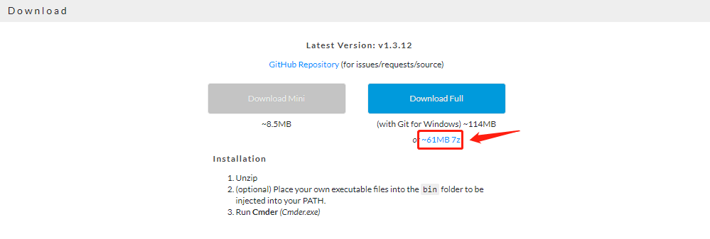
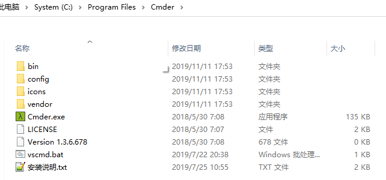
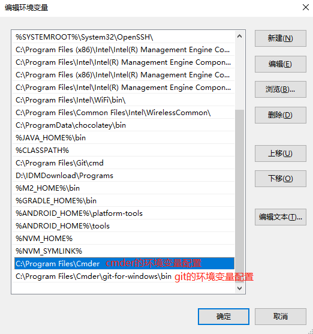
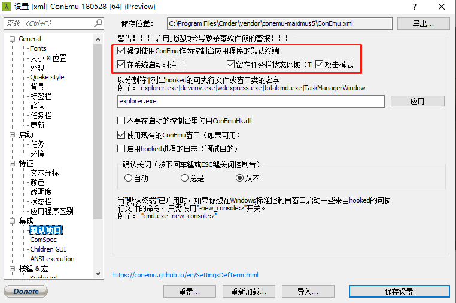
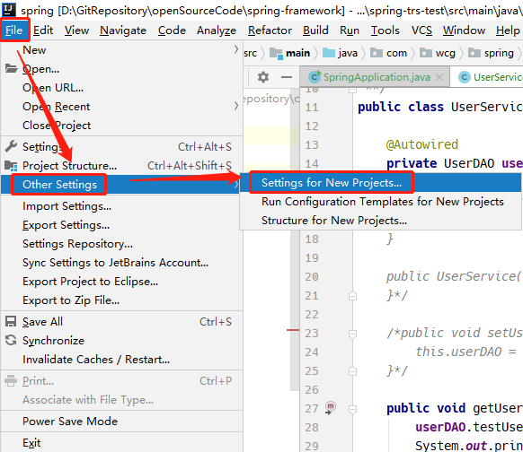
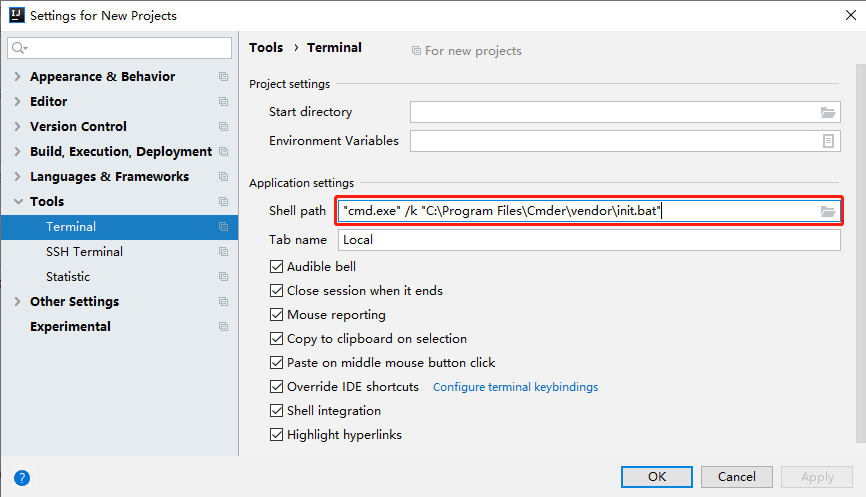
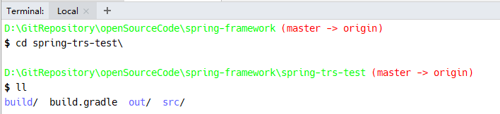
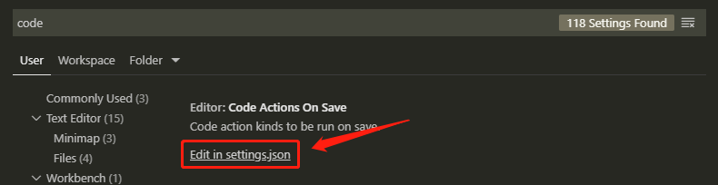
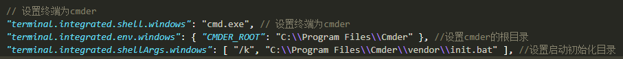
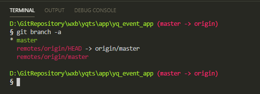

# Cmder完整版配置
cmder支持大部分的Linux命令，界面美观，可作为windows环境下替换cmd、powerShell、git-bash的首选替代工具。

## 1. cmder完整版下载
[cmder官网](https://cmder.net/)可下载精简版（不包含git）和完整版（包含git），我的本子没有安装git，所以选择使用完整版。



下载完成后解压到任意目录（这里我放到了C盘的Program Files文件夹下）:  



## 2. 环境配置
### 2.1 双击启动一次cmder.exe，初始化git；
### 2.2 将`cmder.exe`所在路径和`git.exe`所在路径添加到系统环境变量中。  


## 3. 替换cmd作为windows默认终端
启动cmder后，使用快捷键`win + alt + p`打开设置界面，按下图进行设置：  


## 4. 替换IDEA的默认终端
`File → Other Settings → Setting for New Projects... → Tools → Terminal`  
在`Application settings → Shell Path`一项的输入框中输入：  
```yml
## /k 后面是cmder的实际存放路径
"cmd.exe" /k "C:\Program Files\Cmder\vendor\init.bat"
```

  
  

效果图如下：  


## 5. 替换VS CODE的默认终端
### 5.1 打开设置界面，搜索`code save`，找到并点击`Edit in settings.json`；  


### 5.2 添加配置
```json
// 设置终端为cmder，这里需要将cmder设置为windows默认的终端
"terminal.integrated.shell.windows": "cmd.exe",
//设置cmder的根目录
"terminal.integrated.env.windows": { "CMDER_ROOT": "C:\\Program Files\\Cmder" }, 
//设置启动初始化目录
"terminal.integrated.shellArgs.windows": [ "/k", "C:\\Program Files\\Cmder\\vendor\\init.bat" ], 

//终端颜色配置
"workbench.colorCustomizations": {
  "terminal.foreground": "#37FF13", //设置终端显示字体的颜色
  "terminal.background": "#2b2424"  //设置终端的背景色
},
```


### 5.3 最终效果
