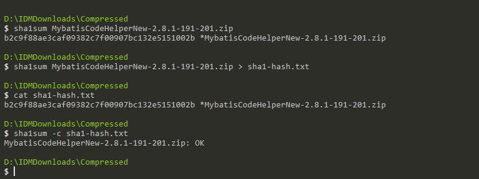

# win10下校验文件的sha1sum值

1. 在`test.zip`文件所在路径下打开`cmd`命令窗口；

2. 键入命令，计算文件的`sha1sum`值

   ```sh
   sha1sum test.zip
   ```

3. 将计算出来的值保存到txt文本中

   ```sh
   sha1sum test.zip > sha1sum.txt. 
   ```

4. 编辑sha1sum文件，用正确的`sha1sum`值替换sha1sum文本中的值，保存；

5. 校验`sha1sum`值是否完全一致。

   ```sh
   sha1sum -c sha1sum.txt
   ```

   