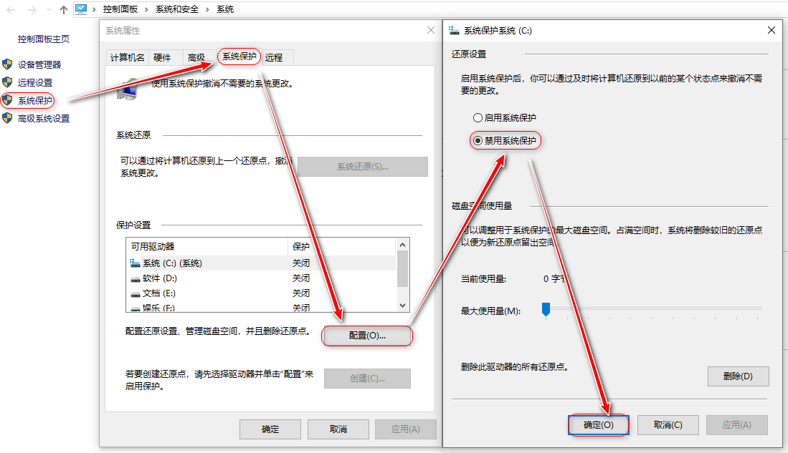

# windows10家庭版升级专业版

## 1. 保留原密钥
- Win+R，输入`regedit`；
- 进入目录 HKEY_LOCAL_MACHINE\SOFTWARE\Microsoft\Windows NT\CurrentVersion\SoftwareProtectionPlatform；
- 选择右侧的`BackupProductKeyDefault`，值的后25为就是密钥。

## 2. 升级
使用密钥升级步骤
  - 进入`设置 → 更新和安全 → 激活 → 更改产品密钥`；
  - 输入有效密钥后点击`下一步`，如果不报错，说明密钥可用；
  - 密钥可用的话，会开始下载更新，等待下载完成、重启...

```yml
# win10家庭版升级到专业版可用密钥

4N7JM-CV98F-WY9XX-9D8CF-369TT

FMPND-XFTD4-67FJC-HDR8C-3YH26
```

更新速度视网速而定，待重启后进入`设置 → 更新和安全 → 激活`，会发现原来激活状态失效，需要重新激活。

win10专业版激活可使用网络上的激活工具激活，这里推荐使用 [数字许可激活工具](https://www.lanzous.com/i373raf)，打开软件后`进度详情`里有激活说明。
>直接点击左下角`激活`按钮即可。

## 3. C盘分区
如果新笔记本只有一个C盘分区，可按以下步骤拆分C盘。以将C盘拆分成2个盘为例进行说明。
- 关闭`系统保护`，解除可用压缩分区只有总分区一半的限制；
  
- `开始菜单 → 鼠标右键 → 磁盘管理`；
- `C盘 → 压缩卷 → 输入压缩空间量 → 确定`，等待压缩完成；
- 对新压缩出来的基本卷进行处理：`鼠标右键 → 新建简单卷 → 指定盘符和名称 → 确定`。
  >这里需要说明一下，压缩卷时每M是按`1024 byte`为单位进行处理的，如果需要压缩出300G的空间，则实际需要的空间大小为`300*1024 + 512`，前面的`300*1024`是计算300G空间的压缩值，后面又加的`512M`是为了凑整用的，如果不加，最终显示的是`299G`