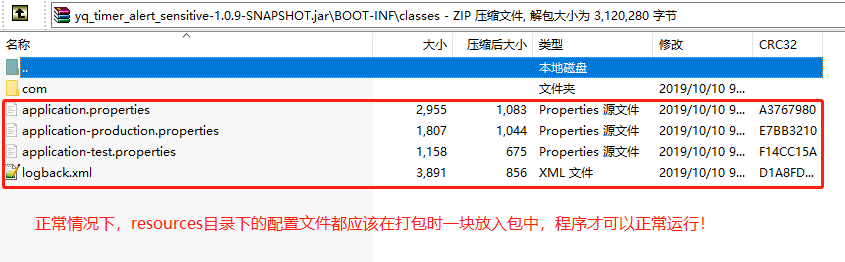

# 场景还原
使用IDEA2019打包项目，或者使用`mvn clean package`打包项目，把打好的包放到服务器运行时，服务无法正常运行，跟之前的正常包比较一下，发现配置文件没有打进去。



# 解决方案
在项目的`pom.xml`文件中添加配置。
```xml
<build>
  <resources>
    <resource>
      <directory>src/main/resource</directory>
      <includes>
        <include>**/*.properties</include>
        <include>**/*.xml</include>
        <include>**/*.tld</include>
        <include>**/*.cer</include>
        <include>**/*.txt</include>
        <include>**/*.sm2</include>
        <include>**/*.keystore</include>
        <include>**/*.jks</include>
      </includes>

      <!-- resource的filtering属性用来表示资源文件中的占位符是否需要
      被替换，true为需要替换；如果*.properties文件中有占位符存在，则
      应单独将*.properties的resource标签拎出来，并配置filtring为true
      -->
      <filtering>false</filtering>
    </resource>
  </resources>
</build>
```