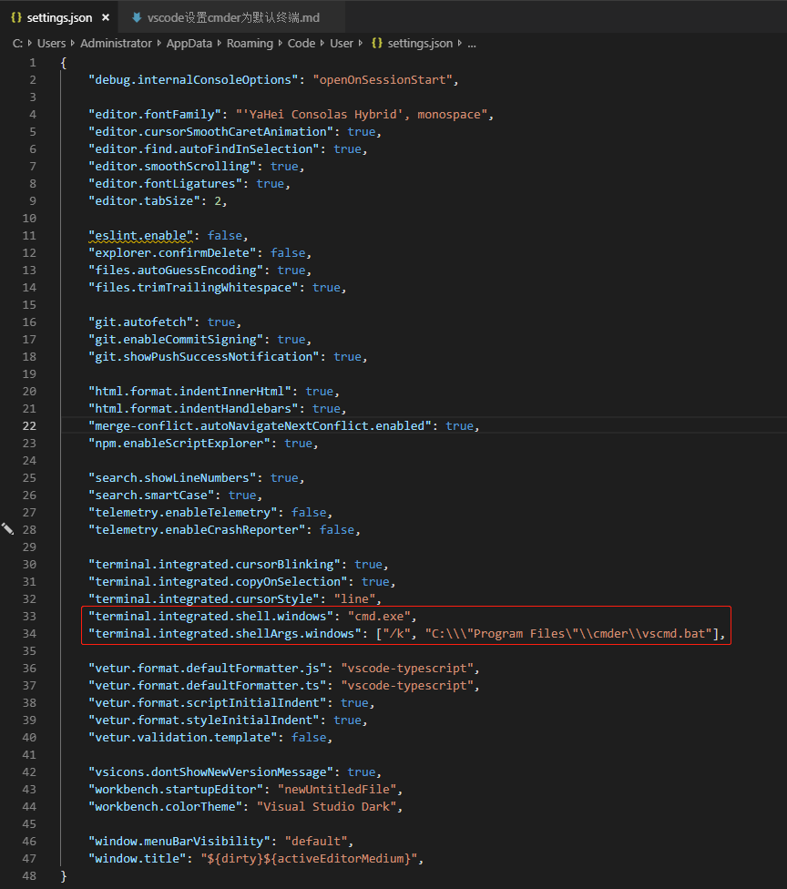

## 原理
使用一个`bat文件`完成cmder_root的设置，并完成cmder初始化

### 1. 在cmder安装根路径下创建`vscmd.bat`文件，内容如下：
CMDER_ROOT指向cmder的安装位置，由于路径中含空格，第三行需要使用双引号括起来。
```bat
@echo off
SET CMDER_ROOT=C:\Program Files\Cmder
"%CMDER_ROOT%\vendor\init.bat"
```

### 2. 修改vscode配置：
```json
"terminal.integrated.shell.windows": "cmd.exe",
"terminal.integrated.shellArgs.windows": ["/k", "C:\\\"Program Files\"\\cmder\\vscmd.bat"],
```
