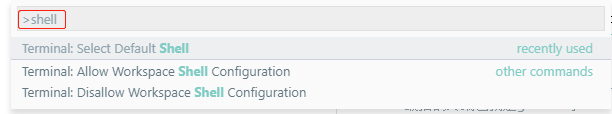
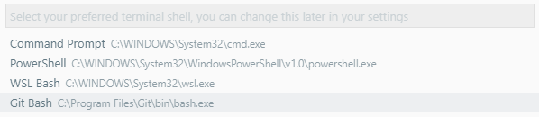
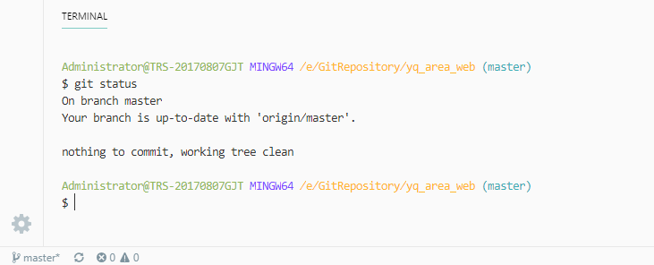

windows环境下，vscode默认使用系统自带的cmd.exe作为默认终端，但用过的都知道cmd下很多命令用着不爽，
如果是win10系统，可选的还有自带的powerShell，如果vscode使用的是浅色主题，使用powershell时
终端字体的黑色背景会很恶心，cmder也不太适应浅色主题，目前发现与vscode最搭的终端也就是git-bash了。

设置方法：
1. 快捷键`F1`调出命令输入框, 输入`shell`，选择`Terminal: select default terminal`，回车;

2. 选择`git bash`，回车;

3. 效果如下：

【注意】
安装git时选中将git加入到系统path才会显示到vscode的shell选择项中。如果安装时未选中该项的，可以手动添加进去。